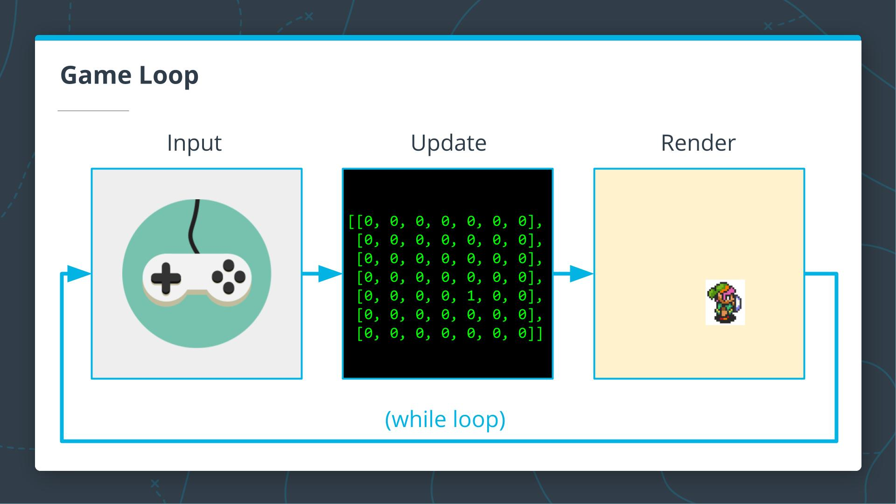
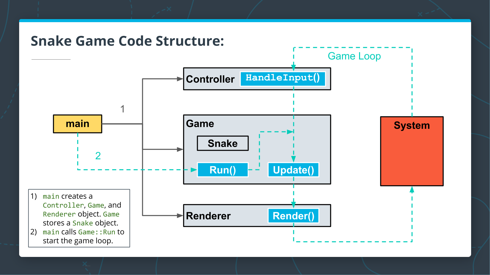

# Capstone Table of Contents
1. [Capstone Intro](#Capstone-Intro)
2. [Steps to Complete Capstone](#Steps-to-Complete-Capstone)
3. [Game Programming](#Game-Programming)
4. [The SDL Library](#The-SDL-Library)
5. [Snake Game Code Walkthrough](#Snake-Game-Code-Walkthrough)
6. [Rubric](#Rubric)

# Capstone Intro
## Overview

The Capstone Project gives you a chance to integrate what you've learned throughout this program. This project will become an important part of your portfolio to share with current and future colleagues and employers.

In this project, you will build a C++ application, following the principles you have learned throughout this Nanodegree Program. This project will demonstrate that you can independently create applications using a wide range of C++ features.

You can choose from two possible options for this capstone project:

## Capstone Option 1

The first option is to build the project of your choice. This is the most flexible option, as this will allow you to focus on the type of application that interests you most. There are a wide variety of applications you can choose from, but here are some suggestions for you to think about:

- Chatbot
- Neural network deployment
- Solitaire
- Microcontroller for an embedded system
- ROS Node simulated in Gazebo
- Networking protocol
- Mandelbrot or Fractal creator
- Hot dog detector using OpenCV
- Video game

There are a wide variety of existing projects and tutorials online that can help you get started, and we'll provide some links below to help. We'll also provide a code repository with a CMakeLists.txt and a "Hello World" application that you can build from. You can use this repo to get started if you wish, but you aren't required to use it.

## Capstone Option 2

The second option for the capstone is to add features to a video game. We'll provide you with a simple 2D Snake game that was inspired by [this Stack Overflow post](https://codereview.stackexchange.com/questions/212296/snake-game-in-c-with-sdl) on beginning game development with the SDL game programming library. The game code provides a solid foundation for you to extend with additional features, or you are welcome to use the code as a framework to build you own game from scratch. If you decide to build your own game, cloning a classic 2D game is great way to get started. Possible ideas include:

- Asteroids
- Pacman
- Space Invaders
- Pong

The game you create doesn’t need to be a fully-featured clone of the original, but there should be enough of a game for a user to play.

Both project options will require a solid effort from you to complete, but I am confident that you will be successful, and we can't wait to see what you create!

## Resources

### Code Repo and Rubric

- The 2D Snake game Github repository is [here](https://github.com/udacity/CppND_Capstone_Snake_Game).
- The empty starter Github repositry is [here](https://github.com/udacity/CppND-Capstone-Hello-World).
- The project rubric is [here](https://learn.udacity.com/rubric/2533). Note that not every rubric item needs to be satisfied to pass the project. Detailed instructions are provided in the next classroom concept.

### Selected Project Resources

- [Tensorflow C++ Api](https://www.tensorflow.org/guide/extend/cc)
- [ROS (Robot Operating System) Tutorials](http://wiki.ros.org/ROS/Tutorials). Some of the tutorials here use C++ and some are in Python.
- Mandelbrot set tutorials [here](https://solarianprogrammer.com/2013/02/28/mandelbrot-set-cpp-11/) and [here](https://medium.com/farouk-ounanes-home-on-the-internet/mandelbrot-set-in-c-from-scratch-c7ad6a1bf2d9)
- Game programming resources will be provided in the upcoming concepts.

# Steps to Complete Capstone
## Step 1: Propose a Project

Identify the application you want to build. We recommend keeping the functionality as simple as possible to start with. Note that it is fine to reuse code from any of the courses in the Nanodegree as a starting point. You are also welcome to use the [Snake game sample code](https://github.com/udacity/CppND_Capstone_Snake_Game) to extend with additional features or to build an entirely different game. If you prefer to start from scratch, you can find a starter repo [here](https://github.com/udacity/CppND-Capstone-Hello-World).

## Step 2: Scope the Project

Review [the rubric](https://learn.udacity.com/rubric/2533). Ensure that the application you build **will satisfy all criteria for the “README” and “Compiling and Testing” sections**, and that the application **will satisfy at least 5 total criteria from the rest of the rubric. Not all rubric items need to be satisfied in order to pass the project**. Scope the features of your project to meet the rubric criteria you want to target.

This flexibility will allow you to focus on the aspects of your application that interest you most.

## Step 3: Build your application

Build your own application, or extend the Snake game with new features.

## Step 4: Document Your Work

Write a short README indicating which project option you chose. The README should also include:

- instructions for running the project
- an overview of your code structure
- an explanation of how your submission satisfies the necessary rubric

# Game Programming
The game loop is a while loop that runs continuously in your code and has three steps:



- **Input**: This step handles user input from a keyboard, joystick, game controller, or other input device.
    
- **Update**: This step uses the input to update the internal state of the game. The game state might include:
    
    - positions of characters in the game world
    - the speed, health, or inventory of characters in the game
    - how many points have been scored in the game so far
    - any other attributes or data in the game
    
    Each part of the game state might be updated independently of the input as well. For example, if a character is moving forward in the game with a given velocity, the update step might change the character's position without any additional input.
    
- **Render**: This step takes the game state and renders the state to the screen according to fixed rules. For example, a character might be rendered with a particular image or "[sprite](https://en.wikipedia.org/wiki/Sprite_%28computer_graphics%29)", or a texture might be applied to the background of the game window.
    

One major benefit of using this design pattern in a game is that each part of the game loop can be implemented separately in the code. If you want to change the appearance of your game without making major changes to how the game works, you can just update the Rendering code. Similarly, you are free to modify how the gameplay works without changing the rendering or input portion of the code at all.

## Snake Game Example


The project code that we provide is an implementation of the classic "Snake" game, which is shown above. This implementation was inspired by code found in [this](https://codereview.stackexchange.com/questions/212296/snake-game-in-c-with-sdl) StackOverflow post.

In this game, you control a snake using the keyboard, and the snake grows in speed and length each time it eats the food on the screen. Internally, the game state includes:

- the speed of the snake
- the current direction the snake is travelling
- the `float` position of the snake's head
- a `vector` of int coordinates representing the snake's body
- the position of the food
- other state data needed to make the game function

At each pass through the game loop, the steps

1. **Input:** the keyboard input is handled and used to set the future direction of the snake.
2. **Update:** The snake's position, length, and velocity are updated. If the snake has just eaten the food, a new food item is created.
3. **Render:** The game state is drawn to the screen. The entire game loop happens approximately 60 times per second, so the rendering and motion look fairly smooth, even though every update is a discrete change to the game state.

Note that the positions of the snake head and snake body are not stored in a 2D array in the current implementation, even though would also be a reasonable way to store some of the game state. However, the game is still rendered according to a 2D grid, and not using continuous coordinates. This happens even though the head coordinates are stored and updated with floats. By storing the head coordinates with floats, we can update the head position according to a fixed velocity. By rendering according to a grid, the vintage, grid-based aesthetic of the game can be maintained.

Now that you have an idea of the basic structure of the game loop, there's one additional step that you will see in the final project code: time control. If we let the while loop run as fast as the computer processor will allow, the game may be unplayable on a very fast machine, and it will play at different speeds depending on where it is run. Pseudocode for a frame duration timer is below:

```cpp
Uint32 frame_start;
Uint32 frame_end;
Uint32 frame_duration;
float target_frame_duration = 1000/60; // milliseconds per frame at 60 frames per second.

while (true) {
    frame_start = GetCurrentTimeMS(); // Current time in milliseconds
    Input();
    Update();
    Render();
    frame_end = get_current_time_in_ms();

    frame_duration = frame_end - frame_start;

    if (frame_duration < target_frame_duration ) {
        Sleep(target_frame_duration - frame_duration);
    }
}
```

In the next concept, we will introduce the SDL2 library that you can use to handle input and render, so you will be ready to begin your Capstone project.

## Resources

- The [Game Programming Patterns Book](https://gameprogrammingpatterns.com/) is an _excellent_ resource for understanding how games work. In particular, [here](https://gameprogrammingpatterns.com/game-loop.html) is a section of the book which discusses the game loop.
- [Here](http://www.informit.com/articles/article.aspx?p=2928180&seqNum=4) is another useful article on the game loop. This one uses the SDL library, which is the same library used in the Snake game repository.

# The SDL Library
The [SDL library](https://www.libsdl.org/) is widely used for Game development as a tool to abstract the hardware so you don't need to worry about working with the hardware directly. SDL manages video, audio, input devices, and other components, and provides you with a simple library interface.

SDL is not a game engine, so doesn't have the full development environment that you might find in Unity or Unreal, but SDL can be used to develop fully-featured games for Android, iOS, Linux, macOS, and Windows. It been used to build thousands of games, including the popular Angry Birds and games from [Valve](https://www.valvesoftware.com/en/) and [HumbleBundle](https://www.humblebundle.com/).

If you are choosing to build the game for your Capstone project, then you can install and use the latest SDL v2.0, also referred to as SDL2.

## Installation

To install SDL 2.0 on your own machine, you can find instructions for each operating system [here](https://wiki.libsdl.org/Installation). Additionally, there are detailed instructions in the LazyFoo SDL tutorial page [here](https://lazyfoo.net/tutorials/SDL/01_hello_SDL/index.php).

Note that for Debian-based Linux users, we recommend using `apt` or `apt-get` to install:

`sudo apt-get install libsdl2-dev`

The [Snake game repository](https://github.com/udacity/CppND-Capstone-Snake-Game) provides an example of how how to set up a CMakeLists.txt file to build an SDL project using CMake.

## Resources

- The SDL Library webpage can be found [here](https://www.libsdl.org/).
- The [LazyFoo SDL2 tutorial](https://lazyfoo.net/tutorials/SDL/) is an in-depth game programming tutorial using SDL2. There's a lot of content here, but the tutorial will walk you through everything from creating a simple window with SDL2 to using particle engines and tiling the screen with textures.
- The [Parallel Realities tutorials](https://www.parallelrealities.co.uk/tutorials/) are a collection of tutorials for creating 2D shooter games (like Asteroids) and 2D platformers (like the original Super Mario Brothers) using SDL2. These are much shorter tutorials that are useful for getting your game up and running.
- The [TwinklebearDev](https://www.willusher.io/pages/sdl2/) SDL2 tutorials include a few simple tutorials for getting SDL2 running and displaying images to the screen.

# Snake Game Code Walkthrough



The Snake game code consists of four main classes: `Game`, `Snake`, `Controller`, and `Renderer`. The image above shows how the code functions:

1. To begin, `main` creates a `Controller`, a `Game`, and a `Renderer` object. `Game` stores a `Snake` object as part of the state.
2. `main` calls `Game::Run` to start the game loop.

The next videos walk through each of the files in the Snake game repository in more detail.

## `main.cpp`
This is the entrypoint for the program. The `main` function in this file sets variables such as the window height and width and the number of frames per second at which the game will be played. The `main` also creates `Renderer`, `Controller`, and `Game` objects, and calls the `Game::Run` method to start the game loop. Video is [here](https://youtu.be/8BkjScSOJR8).

## `snake.h` and `snake.cpp`

These files define the `Snake` class which contains attributes to keep track of the `Snake` speed, size, and location. Additionally, there are methods to update the snake state, which are called from the `Game::Update` method. The `Snake` head and body are treated separately; the head is stored using float coordinates, and the body is stored using a vector of int cell coordinates. The `Snake::UpdateHead` method updates the head location using the snake's speed. If the head has passed into a new cell, then the body is updated with the `Snake::UpdateBody`. Video is [here](https://youtu.be/21kpACl2F_M).

## `game.h` and `game.cpp`

These files define the `Game` class and the game loop: `Game::Run`. The `Game` class stores the state of the game, including an instance of a `Snake` object, the game score, and the location of "food" in the game. Aside from the game loop, the `Game` class also contains methods to update the state of the game (Game::Update), get the size of the snake, get the total score in the game, and place new food in the game if the food has been eaten by the snake. Video is [here](https://youtu.be/ixgsdCjcqn8).

## `render.h` and `render.cpp`

These files define the `Renderer` class which uses the SDL library to render the game to the screen. The `Renderer` class constructor creates the SDL window and an SDL renderer object that can draw in the window. The `Renderer::Render` method draws the food and the snake in the window using the SDL renderer. Video is [here](https://youtu.be/27N1MkVCwXw).

## `controller.h` and `controller.cpp`

These files define the `Controller` class. This class handles keyboard input using the SDL libary, and it sets the snake's direction based on the input. Video is [here](https://youtu.be/LtTAwBU654Q).

## Resources

- [The SDL API](https://wiki.libsdl.org/APIByCategory), organized by category.

# Rubric

## README (All Rubric Points REQUIRED)

|Success Criteria|Specifications|
|---|---|
|A README with instructions is included with the project|The README is included with the project and has instructions for building/running the project.<br><br>If any additional libraries are needed to run the project, these are indicated with cross-platform installation instructions.<br><br>You can submit your writeup as markdown or pdf.|
|The README indicates which project is chosen.|The README describes the project you have built.<br><br>The README also indicates the file and class structure, along with the expected behavior or output of the program.|
|The README includes information about each rubric point addressed.|The README indicates which rubric points are addressed. The README also indicates where in the code (i.e. files and line numbers) that the rubric points are addressed.|

## Compiling and Testing (All Rubric Points REQUIRED)

|Success Criteria|Specifications|
|---|---|
|The submission must compile and run.|The project code must compile and run without errors.<br><br>We strongly recommend using `cmake` and `make`, as provided in the starter repos. If you choose another build system, the code must compile on any reviewer platform.|

## Loops, Functions, I/O

|Success Criteria|Specifications|
|---|---|
|The project demonstrates an understanding of C++ functions and control structures.|A variety of control structures are used in the project.<br><br>The project code is clearly organized into functions.|
|The project reads data from a file and process the data, or the program writes data to a file.|The project reads data from an external file or writes data to a file as part of the necessary operation of the program.|
|The project accepts user input and processes the input.|The project accepts input from a user as part of the necessary operation of the program.|

## Object Oriented Programming

|Success Criteria|Specifications|
|---|---|
|The project uses Object Oriented Programming techniques.|The project code is organized into classes with class attributes to hold the data, and class methods to perform tasks.|
|Classes use appropriate access specifiers for class members.|All class data members are explicitly specified as public, protected, or private.|
|Class constructors utilize member initialization lists.|All class members that are set to argument values are initialized through member initialization lists.|
|Classes abstract implementation details from their interfaces.|All class member functions document their effects, either through function names, comments, or formal documentation. Member functions do not change program state in undocumented ways.|
|Classes encapsulate behavior.|Appropriate data and functions are grouped into classes. Member data that is subject to an invariant is hidden from the user. State is accessed via member functions.|
|Classes follow an appropriate inheritance hierarchy.|Inheritance hierarchies are logical. Composition is used instead of inheritance when appropriate. Abstract classes are composed of pure virtual functions. Override functions are specified.|
|Overloaded functions allow the same function to operate on different parameters.|One function is overloaded with different signatures for the same function name.|
|Derived class functions override virtual base class functions.|One member function in an inherited class overrides a virtual base class member function.|
|Templates generalize functions in the project.|One function is declared with a template that allows it to accept a generic parameter.|

## Memory Management

|Success Criteria|Specifications|
|---|---|
|The project makes use of references in function declarations.|At least two variables are defined as references, or two functions use pass-by-reference in the project code.|
|The project uses destructors appropriately.|At least one class that uses unmanaged dynamically allocated memory, along with any class that otherwise needs to modify state upon the termination of an object, uses a destructor.|
|The project uses scope / Resource Acquisition Is Initialization (RAII) where appropriate.|The project follows the Resource Acquisition Is Initialization pattern where appropriate, by allocating objects at compile-time, initializing objects when they are declared, and utilizing scope to ensure their automatic destruction.|
|The project follows the Rule of 5.|For all classes, if any one of the copy constructor, copy assignment operator, move constructor, move assignment operator, and destructor are defined, then all of these functions are defined.|
|The project uses move semantics to move data, instead of copying it, where possible.|For classes with move constructors, the project returns objects of that class by value, and relies on the move constructor, instead of copying the object.|
|The project uses smart pointers instead of raw pointers.|The project uses at least one smart pointer: `unique_ptr`, `shared_ptr`, or `weak_ptr`. The project does not use raw pointers.|

## Concurrency

|Success Criteria|Specifications|
|---|---|
|The project uses multithreading.|The project uses multiple threads in the execution.|
|A promise and future is used in the project.|A promise and future is used to pass data from a worker thread to a parent thread in the project code.|
|A mutex or lock is used in the project.|A mutex or lock (e.g. `std::lock_guard` or `std::unique_lock) is used to protect data that is shared across multiple threads in the project code.|
|A condition variable is used in the project.|A `std::condition_variable` is used in the project code to synchronize thread execution.|