# Concurrency Table of Contents
1. [Introduction and Running Threads](#Introduction-and-Running-Threads)
	1. [Processes and Threads](#Processes-and-Threads)
	2. [Running a Single Thread](#Running-a-Single-Thread)
		1. [Concurrency Support in C++11](Concurrency-Support-in-C++11)
		2. [Starting a second thread](#Starting-a-second-thread)
		3. [Randomness of events](#Randomness-of-events)
		4. [Using join as a barrier](#Using-join-as-a-barrier)
		5. [Detach](#Detach)
	3. [Starting a Thread with Function Objects](#Starting-a-Thread-with-Function-Objects)
		1. [Lambdas](#Lambdas)
		2. [Starting Threads with Lambdas](#Starting-Threads-with-Lambdas)
	4. [Starting a Thread with Variadic Templates and Member Functions](#Starting-a-Thread-with-Variadic-Templates-and-Member-Functions)
		1. [Passing Arguments using a Variadic Template](#Passing-Arguments-using-a-Variadic-Template)
		2. [Starting Threads with Member Functions](#Starting-Threads-with-Member-Functions)
	5. [Running Multiple Threads](#Running-Multiple-Threads)
	6. [Lesson 1 Exercise](#Lesson-1-Exercise)
2. [Passing Data Between Threads](#Passing-Data-Between-Threads)
	1. [Promises and Futures](#Promises-and-Futures)
		1. [Passing exceptions](#Passing-exceptions)
	2. [Threads vs Tasks](#Threads-vs-Tasks)
		1. [Starting threads with async](#Starting-threads-with-async)
		2. [Task based concurrency](#Task-based-concurrency)
		3. [Assessing the advantage of parallel execution](#Assessing-the-advantage-of-parallel-execution)
	3. [Avoiding Data Races](#Avoiding-Data-Races)
		1. [Passing data to a thread by value](#Passing-data-to-a-thread-by-value)
		2. [Overwriting the copy constructor](#Overwriting-the-copy-constructor)
		3. [Passing data using move semantics](#Passing-data-using-move-semantics)
	4. [Lesson 2 Exercise](#Lesson-2-Exercise)
3. [Mutexes and Locks](#Mutexes-and-Locks)
	1. [Using a Mutex to Protect Shared Data](#Using-a-Mutex-to-Protect-Shared-Data)
	2. [Using timed_mutex](#Using-timed_mutex)
	3. [Deadlock](#Deadlock)
	4. [Using locks to avoid deadlocks](#Using-locks-to-avoid-deadlocks)
		1. [Lock Guard](#Lock-Guard)
		2. [Unique Lock](#Unique-Lock)
		3. [Avoiding deadlocks with std lock](#Avoiding-deadlocks-with-std-lock)
	5. [Lesson 3 Exercise](#Lesson-3-Exercise)
4. [Condition Variables and Message Queues](#Condition-Variables-and-Message-Queues)
	1. [The Monitor Object Pattern](#The-Monitor-Object-Pattern)
	2. [Creating an Infinite Polling Loop](#Creating-an-Infinite-Polling-Loop)
	3. [Writing a Vehicle Counter](#Writing-a-Vehicle-Counter)
	4. [Building a Concurrent Message Queue](#Building-a-Concurrent-Message-Queue)
5. [Project Concurrent Traffic Simulation](#Project-Concurrent-Traffic-Simulation)

# Introduction and Running Threads
## Processes and Threads
In this lesson, you will learn how to start and manage your first parallel path of execution, which runs concurrently with the main program and is thus asynchronous. In contrast to synchronous programs, the main program can continue with its line of execution without the need to wait for the parallel task to complete. The following figure illustrates this difference.

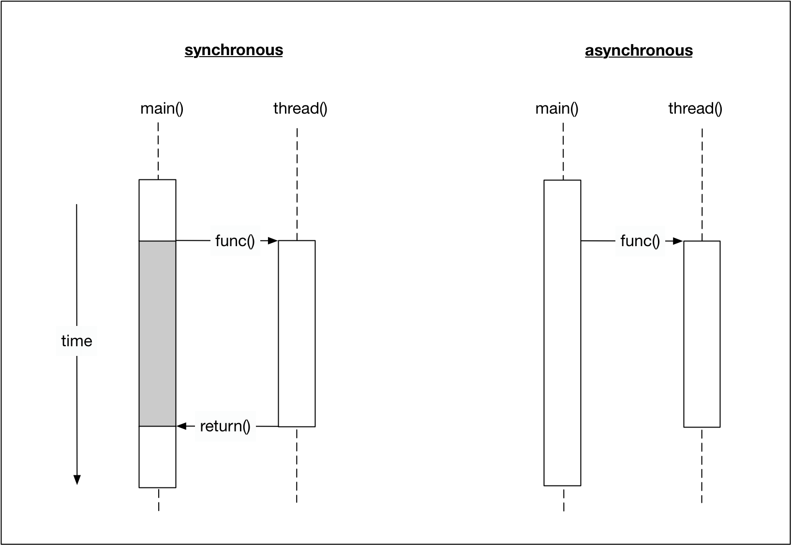

Before we start writing a first asynchronous program in C++, let us take a look at the differences between two important concepts : processes and threads.

A _process_ (also called a task) is a computer program at runtime. It is comprised of the runtime environment provided by the operating system (OS), as well as of the embedded binary code of the program during execution. A process is controlled by the OS through certain actions with which it sets the process into one of several carefully defined states:


- **Ready** : After its creation, a process enters the ready state and is loaded into main memory. The process now is ready to run and is waiting for CPU time to be executed. Processes that are ready for execution by the CPU are stored in a queue managed by the OS.
- **Running** : The operating system has selected the process for execution and the instructions within the process are executed on one or more of the available CPU cores.
- **Blocked** : A process that is blocked is one that is waiting for an event (such as a system resource becoming available) or the completion of an I/O operation.
- **Terminated** : When a process completes its execution or when it is being explicitly killed, it changes to the "terminated" state. The underlying program is no longer executing, but the process remains in the process table as a "zombie process". When it is finally removed from the process table, its lifetime ends.
- **Ready suspended** : A process that was initially in ready state but has been swapped out of main memory and placed onto external storage is said to be in suspend ready state. The process will transition back to ready state whenever it is moved to main memory again.
- **Blocked suspended** : A process that is blocked may also be swapped out of main memory. It may be swapped back in again under the same conditions as a "ready suspended" process. In such a case, the process will move to the blocked state, and may still be waiting for a resource to become available.

Processes are managed by the _scheduler_ of the OS. The scheduler can either let a process run until it ends or blocks (non-interrupting scheduler), or it can ensure that the currently running process is interrupted after a short period of time. The scheduler can switch back and forth between different active processes (interrupting scheduler), alternately assigning them CPU time. The latter is the typical scheduling strategy of any modern operating system.

Since the administration of processes is computationally taxing, operating systems support a more resource-friendly way of realizing concurrent operations: the threads.

A _thread_ represents a concurrent execution unit within a process. In contrast to full-blown processes as described above, threads are characterized as light-weight processes (LWP). These are significantly easier to create and destroy: In many systems the creation of a thread is up to 100 times faster than the creation of a process. This is especially advantageous in situations, when the need for concurrent operations changes dynamically.

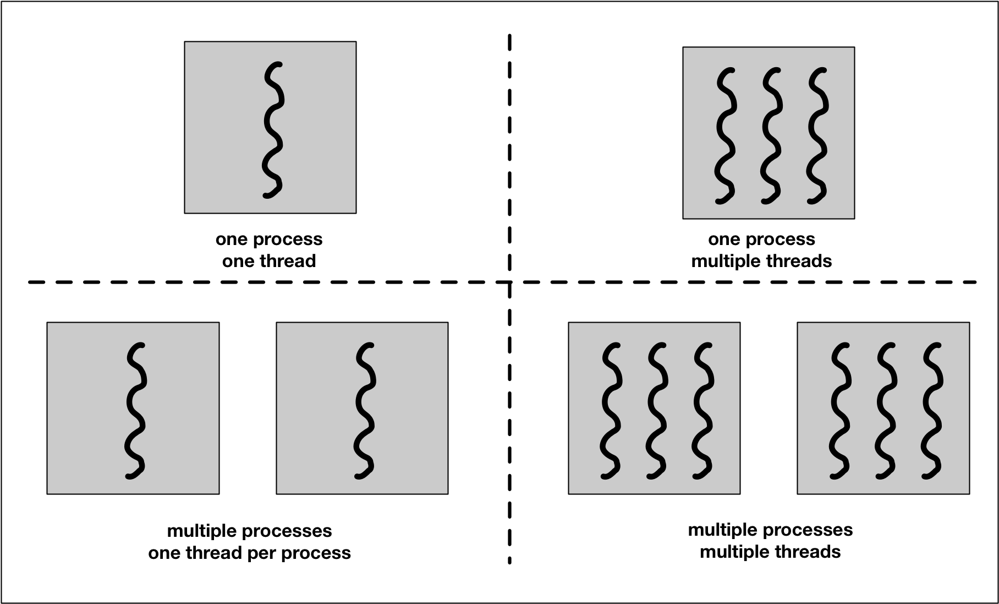

Threads exist within processes and share their resources. As illustrated by the figure above, a process can contain several threads or - if no parallel processing is provided for in the program flow - only a single thread.

A major difference between a process and a thread is that each process has its own address space, while a thread does not require a new address space to be created. All the threads in a process can access its shared memory. Threads also share other OS dependent resources such as processors, files, and network connections. As a result, the management overhead for threads is typically less than for processes. Threads, however, are not protected against each other and must carefully synchronize when accessing the shared process resources to avoid conflicts.

Similar to processes, threads exist in different states, which are illustrated in the figure below:

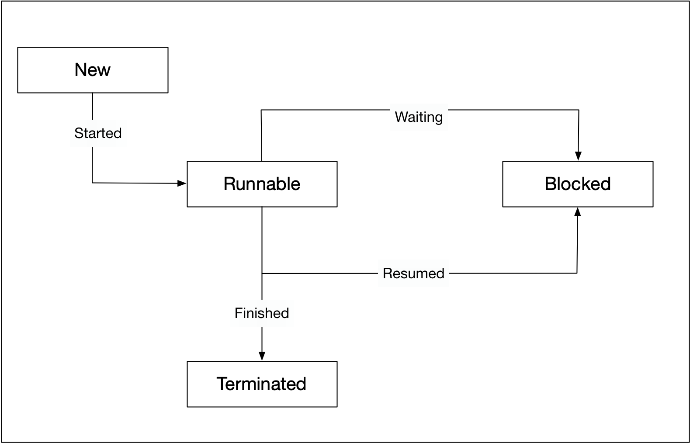

- **New** : A thread is in this state once it has been created. Until it is actually running, it will not take any CPU resources.
- **Runnable** : In this state, a thread might actually be running or it might be ready to run at any instant of time. It is the responsibility of the thread scheduler to assign CPU time to the thread.
- **Blocked** : A thread might be in this state, when it is waiting for I/O operations to complete. When blocked, a thread cannot continue its execution any further until it is moved to the runnable state again. It will not consume any CPU time in this state. The thread scheduler is responsible for reactivating the thread.

**Quiz**

In a concurrent program **Threads** share memory. Thus many **Threads** can access and modify the same memory.

Creating a **Process** is fairly resource-intensive. It is generally more efficient to use several **Threads** withing a **Process**.

In contrast to a **Process**, **Threads** are characterized as light-weight. They are significantly easier to create and destroy.

Inter-**Thread** communication can be faster than inter-**Process** communication.

## Running a Single Thread
### Concurrency Support in C++11
The concurrency support in C++ makes it possible for a program to execute multiple threads in parallel. Concurrency was first introduced into the standard with C++11. Since then, new concurrency features have been added with each new standard update, such as in C++14 and C++17. Before C++11, concurrent behavior had to be implemented using native concurrency support from the OS, using POSIX Threads, or third-party libraries such as BOOST. The standardization of concurrency in C++ now makes it possible to develop cross-platform concurrent programs, which is as significant improvement that saves time and reduces error proneness. Concurrency in C++ is provided by the thread support library, which can be accessed by including the header.

A running program consists of at least one thread. When the main function is executed, we refer to it as the "main thread". Threads are uniquely identified by their thread ID, which can be particularly useful for debugging a program. The code below prints the thread identifier of the main thread and outputs it to the console:

```cpp
#include <iostream>
#include <thread>

int main()
{
    std::cout << "Hello concurrent world from main! Thread id = " << std::this_thread::get_id() << std::endl;

    return 0;
}
```

The results when run are:
```
Hello concurrent world from main! Thread id = 1
```

Also, it is possible to retrieve the number of concurrent threads supported. The example below prints the number of concurrent threads supported to the console.

```cpp
#include <iostream>
#include <thread>

int main()
{
    unsigned int nThreads = std::thread::hardware_concurrency();
    std::cout << "This machine supports concurrency with " << nThreads << " concurrent threads available" << std::endl;

    return 0;
}
```

The results when run are:
```
This machine supports concurrency with 12 concurrent threads available
```

### Starting a second thread
In this section, we will start a second thread in addition to the main thread of our program. To do this, we need to construct a thread object and pass it the function we want to be executed by the thread. Once the thread enters the runnable state, the execution of the associated thread function may start at any point in time.

After the thread object has been constructed, the main thread will continue and execute the remaining instructions until it reaches the end and returns. It is possible that by this point in time, the thread will also have finished. But if this is not the case, the main program will terminate and the resources of the associated process will be freed by the OS. As the thread exists within the process, it can no longer access those resources and thus not finish its execution as intended.

To prevent this from happening and have the main program wait for the thread to finish the execution of the thread function, we need to call `join()` on the thread object. This call will only return when the thread reaches the end of the thread function and block the main thread until then.

The code below shows how to use `join()` to ensure that `main()` waits for the thread `t` to finish its operations before returning. It uses the function `sleep_for()`, which pauses the execution of the respective threads for a specified amount of time. The idea is to simulate some work to be done in the respective threads of execution.

```cpp

```

To compile this code with `g++`, you will need to use the `-pthread` flag. `pthread` adds support for multithreading with the pthreads library, and the option sets flags for both the preprocessor and linker:

`g++ example_3.cpp -pthread`

**Note:** If you compile without the `-pthread` flag, you will see an error of the form: `undefined reference to pthread_create`. You will need to use the `-pthread` flag for all other multithreaded examples in this course going forward.

The code produces the following output:
```
Finished work in main
Finished work in thread
```

Not surprisingly, the main function finishes before the thread because the delay inserted into the thread function is much larger than in the main path of execution. The call to `join()` at the end of the main function ensures that it will not prematurely return. As an experiment, comment out `t.join()` and execute the program. What do you expect will happen?

```
Finished work in main
terminate called without an active exception
Aborted (core dumped)
```

### Randomness of events
One very important trait of concurrent programs is their non-deterministic behavior. It can not be predicted which thread the scheduler will execute at which point in time. In the code below, the amount of work to be performed both in the thread function and in main has been split into two separate jobs.

```cpp
#include <iostream>
#include <thread>

void threadFunction()
{
    std::this_thread::sleep_for(std::chrono::milliseconds(50)); // simulate work
    std::cout << "Finished work 1 in thread\n"; 

    std::this_thread::sleep_for(std::chrono::milliseconds(50)); 
    std::cout << "Finished work 2 in thread\n"; 
}

int main()
{
    // create thread
    std::thread t(threadFunction);

    // do something in main()
    std::this_thread::sleep_for(std::chrono::milliseconds(50)); // simulate work
    std::cout << "Finished work 1 in main\n";

    std::this_thread::sleep_for(std::chrono::milliseconds(50)); 
    std::cout << "Finished work 2 in main\n";
    
    // wait for thread to finish
    t.join();

    return 0;
}
```

The console output shows that the work packages in both threads have been interleaved with the first package being performed before the second package.

Interestingly, when executed on my local machine, the order of execution has changed. Now, instead of finishing the second work package in the thread first, main gets there first.

Executing the code several times more shows that the two versions of program output interchange in a seemingly random manner. This element of randomness is an important characteristic of concurrent programs and we have to take measures to deal with it in a controlled way that prevent unwanted behavior or even program crashes.

```
Finished work 1 in main
Finished work 1 in thread
Finished work 2 in main
Finished work 2 in thread
```

```
Finished work 1 in thread
Finished work 1 in main
Finished work 2 in thread
Finished work 2 in main
```

### Using join as a barrier
In the previous example, the order of execution is determined by the scheduler. If we wanted to ensure that the thread function completed its work before the main function started its own work (because it might be waiting for a result to be available), we could achieve this by repositioning the call to join.

In the file below, the `.join()` has been moved to before the work in `main()`. 

```cpp
#include <iostream>
#include <thread>

void threadFunction()
{
    std::this_thread::sleep_for(std::chrono::milliseconds(50)); // simulate work
    std::cout << "Finished work 1 in thread\n"; 

    std::this_thread::sleep_for(std::chrono::milliseconds(50)); 
    std::cout << "Finished work 2 in thread\n"; 
}

int main()
{
    // create thread
    std::thread t(threadFunction);
    
    // wait for thread to finish
    t.join();

    // do something in main()
    std::this_thread::sleep_for(std::chrono::milliseconds(50)); // simulate work
    std::cout << "Finished work 1 in main\n";

    std::this_thread::sleep_for(std::chrono::milliseconds(50)); 
    std::cout << "Finished work 2 in main\n";

    return 0;
}
```

The order of execution now always looks like the following:

```
Finished work 1 in thread
Finished work 2 in thread
Finished work 1 in main
Finished work 2 in main
```

In later sections of this course, we will make extended use of the join() function to carefully control the flow of execution in our programs and to ensure that results of thread functions are available and complete where we need them to be.

### Detach
Let us now take a look at what happens if we don’t join a thread before its destructor is called. When we comment out join in the example above and then run the program again, it aborts with an error. The reason why this is done is that the designers of the C++ standard wanted to make debugging a multi-threaded program easier: Having the program crash forces the programer to remember joining the threads that are created in a proper way. Such a hard error is usually much easier to detect than soft errors that do not show themselves so obviously.

There are some situations however, where it might make sense to not wait for a thread to finish its work. This can be achieved by "detaching" the thread, by which the internal state variable "joinable" is set to "false". This works by calling the `detach()` method on the thread. The destructor of a detached thread does nothing: It neither blocks nor does it terminate the thread. In the following example, detach is called on the thread object, which causes the main thread to immediately continue until it reaches the end of the program code and returns. Note that a detached thread can not be joined ever again.

```cpp
#include <iostream>
#include <thread>

void threadFunction()
{
    std::this_thread::sleep_for(std::chrono::milliseconds(50)); // simulate work
    std::cout << "Finished work in thread\n"; 
}

int main()
{
    // create thread
    std::thread t(threadFunction);

    // detach thread and continue with main
    t.detach();

    // do something in main()
    std::this_thread::sleep_for(std::chrono::milliseconds(50)); // simulate work
    std::cout << "Finished work in main\n";

    return 0;
}
```

Programmers should be very careful though when using the `detach()`-method. You have to make sure that the thread does not access any data that might get out of scope or be deleted. Also, we do not want our program to terminate with threads still running. Should this happen, such threads will be terminated very harshly without giving them the chance to properly clean up their resources - what would usually happen in the destructor. So a well-designed program usually has a well-designed mechanism for joining all threads before exiting.

#### Quiz
Please create a new function called `threadFunctionOdd` that outputs the string "Odd threadn". Then write a for-loop that starts 6 threads and immediately detaches them. Based on wether the increment variable is even or odd, you should pass the respective function to the thread.

```cpp
#include <iostream>
#include <thread>

void threadFunctionEven()
{
    std::this_thread::sleep_for(std::chrono::milliseconds(1)); // simulate work
    std::cout << "Even thread\n";
}

/* Student Task START */
void threadFunctionOdd()
{
    std::this_thread::sleep_for(std::chrono::milliseconds(1)); // simulate work
    std::cout << "Odd thread\n";
}
/* Student Task END */

int main()
{
    /* Student Task START */
    for (int i = 0; i < 6; ++i) {
        if (i % 2 == 0) {
            std::thread t(threadFunctionEven);
            t.detach();
        } else {
            std::thread t(threadFunctionOdd);
            t.detach();
        }
    }
    /* Student Task END */

    // ensure that main does not return before the threads are finished
    std::this_thread::sleep_for(std::chrono::milliseconds(1)); // simulate work

    std::cout << "End of main is reached" << std::endl;
    return 0;
}
```

Output varies each time program is run, but here is one example:
```
Odd thread
Even thread
Even thread
Odd thread
Even thread
End of main is reached
Odd thread
Odd thread
```

The order in which even and odd threads are executed changes. Also, some threads are executed after the main function reaches its end. When `sleep_for` is removed, threads will not finish before the program terminates. And the output is:

```
End of main is reached
```

## Starting a Thread with Function Objects
In the previous section, we have created our first thread by passing it a function to execute. We did not discuss this concept in depth at the time, but in this section we will focus on the details of passing functions to other functions, which is one form of a _callable object_.

In C++, callable objects are object that can appear as the left-hand operand of the call operator. These can be pointers to functions, objects of a class that defines an overloaded function call operator and _lambdas_ (an anonymous inline function), with which function objects can be created in a very simple way. In the context of concurrency, we can use callable objects to attach a function to a thread.

In the last section, we constructed a thread object by passing a function to it without any arguments. If we were limited to this approach, the only way to make data available from within the thread function would be to use global variables - which is definitely not recommendable and also incredibly messy.

In this section, we will therefore look at several ways of passing data to a thread function.

The `std::thread` constructor can also be called with instances of classes that implement the function-call operator. In the following, we will thus define a class that has an overloaded `()`-operator. In preparation for the final project of this course, which will be a traffic simulation with vehicles moving through intersections in a street grid, we will define a (very) early version of the Vehicle class in this example:

```cpp
#include <iostream>
#include <thread>

class Vehicle
{
public:
    void operator()()
    {
        std::cout << "Vehicle object has been created \n" << std::endl;
    }
};


int main()
{
    // create thread 
    std::thread t(Vehicle()); // C++'s most vexing parse

    // do something in main()
    std::cout << "Finished work in main \n";

    // wait for thread to finish
    t.join();

    return 0;
}
```

When executing this code, the clang++ compiler generates a warning, which is followed by an error:

A similar error is shown when compiling with g++:

`error: request for member ‘join’ in ‘t’, which is of non-class type ‘std::thread(Vehicle (*)())’      t.join();`

So you will see an error when you compile `example_1.cpp`!

The extra parentheses suggested by the compiler avoid what is known as C++'s "most vexing parse", which is a specific form of syntactic ambiguity resolution in the C++ programming language.

The expression was coined by Scott Meyers in 2001, who talks about it in details in his book "Effective STL". The "most vexing parse" comes from a rule in C++ that says that anything that could be considered as a function declaration, the compiler should parse it as a function declaration - even if it could be interpreted as something else.

In the previous code example, the line 
```cpp
std::thread t(Vehicle());
```

is seemingly ambiguous, since it could be interpreted either as

1. a variable definition for variable `t` of class `std::thread`, initialized with an anonymous instance of class Vehicle or
2. a function declaration for a function `t` that returns an object of type `std::thread` and has a single (unnamed) parameter that is a pointer to function returning an object of type `Vehicle`

Most programmers would presumable expect the first case to be true, but the C++ standard requires it to be interpreted as the second - hence the compiler warning.

There are three ways of forcing the compiler to consider the line as the first case, which would create the thread object we want:

- Add an extra pair of parentheses
- Use copy initialization
- Use uniform initialization with braces

The following code shows all three variants:

```cpp
#include <iostream>
#include <thread>

class Vehicle
{
public:
    void operator()()
    {
        std::cout << "Vehicle object has been created \n";
    }
};


int main()
{
    // create thread 
    //std::thread t0(Vehicle()); // C++'s most vexing parse
    
    std::thread t1( (Vehicle()) ); // Add an extra pair of parantheses
    
    std::thread t2 = std::thread( Vehicle() ); // Use copy initialization
    
    std::thread t3{ Vehicle() };// Use uniform initialization with braces

    // do something in main()
    std::cout << "Finished work in main \n";

    // wait for thread to finish
    t1.join();
    t2.join();
    t3.join();

    return 0;
}
```

The output of this code sample shows that all three threads are executed and the Vehicle object is properly initialized:

```
Vehicle object has been created 
Vehicle object has been created 
Finished work in main 
Vehicle object has been created 
```

Whichever option we use, the idea is the same: the function object is copied into internal storage accessible to the new thread, and the new thread invokes the operator `()`. The `Vehicle` class can of course have data members and other member functions too, and this is one way of passing data to the thread function: pass it in as a constructor argument and store it as a data member:

```cpp
#include <iostream>
#include <thread>

class Vehicle
{
public:
    Vehicle(int id) : _id(id) {}
    void operator()()
    {
        std::cout << "Vehicle #" << _id << " has been created" << std::endl;
    }

private:
    int _id;
};

int main()
{
    // create thread
    std::thread t = std::thread(Vehicle(1)); // Use copy initialization

    // do something in main()
    std::cout << "Finished work in main \n";

    // wait for thread to finish
    t.join();

    return 0;
}
```

In the above code example, the class `Vehicle` has a constructor that takes an integer and it will store it internally in a variable `_id`. In the overloaded function call operator, the vehicle id is printed to the console. In `main()`, we are creating the `Vehicle` object using copy initialization. The output of the program is given below:

```
Finished work in main
Vehicle #1 has been created
```

As can easily be seen, the integer ID has been successfully passed into the thread function.

### Lambdas
Another very useful way of starting a thread and passing information to it is by using a lambda expression ("Lambda" for short). With a Lambda you can easily create simple function objects.

The name "Lambda" comes from Lambda Calculus , a mathematical formalism invented by Alonzo Church in the 1930s to investigate questions of logic and computability. Lambda calculus formed the basis of LISP, a functional programming language. Compared to Lambda Calculus and LISP, C ++ - Lambdas have the properties of being unnamed and capturing variables from the surrounding context, but lack the ability to execute and return functions.

A Lambda is often used as an argument for functions that can take a callable object. This can be easier than creating a named function that is used only when passed as an argument. In such cases, Lambdas are generally preferred because they allow the function objects to be defined inline. If Lambdas were not available, we would have to define an extra function somewhere else in our source file - which would work but at the expense of the clarity of the source code.

A Lambda is a function object (a "functor"), so it has a type and can be stored and passed around. Its result object is called a "closure", which can be called using the operator `()` as we will see shortly.

A lambda formally consists of three parts: a capture list `[]` , a parameter list `()` and a main part `{}`, which contains the code to be executed when the Lambda is called. Note that in principal all parts could be empty.

_The capture list `[]`_: By default, variables outside of the enclosing {} around the main part of the Lambda can not be accessed. By adding a variable to the capture list however, it becomes available within the Lambda either as a copy or as a reference. The captured variables become a part of the Lambda.

By default, variables in the capture block can not be modified within the Lambda. Using the keyword "mutable" allows to modify the parameters captured by copy, and to call their non-const member functions within the body of the Lambda. The following code examples show several ways of making the external variable "id" accessible within a Lambda.

```cpp
#include <iostream>

int main()
{
    // create lambdas
    int id = 0; // Define an integer variable

    //auto f0 = []() { std::cout << "ID = " << id << std::endl; }; // Error: 'id' cannot be accessed

    id++;
    auto f1 = [id]() { std::cout << "ID = " << id << std::endl; }; // OK, 'id' is captured by value

    id++;
    auto f2 = [&id]() { std::cout << "ID = " << id << std::endl; }; // OK, 'id' is captured by reference

    //auto f3 = [id]() { std::cout << "ID = " << ++id << std::endl; }; // Error, 'id' may not be modified

    auto f4 = [id]() mutable { std::cout << "ID = " << ++id << std::endl; }; // OK, 'id' may be modified

    // execute lambdas
    f1();
    f2();
    f4();

    return 0;
}
```

Output is:

```
ID = 1
ID = 2
ID = 3
```

Even though we have been using Lambdas in the above example in various ways, it is important to note that a Lambda does not exist at runtime. The runtime effect of a Lambda is the generation of an object, which is known as _closure_. The difference between a Lambda and the corresponding closure is similar to the distinction between a class and an instance of the class. A class exists only in the source code while the objects created from it exist at runtime.

We can use (a copy of) the closure (i.e. f0, f1, …) to execute the code within the Lambda at a position in our program different to the line where the function object was created.

_The parameter list `()`_ : The way parameters are passed to a Lambda is basically identical to calling a regular function. If the Lambda takes no arguments, these parentheses can be omitted (except when "mutable" is used).

The following example illustrates how the function object is first created and then used to pass the parameter id later in the code.

```cpp
#include <iostream>

int main()
{
    int id = 0; // Define an integer variable

    // create lambda
    auto f = [](const int id) { std::cout << "ID = " << id << std::endl; }; // ID is passed as a parameter

    // execute function object and pass the parameter
    f(id);

    return 0;
}
```

**Quiz**

The code below shows how to capture variables by value and by reference, how to pass variables to a Lambda using the parameter list and how to use the closure to execute the Lambda.

```cpp
#include <iostream>

int main()
{
    int id = 0; // Define an integer variable

    // capture by reference (immutable)
    auto f0 = [&id]() { std::cout << "a) ID in Lambda = " << id << std::endl; };

    // capture by value (mutable)
    auto f1 = [id]() mutable { std::cout << "b) ID in Lambda = " << ++id << std::endl; };
    f1(); // call the closure and execute the code witin the Lambda
    std::cout << "c) ID in Main = " << id << std::endl;

    // capture by reference (mutable)
    auto f2 = [&id]() mutable { std::cout << "d) ID in Lambda = " << ++id << std::endl; };
    f2(); 
    std::cout << "e) ID in Main = " << id << std::endl; 

    // pass parameter 
    auto f3 = [](const int id) { std::cout << "f) ID in Lambda = " << id << std::endl; };   
    f3(++id);

    // observe the effect of capturing by reference at an earlier point in time
    f0(); 

    return 0;
}
```

Output is:

```
b) ID in Lambda = 1
c) ID in Main = 0
d) ID in Lambda = 1
e) ID in Main = 1
f) ID in Lambda = 2
a) ID in Lambda = 2
```

Youtube video explaining is [here](https://youtu.be/K8GxT0bHosY).

### Starting Threads with Lambdas
A Lambda is, as we’ve seen, just an object and, like other objects it may be copied, passed as a parameter, stored in a container, etc. The Lambda object has its own scope and lifetime which may, in some circumstances, be different to those objects it has ‘captured’. Programers need to take special care when capturing local objects by reference because a Lambda’s lifetime may exceed the lifetime of its capture list: It must be ensured that the object to which the reference points is still in scope when the Lambda is called. This is especially important in multi-threading programs.

So let us start a thread and pass it a Lambda object to execute:
```cpp
#include <iostream>
#include <thread>

int main()
{
    int id = 0; // Define an integer variable

    // starting a first thread (by reference)
    auto f0 = [&id]() {
        std::this_thread::sleep_for(std::chrono::milliseconds(100));
        std::cout << "a) ID in Thread (call-by-reference) = " << id << std::endl;
    };
    std::thread t1(f0);

    // starting a second thread (by value)
    std::thread t2([id]() mutable {
        std::this_thread::sleep_for(std::chrono::milliseconds(50));
        std::cout << "b) ID in Thread (call-by-value) = " << id << std::endl;
    });

    // increment and print id in main
    ++id;
    std::cout << "c) ID in Main (call-by-value) = " << id << std::endl;

    // wait for threads before returning
    t1.join();
    t2.join();

    return 0;
}
```

The output of the program is:
```
c) ID in Main (call-by-value) = 1
b) ID in Thread (call-by-value) = 0
a) ID in Thread (call-by-reference) = 1
```

As you can see, the output in the main thread is generated first, at which point the variable ID has taken the value 1. Then, the call-by-value thread is executed with ID at a value of 0. Then, the call-by-reference thread is executed with ID at a value of 1. This illustrates the effect of passing a value by reference : when the data to which the reference refers changes before the thread is executed, those changes will be visible to the thread. We will see other examples of such behavior later in the course, as this is a primary source of concurrency bugs.

## Starting a Thread with Variadic Templates and Member Functions
### Passing Arguments using a Variadic Template
In the previous section, we have seen that one way to pass arguments in to the thread function is to package them in a class using the function call operator. Even though this worked well, it would be very cumbersome to write a special class every time we need to pass data to a thread. We can also use a Lambda that captures the arguments and then calls the function. But there is a simpler way: The thread constructor may be called with a function and all its arguments. That is possible because the thread constructor is a _variadic template_ that takes multiple arguments.

Before C++11, classes and functions could only accept a fixed number of arguments, which had to be specified during the first declaration. With variadic templates it is possible to include any number of arguments of any type.

```cpp
#include <iostream>
#include <thread>
#include <string>

void printID(int id)
{
    std::this_thread::sleep_for(std::chrono::milliseconds(50));
    std::cout << "ID = " << id << std::endl;
    
}

void printIDAndName(int id, std::string name)
{
    std::this_thread::sleep_for(std::chrono::milliseconds(100));
    std::cout << "ID = " << id << ", name = " << name << std::endl;
}

int main()
{
    int id = 0; // Define an integer variable

    // starting threads using variadic templates
    std::thread t1(printID, id);
    std::thread t2(printIDAndName, ++id, "MyString");
    std::thread t3(printIDAndName, ++id); // this procudes a compiler error

    // wait for threads before returning
    t1.join();
    t2.join();
    //t3.join();


    return 0;
}
```

As seen in the code example above, a first thread object is constructed by passing it the function `printID` and an integer argument. Then, a second thread object is constructed with a function `printIDAndName`, which requires an integer and a string parameter. If only a single argument was provided to the thread when calling `printIDAndName`, a compiler error would occur (see `std::thread t3` in the example) - which is the same type checking we would get when calling the function directly.

There is one more difference between calling a function directly and passing it to a thread: With the former, arguments may be passed by value, by reference or by using move semantics - depending on the signature of the function. When calling a function using a variadic template, the arguments are by default either moved or copied - depending on wether they are rvalues or lvalues. There are ways however which allow us to overwrite this behavior. If you want to move an lvalue for example, we can call `std::move`. In the following example, two threads are started, each with a different string as a parameter. With `t1`, the string name1 is copied by value, which allows us to print name1 even after `join` has been called. The second string `name2` is passed to the thread function using move semantics, which means that it is not available any more after `join` has been called on `t2`.

```cpp
#include <iostream>
#include <thread>
#include <string>

void printName(std::string name, int waitTime)
{
    std::this_thread::sleep_for(std::chrono::milliseconds(waitTime));
    std::cout << "Name (from Thread) = " << name << std::endl;
}

int main()
{
    std::string name1 = "MyThread1";
    std::string name2 = "MyThread2";

    // starting threads using value-copy and move semantics 
    std::thread t1(printName, name1, 50);
    std::thread t2(printName, std::move(name2), 100);

    // wait for threads before returning
    t1.join();
    t2.join();

    // print name from main
    std::cout << "Name (from Main) = " << name1 << std::endl;
    std::cout << "Name (from Main) = " << name2 << std::endl;

    return 0;
}
```

Output is:

```
Name (from Thread) = MyThread1
Name (from Thread) = MyThread2
Name (from Main) = MyThread1
Name (from Main) = 
```

In the following example, the signature of the thread function is modified to take a non-const reference to the string instead.

```cpp
#include <iostream>
#include <thread>
#include <string>

void printName(std::string &name, int waitTime)
{
    std::this_thread::sleep_for(std::chrono::milliseconds(waitTime));
    name += " (from Thread)";
    std::cout << name << std::endl;
}

int main()
{
    std::string name("MyThread");

    // starting thread
    std::thread t(printName, std::ref(name), 50);

    // wait for thread before returning
    t.join();

    // print name from main
    name += " (from Main)";
    std::cout << name << std::endl;

    return 0;
}
```

When passing the string variable name to the thread function, we need to explicitly mark it as a reference, so the compiler will treat it as such. This can be done by using the `std::ref` function. In the console output it becomes clear that the string has been successfully modified within the thread function before being passed to `main`.

Output is:

```
MyThread (from Thread)
MyThread (from Thread) (from Main)
```

Even though the code works, we are now sharing mutable data between threads - which will be something we discuss in later sections of this course as a primary source for concurrency bugs.

### Starting Threads with Member Functions

In the previous sections, you have seen how to start threads with functions and function objects, with and without additional arguments. Also, you now know how to pass arguments to a thread function by reference. But what if we wish to run a member function other than the function call operator, such as a member function of an existing object? Luckily, the C++ library can handle this use-case: For calling member functions, the `std::thread` function requires an additional argument for the object on which to invoke the member function.

```cpp
#include <iostream>
#include <thread>

class Vehicle
{
public:
    Vehicle() : _id(0) {}
    void addID(int id) { _id = id; }
    void printID()
    {
        std::cout << "Vehicle ID=" << _id << std::endl;
    }

private:
    int _id;
};

int main()
{
    // create thread
    Vehicle v1, v2;
    std::thread t1 = std::thread(&Vehicle::addID, v1, 1); // call member function on object v
    std::thread t2 = std::thread(&Vehicle::addID, &v2, 2); // call member function on object v

    // wait for thread to finish
    t1.join();
    t2.join();

    // print Vehicle id
    v1.printID();
    v2.printID();

    return 0;
}
```

In the example above, the Vehicle object v1 is passed to the thread function by value, thus a copy is made which does not affect the „original“ living in the main thread. Changes to its member variable `_id` will thus not show when printing calling `printID()` later in main. The second `Vehicle` object `v2` is instead passed by reference. Therefore, changes to its `_id` variable will also be visible in the `main` thread - hence the following console output:

```
Vehicle ID=0
Vehicle ID=2
```

In the previous example, we have to ensure that the existence of `v2` outlives the completion of the thread `t2` - otherwise there will be an attempt to access an invalidated memory address. An alternative is to use a heap-allocated object and a reference-counted pointer such as `std::shared_ptr<Vehicle>` to ensure that the object lives as long as it takes the thread to finish its work. The following example shows how this can be implemented:

```cpp
#include <iostream>
#include <thread>

class Vehicle
{
public:
    Vehicle() : _id(0) {}
    void addID(int id) { _id = id; }
    void printID()
    {
        std::cout << "Vehicle ID=" << _id << std::endl;
    }

private:
    int _id;
};

int main()
{
    // create thread
    std::shared_ptr<Vehicle> v(new Vehicle);
    std::thread t = std::thread(&Vehicle::addID, v, 1); // call member function on object v
    
    // wait for thread to finish
    t.join();
    
    // print Vehicle id
    v->printID();
    
    return 0;
}
```

Outputs:

```
Vehicle ID=1
```

Change the code from the previous example in a way that a new member variable `_name` of type `std::string` is added to the `Vehicle` class. Then, define a function `setName` which takes a string as an argument and assigns this to `_name`. The function `setName` needs to be started as a thread from `main`. Also, add a function `printName` to the `Vehicle` class which is used at the end of `main` to print the name to the console.

```cpp
#include <iostream>
#include <thread>

class Vehicle
{
public:
    Vehicle() : _id(0) {}
    void addID(int id) { _id = id; }
    void setName(std::string name) {_name = name;}
    void printID()
    {
        std::cout << "Vehicle ID=" << _id << std::endl;
    }
    void printName()
    {
        std::cout << "Vehicle Name=" << _name << std::endl;
    }
private:
    int _id;
    std::string _name;
};

int main()
{
    // create thread
    std::shared_ptr<Vehicle> v(new Vehicle);
    std::thread t = std::thread(&Vehicle::addID, v, 1); // call member function on object v
    std::thread t2 = std::thread(&Vehicle::setName, v, "Porsche");
    
    // wait for thread to finish
    t.join();
    t2.join();
    
    // print Vehicle id
    v->printID();
    v->printName();
    
    return 0;
}
```

Outputs:

```
Vehicle ID=1
Vehicle Name=Porsche
```

## Running Multiple Threads
Using threads follows a basic concept called "fork-join-parallelism". The basic mechanism of this concept follows a simple three-step pattern:

1. Split the flow of execution into a parallel thread ("fork")
2. Perform some work in both the main thread and the parallel thread
3. Wait for the parallel thread to finish and unite the split flow of execution again ("join")

The following diagram illustrates the basic idea of forking:

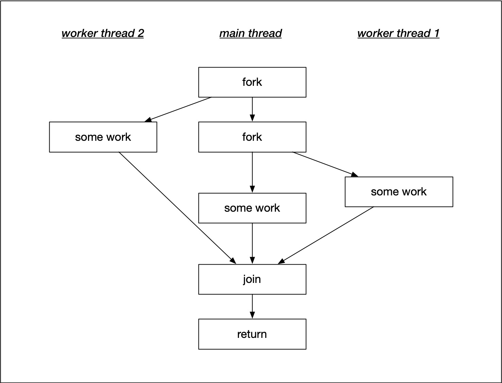

In the main thread, the program flow is forked into three parallel branches. In both worker branches, some work is performed - which is why threads are often referred to as "worker threads". Once the work is completed, the flow of execution is united again in the main function using the `join()` command. In this example, join acts as a barrier where all threads are united. The execution of main is in fact halted, until both worker threads have successfully completed their respective work.

In the following example, a number of threads is created and added to a vector. The basic idea is to loop over the vector at the end of the main function and call join on all the thread objects inside the vector.

```cpp
#include <iostream>
#include <thread>
#include <vector>

void printHello()
{
    // perform work
    std::cout << "Hello from Worker thread #" << std::this_thread::get_id() << std::endl;
}

int main()
{
    // create threads
    std::vector<std::thread> threads;
    for (size_t i = 0; i < 5; ++i)
    {
        // copying thread objects causes a compile error
        /*
        std::thread t(printHello);
        threads.push_back(t); 
        */

        // moving thread objects will work
        threads.emplace_back(std::thread(printHello));
    }

    // do something in main()
    std::cout << "Hello from Main thread #" << std::this_thread::get_id() << std::endl;

    // call join on all thread objects using a range-based loop
    for (auto &t : threads)
        t.join();

    return 0;
}
```

When we try to compile the program using the `push_back()` function (which is the usual way in most cases), we get a compiler error. The problem with our code is that by pushing the thread object into the vector, we attempt to make a copy of it. However, thread objects do not have a copy constructor and thus can not be duplicated. If this were possible, we would create yet another branch in the flow of execution - which is not what we want. The solution to this problem is to use move semantics, which provide a convenient way for the contents of objects to be 'moved' between objects, rather than copied. It might be a good idea at this point to refresh your knowledge on move semantics, on rvalues and lvalues as well as on rvalue references, as we will make use of these concepts throughout the course.

To solve our problem, we can use the function `emplace_back()` instead of `push_back()`, which internally uses move semantics to move our thread object into the vector without making a copy. When executing the code, we get the following output:

```
Hello from Worker thread #Hello from Worker thread #139881957631744
Hello from Main thread #139881966028608
Hello from Worker thread #139881932453632
Hello from Worker thread #139881949239040
139881966024448Hello from Worker thread #139881940846336
```

This is surely not how we intended the console output to look like. When we take a close look at the call to std::cout in the thread function, we can see that it actually consists of three parts: the string "Hello from worker…", the respective thread id and finally the line break at the end. In the output, all three components are completely intermingled. Also, when the program is run several times, the output will look different with each execution. This shows us two important properties of concurrent programs:

1. The order in which threads are executed is non-deterministic. Every time a program is executed, there is a chance for a completely different order of execution.
2. Threads may get preempted in the middle of execution and another thread may be selected to run.

These two properties pose a major problem with concurrent applications: A program may run correctly for thousands of times and suddenly, due to a particular interleaving of threads, there might be a problem. From a debugging perspective, such errors are very hard to detect as they can not be reproduced easily.

Let us adjust the program code from the previous example and use a Lambda instead of the function `printHello()`. Also, we will pass the loop counter i into the Lambda to enforce an individual wait time for each thread. The idea is to prevent the interleaving of text on the command line which we saw in the previous example.

```cpp
#include <iostream>
#include <thread>
#include <chrono>
#include <random>
#include <vector>

int main()
{
    // create threads
    std::vector<std::thread> threads;
    int i;
    for (i = 0; i < 10; ++i)
    {
        // create new thread from a Lambda
        threads.emplace_back([&i]() {

            // wait for certain amount of time
            std::this_thread::sleep_for(std::chrono::milliseconds(10 * i));

            // perform work
            std::cout << "Hello from Worker thread #" << i << std::endl;
        });
    }

    // do something in main()
    std::cout << "Hello from Main thread" << std::endl;

    // call join on all thread objects using a range-based loop
    for (auto &t : threads)
        t.join();

    return 0;
}
```

When executing the code however, the following output is generated on the console:

```
Hello from Main thread
Hello from Worker thread #10
Hello from Worker thread #10
Hello from Worker thread #10
Hello from Worker thread #10
Hello from Worker thread #10
Hello from Worker thread #10
Hello from Worker thread #10
Hello from Worker thread #10
Hello from Worker thread #10
Hello from Worker thread #10
```

Clearly this is not what we expected. Can you find the bug and fix the code so that each thread gets the corresponding integer ranging from 0 to 9?

Solution: i needs to be passed by value here to get thread numbers from 0-9. See below:

```cpp
#include <iostream>
#include <thread>
#include <chrono>
#include <random>
#include <vector>

int main()
{
    // create threads
    std::vector<std::thread> threads;
    for (int i = 0; i < 10; ++i)
    {
        // create new thread from a Lambda
        threads.emplace_back([i]() {

            // wait for certain amount of time
            std::this_thread::sleep_for(std::chrono::milliseconds(10 * i));

            // perform work
            std::cout << "Hello from Worker thread #" << i << std::endl;
        });
    }

    // do something in main()
    std::cout << "Hello from Main thread" << std::endl;

    // call join on all thread objects using a range-based loop
    for (auto &t : threads)
        t.join();

    return 0;
}
```

Output is:

```
Hello from Worker thread #0
Hello from Main thread
Hello from Worker thread #1
Hello from Worker thread #2
Hello from Worker thread #3
Hello from Worker thread #4
Hello from Worker thread #5
Hello from Worker thread #6
Hello from Worker thread #7
Hello from Worker thread #8
Hello from Worker thread #9
```

## Lesson 1 Exercise
See videos [here](https://youtu.be/iifZEu0ctxc) and [here](https://youtu.be/OwiKpGYN9wI).

See lesson code [here](Lesson1Exercise).

- **Task L1.1** : In the base class `TrafficObject`, set up a thread barrier in its destructor that ensures that all the thread objects in the member vector `_threads` are joined.
    
- **Task L1.2** : In the `Vehicle` class, start a thread with the member function `drive` and the object `this` as the launch parameters. Also, add the created thread into the `_thread` vector of the parent class.
    
- **Task L1.3** : Vary the number of simulated vehicles in `main` and use the top function on the terminal or the task manager of your system to observe the number of threads used by the simulation.

You can find these tasks in the `project_tasks.txt` within the workspace as well.

### Build Instructions
To compile and run the code, create a `build` directory and use `cmake` and `make` as follows:

```
root@a9ad274128c4:/home/workspace/L1_Project# mkdir build
root@a9ad274128c4:/home/workspace/L1_Project# cd build
root@a9ad274128c4:/home/workspace/L1_Project/build# cmake ..
root@a9ad274128c4:/home/workspace/L1_Project/build# make
root@a9ad274128c4:/home/workspace/L1_Project/build# ./traffic_simulation
```

# Passing Data Between Threads
## Promises and Futures
The methods for passing data to a thread we have discussed so far are both useful during thread construction: We can either pass arguments to the thread function using variadic templates or we can use a Lambda to capture arguments by value or by reference. The following example illustrates the use of these methods again:

```cpp
#include <iostream>
#include <thread>

void printMessage(std::string message)
{
    std::this_thread::sleep_for(std::chrono::milliseconds(10)); // simulate work
    std::cout << "Thread 1: " << message << std::endl;
}

int main()
{
    // define message
    std::string message = "My Message";

    // start thread using variadic templates
    std::thread t1(printMessage, message);

    // start thread using a Lambda
    std::thread t2([message] {
        std::this_thread::sleep_for(std::chrono::milliseconds(10)); // simulate work
        std::cout << "Thread 2: " << message << std::endl;
    });

    // thread barrier
    t1.join();
    t2.join();

    return 0;
}
```

Output is:

```
Thread 1: My Message
Thread 2: My Message
```

A drawback of these two approaches is that the information flows from the parent thread (`main`) to the worker threads (`t1` and `t2`). In this section, we want to look at a way to pass data in the opposite direction - that is from the worker threads back to the parent thread.

In order to achieve this, the threads need to adhere to a strict synchronization protocol. There is such a mechanism available in the C++ standard that we can use for this purpose. This mechanism acts as a single-use channel between the threads. The sending end of the channel is called "promise" while the receiving end is called "future".

In the C++ standard, the class template std::promise provides a convenient way to store a value or an exception that will be acquired asynchronously at a later time via a `std::future` object. Each `std::promise` object is meant to be used only a single time.

In the following example, we want to declare a promise which allows for transmitting a string between two threads and modifying it in the process.

```cpp
#include <iostream>
#include <thread>
#include <future>

void modifyMessage(std::promise<std::string> && prms, std::string message)
{
    std::this_thread::sleep_for(std::chrono::milliseconds(4000)); // simulate work
    std::string modifiedMessage = message + " has been modified"; 
    prms.set_value(modifiedMessage);
}

int main()
{
    // define message
    std::string messageToThread = "My Message";

    // create promise and future
    std::promise<std::string> prms;
    std::future<std::string> ftr = prms.get_future();

    // start thread and pass promise as argument
    std::thread t(modifyMessage, std::move(prms), messageToThread);

    // print original message to console
    std::cout << "Original message from main(): " << messageToThread << std::endl;

    // retrieve modified message via future and print to console
    std::string messageFromThread = ftr.get();
    std::cout << "Modified message from thread(): " << messageFromThread << std::endl;

    // thread barrier
    t.join();
    return 0;
}
```

After defining a message, we have to create a suitable promise that can take a string object. To obtain the corresponding future, we need to call the method `get_future()` on the promise. Promise and future are the two types of the communication channel we want to use to pass a string between threads. The communication channel set up in this manner can only pass a string.

We can now create a thread that takes a function and we will pass it the promise as an argument as well as the message to be modified. Promises can not be copied, because the promise-future concept is a two-point communication channel for one-time use. Therefore, we must pass the promise to the thread function using `std::move`. The thread will then, during its execution, use the promise to pass back the modified message.

The thread function takes the promise as an rvalue reference in accordance with move semantics. After waiting for several seconds, the message is modified and the method `set_value()` is called on the promise.

Back in the main thread, after starting the thread, the original message is printed to the console. Then, we start listening on the other end of the communication channel by calling the function `get()` on the future. This method will block until data is available - which happens as soon as set_value has been called on the promise (from the thread). If the result is movable (which is the case for `std::string`), it will be moved - otherwise it will be copied instead. After the data has been received (with a considerable delay), the modified message is printed to the console.

```
Original message from main(): My Message
Modified message from thread(): My Message has been modified
```

It is also possible that the worker value calls set_value on the promise before `get()` is called on the future. In this case, `get()` returns immediately without any delay. After `get()` has been called once, the future is no longer usable. This makes sense as the normal mode of data exchange between promise and future works with `std::move` - and in this case, the data is no longer available in the channel after the first call to `get()`. If `get()` is called a second time, an exception is thrown.

There are some situations where it might be interesting to separate the waiting for the content from the actual retrieving. Futures allow us to do that using the `wait()` function. This method will block until the future is ready. Once it returns, it is guaranteed that data is available and we can use `get()` to retrieve it without delay.

In addition to wait, the C++ standard also offers the method `wait_for`, which takes a time duration as an input and also waits for a result to become available. The method `wait_for()` will block either until the specified timeout duration has elapsed or the result becomes available - whichever comes first. The return value identifies the state of the result.

In the following example, please use the wait_for method to wait for the availability of a result for one second. After the time has passed (or the result is available) print the result to the console. Should the time be up without the result being available, print an error message to the console instead.

```cpp
#include <iostream>
#include <thread>
#include <future>
#include <cmath>

void computeSqrt(std::promise<double> &&prms, double input)
{
    std::this_thread::sleep_for(std::chrono::milliseconds(2000)); // simulate work
    double output = sqrt(input);
    prms.set_value(output);
}

int main()
{
    // define input data
    double inputData = 42.0;

    // create promise and future
    std::promise<double> prms;
    std::future<double> ftr = prms.get_future();

    // start thread and pass promise as argument
    std::thread t(computeSqrt, std::move(prms), inputData);

// Student task STARTS here
    // wait for result to become available
    auto status = ftr.wait_for(std::chrono::milliseconds(1000));
    if (status == std::future_status::ready) // result is ready
    {
        std::cout << "Result = " << ftr.get() << std::endl;
    }

    //  timeout has expired or function has not yet been started
    else if (status == std::future_status::timeout || status == std::future_status::deferred)
    {
        std::cout << "Result unavailable" << std::endl;
    }
// Student task ENDS here    

    // thread barrier
    t.join();

    return 0;
}
```

If the `ftr.wait_for` is set to 3000 (3 seconds), the output is:
```
Result = 6.48074
```

If `ftr.wait_for` is set to 1000 (1 second), the output is:
```
Result unavailable
```

### Passing exceptions
The future-promise communication channel may also be used for passing exceptions. To do this, the worker thread simply sets an exception rather than a value in the promise. In the parent thread, the exception is then re-thrown once `get()` is called on the future.

Let us take a look at the following example to see how this mechanism works:

```cpp
#include <iostream>
#include <thread>
#include <future>
#include <cmath>
#include <memory>

void divideByNumber(std::promise<double> &&prms, double num, double denom)
{
    std::this_thread::sleep_for(std::chrono::milliseconds(500)); // simulate work
    try
    {
        if (denom == 0)
            throw std::runtime_error("Exception from thread: Division by zero!");
        else
            prms.set_value(num / denom);
    }
    catch (...)
    {
        prms.set_exception(std::current_exception());
    }
}

int main()
{
    // create promise and future
    std::promise<double> prms;
    std::future<double> ftr = prms.get_future();

    // start thread and pass promise as argument
    double num = 42.0, denom = 0.0;
    std::thread t(divideByNumber, std::move(prms), num, denom);

    // retrieve result within try-catch-block
    try
    {
        double result = ftr.get();
        std::cout << "Result = " << result << std::endl;
    }
    catch (std::runtime_error e)
    {
        std::cout << e.what() << std::endl;
    }

    // thread barrier
    t.join();

    return 0;
}

```

In the thread function, we need to implement a try-catch block which can be set to catch a particular exception or - as in our case - to catch all exceptions. Instead of setting a value, we now want to throw a `std::exception` along with a customized error message. In the catch-block, we catch this exception and throw it to the parent thread using the promise with set_exception. The function `std::current_exception` allows us to easily retrieve the exception which has been thrown.

On the parent side, we now need to catch this exception. In order to do this, we can use a try-block around the call to `get()`. We can set the catch-block to catch all exceptions or - as in this example - we could also catch a particular one such as the standard exception. Calling the method `what()` on the exception allows us to retrieve the message from the exception - which is the one defined on the promise side of the communication channel.

When we run the program, we can see that the exception is being thrown in the worker thread with the main thread printing the corresponding error message to the console.

```
Exception from thread: Division by zero!
```

So a promise future pair can be used to pass either values or exceptions between threads.

## Threads vs Tasks
### Starting threads with async
In the last section we have seen how data can be passed from a worker thread to the parent thread using promises and futures. A disadvantage of the promise-future approach however is that it is very cumbersome (and involves a lot of boilerplate code) to pass the promise to the thread function using an rvalue reference and `std::move`. For the straight-forward task of returning data or exceptions from a worker thread to the parent thread however, there is a simpler and more convenient way using `std::async()` instead of `std::thread()`.

Let us adapt the code example from the last section to use `std::async`:

```cpp
#include <iostream>
#include <thread>
#include <future>
#include <cmath>
#include <memory>

double divideByNumber(double num, double denom)
{
	// print system id of worker thread
    std::cout << "Worker thread id = " << std::this_thread::get_id() << std::endl;
    std::this_thread::sleep_for(std::chrono::milliseconds(500)); // simulate work

    if (denom == 0)
        throw std::runtime_error("Exception from thread: Division by zero!");

    return num / denom;
}


int main()
{
	std::cout << "Main thread id = " << std::this_thread::get_id() << std::endl;
    // use async to start a task
    double num = 42.0, denom = 2.0;
    std::future<double> ftr = std::async(divideByNumber, num, denom);

    // retrieve result within try-catch-block
    try
    {
        double result = ftr.get();
        std::cout << "Result = " << result << std::endl;
    }
    catch (std::runtime_error e)
    {
        std::cout << e.what() << std::endl;
    }

    return 0;
}
```
The first change we are making is in the thread function: We are removing the promise from the argument list as well as the try-catch block. Also, the return type of the function is changed from void to double as the result of the computation will be channeled back to the main thread using a simple return. After these changes, the function has no knowledge of threads, nor of futures or promises - it is a simple function that takes two doubles as arguments and returns a double as a result. Also, it will throw an exception when a division by zero is attempted.

In the main thread, we need to replace the call to `std::thread` with `std::async`. Note that async returns a future, which we will use later in the code to retrieve the value that is returned by the function. A promise, as with `std::thread`, is no longer needed, so the code becomes much shorter. In the try-catch block, nothing has changed - we are still calling `get()` on the future in the try-block and exception-handling happens unaltered in the catch-block. Also, we do not need to call `join()` any more. With `async`, the thread destructor will be called automatically - which reduces the risk of a concurrency bug.

When we execute the code in the previous example, the output is identical to before, so we seemingly have the same functionality as before - or do we? When we use the `std::this_thread::get_id()` to print the system thread ids of the main and of the worker thread, we get the following output:

```
Main thread id =   139898290755392
Worker thread id = 139898290751232
Result = 21
```

As expected, the ids between the two threads differ from each other - they are running in parallel. However, one of the major differences between `std::thread` and `std::async` is that with the latter, the system decides wether the associated function should be run asynchronously or synchronously. By adjusting the launch parameters of `std::async` manually, we can directly influence whether the associated thread function will be executed synchronously or asynchronously.

The line:
```cpp
std::future<double> ftr = std::async(std::launch::deferred, divideByNumber, num, denom);
```

enforces the synchronous execution of `divideByNumber`, which results in the following output, where the thread ids for main and worker thread are identical.

```cpp
#include <iostream>
#include <thread>
#include <future>
#include <cmath>
#include <memory>

double divideByNumber(double num, double denom)
{
    // print system id of worker thread
    std::cout << "Worker thread id = " << std::this_thread::get_id() << std::endl;

    std::this_thread::sleep_for(std::chrono::milliseconds(500)); // simulate work

    if (denom == 0)
        throw std::runtime_error("Exception from thread#: Division by zero!");

    return num / denom;
}


int main()
{
    // print system id of worker thread
    std::cout << "Main thread id = " << std::this_thread::get_id() << std::endl;

    // use async to start a task
    double num = 42.0, denom = 2.0;
    std::future<double> ftr = std::async(std::launch::deferred, divideByNumber, num, denom);

    // retrieve result within try-catch-block
    try
    {
        double result = ftr.get();
        std::cout << "Result = " << result << std::endl;
    }
    catch (std::runtime_error e)
    {
        std::cout << e.what() << std::endl;
    }

    return 0;
}
```

```
Main thread id =   140504874387264
Worker thread id = 140504874387264
Result = 21
```

If we were to use the launch option "async" instead of "deferred", we would enforce an asynchronous execution whereas the option "any" would leave it to the system to decide - which is the default.

At this point, let us compare `std::thread` with `std::async`: Internally, `std::async` creates a promise, gets a future from it and runs a template function that takes the promise, calls our function and then either sets the value or the exception of that promise - depending on function behavior. The code used internally by `std::async` is more or less identical to the code we used in the previous example, except that this time it has been generated by the compiler and it is hidden from us - which means that the code we write appears much cleaner and leaner. Also, `std::async` makes it possible to control the amount of concurrency by passing an optional launch parameter, which enforces either synchronous or asynchronous behavior. This ability, especially when left to the system, allows us to prevent an overload of threads, which would eventually slow down the system as threads consume resources for both management and communication. If we were to use too many threads, the increased resource consumption would outweigh the advantages of parallelism and slow down the program. By leaving the decision to the system, we can ensure that the number of threads is chosen in a carefully balanced way that optimizes runtime performance by looking at the current workload of the system and the multi-core architecture of the system.

### Task based concurrency
Determining the optimal number of threads to use is a hard problem. It usually depends on the number of available cores wether it makes sense to execute code as a thread or in a sequential manner. The use of `std::async` (and thus tasks) take the burden of this decision away from the user and let the system decide wether to execute the code sequentially or as a thread. With tasks, the programmer decides what CAN be run in parallel in principle and the system then decides at runtime what WILL be run in parallel.

Internally, this is achieved by using thread-pools wich represent the number of available threads based on the cores/processors as well as by using work-stealing queues, where tasks are re-distributed among the available processors dynamically. The following diagram shows the principal of task distribution on a multi-core system using work stealing queues.


As can be seen, the first core in the example is heavily oversubscribed with several tasks that are waiting to be executed. The other cores however are running idle. The idea of a work-stealing queue is to have a watchdog program running in the background that regularly monitors the amount of work performed by each processor and redistributes it as needed. For the above example this would mean that tasks waiting for execution on the first core would be shifted (or "stolen") from busy cores and added to available free cores such that idle time is reduced. After this rearranging procedire, the task distribution in our example could look as shown in the following diagram.


A work distribution in this manner can only work, when parallelism is explicitly described in the program by the programmer. If this is not the case, work-stealing will not perform effectively.

To conclude this section, a general comparison of task-based and thread-based programming is given in the following:

With tasks, the system takes care of many details (e.g. join). With threads, the programmer is responsible for many details. As far as resources go, threads are usually more heavy-weight as they are generated by the operating system (OS). It takes time for the OS to be called and to allocate memory / stack / kernel data structures for the thread. Also, destroying the thread is expensive. Tasks on the other hand are more light-weight as they will be using a pool of already created threads (the "thread pool").

Threads and tasks are used for different problems. Threads have more to do with latency. When you have functions that can block (e.g. file input, server connection), threads can avoid the program to be blocked, when e.g. the server is waiting for a response. Tasks on the other hand focus on throughput, where many operations are executed in parallel.

### Assessing the advantage of parallel execution

In this section, we want to explore the influence of the number of threads on the performance of a program with respect to its overall runtime. The example below has a thread function called "workerThread" which contains a loop with an adjustable number of cycles in which a mathematical operation is performed.

```cpp
#include <iostream>
#include <thread>
#include <future>
#include <cmath>
#include <vector>
#include <chrono>

void workerFunction(int n)
{
    // print system id of worker thread
    std::cout << "Worker thread id = " << std::this_thread::get_id() << std::endl;

    // perform work
    for (int i = 0; i < n; ++i)
    {
        sqrt(12345.6789);
    }
}

int main()
{
    // print system id of worker thread
    std::cout << "Main thread id = " << std::this_thread::get_id() << std::endl;

    // start time measurement
    std::chrono::high_resolution_clock::time_point t1 = std::chrono::high_resolution_clock::now();
    
    // launch various tasks
    std::vector<std::future<void>> futures;
    int nLoops = 10, nThreads = 5;
    for (int i = 0; i < nThreads; ++i)
    {
        futures.emplace_back(std::async(workerFunction, nLoops));
    }

    // wait for tasks to complete
    for (const std::future<void> &ftr : futures)
        ftr.wait();

    // stop time measurement and print execution time
    std::chrono::high_resolution_clock::time_point t2 = std::chrono::high_resolution_clock::now();
    auto duration = std::chrono::duration_cast<std::chrono::microseconds>( t2 - t1 ).count();
    std::cout << "Execution finished after " << duration <<" microseconds" << std::endl;
    
    return 0;
}
```

In `main()`, a for-loop starts a configurable number of tasks that can either be executed synchronously or asynchronously. As an experiment, we will now use a number of different parameter settings to execute the program and evaluate the time it takes to finish the computations. The idea is to gauge the effect of the number of threads on the overall runtime:

1. int nLoops = 1e7 , nThreads = 4 , std::launch::async


With this set of parameters, the high workload is computed in parallel, with an overall runtime of ~45 milliseconds.

2. int nLoops = 1e7 , nThreads = 5 , std::launch::deferred

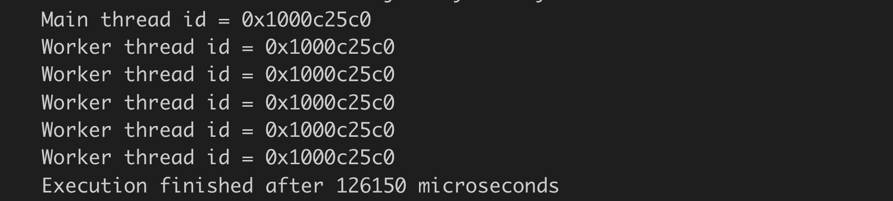

The difference to the first set of parameters is the synchronous execution of the tasks - all computations are performed sequentially - with an overall runtime of ~126 milliseconds. While impressive with regard to the achieved speed-up, the relative runtime advantage of setting 1 to this settings is at a factor of ~2.8 on a 4-core machine.

3. int nLoops = 10 , nThreads = 5 , std::launch::async

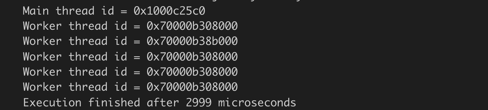

In this parameter setting, the tasks are run in parallel again but with a significantly lower number of computations: The thread function now computes only 10 square roots where with settings 1 and 2 a total of 10.000.000 square roots were computed. The overall runtime of this example therefore is significantly lower with only ~3 milliseconds.

4. int nLoops = 10 , nThreads = 5 , std::launch::deferred


In this last example, the same 10 square roots are computed sequentially. Surprising, the overall runtime is at only 0.01 milliseconds - an astounding difference to the asynchronous execution and a stark reminder that starting and managing threads takes a significant amount of time. It is therefore not a general advantage if computations are performed in parallel: It must be carefully weighed with regard to the computational effort whether parallelization makes sense.

- The concurrency abstraction level of threads is low
- The concurrency abstraction level of tasks is high
- Resource usage can be described as heavy-weight for threads and light-weight for tasks.
- Primary use-cases for threads are applications where latency needs to be improved.
- Primary use-cases for tasks are scenarios where throughput needs to be high.

## Avoiding Data Races

One of the primary sources of error in concurrent programming are data races. They occur, when two concurrent threads are accessing the same memory location while at least one of them is modifying (the other thread might be reading or modifying). In this scenario, the value at the memory location is completely undefined. Depending on the system scheduler, the second thread will be executed at an unknown point in time and thus see different data at the memory location with each execution. Depending on the type of program, the result might be anything from a crash to a security breach when data is read by a thread that was not meant to be read, such as a user password or other sensitive information. Such an error is called a "data race" because two threads are racing to get access to a memory location first, with the content at the memory location depending on the result of the race.

The following diagram illustrates the principle: One thread wants to increment a variable `x`, whereas the other thread wants to print the same variable. Depending on the timing of the program and thus the order of execution, the printed result might change each time the program is executed.


In this example, one safe way of passing data to a thread would be to carefully synchronize the two threads using either `join()` or the promise-future concept that can guarantee the availability of a result. Data races are always to be avoided. Even if nothing bad seems to happen, they are a bug and should always be treated as such. Another possible solution for the above example would be to make a copy of the original argument and pass the copy to the thread, thereby preventing the data race.

### Passing data to a thread by value

In the following example, an instance of the proprietary class `Vehicle` is created and passed to a thread by value, thus making a copy of it.

```cpp
#include <iostream>
#include <thread>
#include <future>

class Vehicle
{
public:
    //default constructor
    Vehicle() : _id(0)
    {
        std::cout << "Vehicle #" << _id << " Default constructor called" << std::endl;
    }

    //initializing constructor
    Vehicle(int id) : _id(id)
    {
        std::cout << "Vehicle #" << _id << " Initializing constructor called" << std::endl;
    }

    // setter and getter
    void setID(int id) { _id = id; }
    int getID() { return _id; }

private:
    int _id;
};

int main()
{
    // create instances of class Vehicle
    Vehicle v0; // default constructor
    Vehicle v1(1); // initializing constructor

    // read and write name in different threads (which one of the above creates a data race?)
    std::future<void> ftr = std::async([](Vehicle v) {
        std::this_thread::sleep_for(std::chrono::milliseconds(500)); // simulate work
        v.setID(2);
    }, v0);

    v0.setID(3);

    ftr.wait();
    std::cout << "Vehicle #" << v0.getID() << std::endl;

    return 0;
}
```
Note that the class Vehicle has a default constructor and an initializing constructor. In the main function, when the instances `v0` and `v1` are created, each constructor is called respectively. Note that `v0` is passed by value to a Lambda, which serves as the thread function for `std::async`. Within the Lambda, the id of the Vehicle object is changed from the default (which is 0) to a new value 2. Note that the thread execution is paused for 500 milliseconds to guarantee that the change is performed well after the main thread has proceeded with its execution.

In the `main` thread, immediately after starting up the worker thread, the id of `v0` is changed to 3. Then, after waiting for the completion of the thread, the vehicle id is printed to the console. In this program, the output will always be the following:


Passing data to a thread in this way is a clean and safe method as there is no danger of a data race - at least when atomic data types such as integers, doubles, chars or booleans are passed.

When passing a complex data structure however, there are sometimes pointer variables hidden within, that point to a (potentially) shared data buffer - which might cause a data race even though the programmer believes that the copied data will effectively preempt this. The next example illustrates this case by adding a new member variable to the `Vehicle` class, which is a pointer to a string object, as well as the corresponding getter and setter functions.

```cpp
#include <iostream>
#include <thread>
#include <future>

class Vehicle
{
public:
    //default constructor
    Vehicle() : _id(0), _name(new std::string("Default Name"))
    {
        std::cout << "Vehicle #" << _id << " Default constructor called" << std::endl;
    }

    //initializing constructor
    Vehicle(int id, std::string name) : _id(id), _name(new std::string(name))
    {
        std::cout << "Vehicle #" << _id << " Initializing constructor called" << std::endl;
    }

    // setter and getter
    void setID(int id) { _id = id; }
    int getID() { return _id; }
    void setName(std::string name) { *_name = name; }
    std::string getName() { return *_name; }

private:
    int _id;
    std::string *_name;
};

int main()
{
    // create instances of class Vehicle
    Vehicle v0;    // default constructor
    Vehicle v1(1, "Vehicle 1"); // initializing constructor

    // launch a thread that modifies the Vehicle name
    std::future<void> ftr = std::async([](Vehicle v) {
        std::this_thread::sleep_for(std::chrono::milliseconds(500)); // simulate work
        v.setName("Vehicle 2");
    },v0);

    v0.setName("Vehicle 3");

    ftr.wait();
    std::cout << v0.getName() << std::endl;

    return 0;
}
```

The output of the program looks like this:


The basic program structure is mostly identical to the previous example with the object `v0` being copied by value when passed to the thread function. This time however, even though a copy has been made, the original object `v0` is modified, when the thread function sets the new name. This happens because the member `_name` is a pointer to a string and after copying, even though the pointer variable has been duplicated, it still points to the same location as its value (i.e. the memory location) has not changed. Note that when the delay is removed in the thread function, the console output varies between "Vehicle 2" and "Vehicle 3", depending on the system scheduler. Such an error might go unnoticed for a long time. It could show itself well after a program has been shipped to the client - which is what makes this error type so treacherous.

Classes from the standard template library usually implement a deep copy behavior by default (such as `std::vector`). When dealing with proprietary data types, this is not guaranteed. The only safe way to tell whether a data structure can be safely passed is by looking at its implementation: Does it contain only atomic data types or are there pointers somewhere? If this is the case, does the data structure implement the copy constructor (and the assignment operator) correctly? Also, if the data structure under scrutiny contains sub-objects, their respective implementation has to be analyzed as well to ensure that deep copies are made everywhere.

Unfortunately, one of the primary concepts of object-oriented programming - information hiding - often prevents us from looking at the implementation details of a class - we can only see the interface, which does not tell us what we need to know to make sure that an object of the class may be safely passed by value.

### Overwriting the copy constructor
The problem with passing a proprietary class is that the standard copy constructor makes a 1:1 copy of all data members, including pointers to objects. This behavior is also referred to as "shallow copy". In the above example we would have liked (and maybe expected) a "deep copy" of the object though, i.e. a copy of the data to which the pointer refers. A solution to this problem is to create a proprietary copy constructor in the class `Vehicle`. The following piece of code overwrites the default copy constructor and can be modified to make a customized copy of the data members.

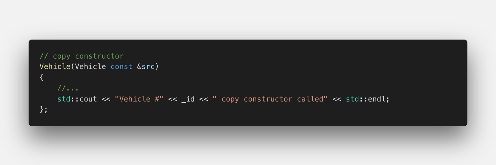

Expanding on the code example from above, please implement the code required for a deep copy so that the program always prints "Vehicle 3" to the console, regardless of the delay within the thread function.

```cpp
#include <iostream>
#include <thread>
#include <future>

class Vehicle
{
public:
    //default constructor
    Vehicle() : _id(0), _name(new std::string("Default Name"))
    {
        std::cout << "Vehicle #" << _id << " Default constructor called" << std::endl;
    }

    //initializing constructor
    Vehicle(int id, std::string name) : _id(id), _name(new std::string(name))
    {
        std::cout << "Vehicle #" << _id << " Initializing constructor called" << std::endl;
    }

    // copy constructor 
    Vehicle(Vehicle const &src)
    {
        // QUIZ: Student code STARTS here
        _id = src._id;
        if (src._name != nullptr)
        {
            _name = new std::string;
            *_name = *src._name;
        }
        // QUIZ: Student code ENDS here
        std::cout << "Vehicle #" << _id << " copy constructor called" << std::endl;
    }

    // setter and getter
    void setID(int id) { _id = id; }
    int getID() { return _id; }
    void setName(std::string name) { *_name = name; }
    std::string getName() { return *_name; }

private:
    int _id;
    std::string *_name;
};

int main()
{
    // create instances of class Vehicle
    Vehicle v0;    // default constructor
    Vehicle v1(1, "Vehicle 1"); // initializing constructor

    // launch a thread that modifies the Vehicle name
    std::future<void> ftr = std::async([](Vehicle v) {
        std::this_thread::sleep_for(std::chrono::milliseconds(500)); // simulate work
        v.setName("Vehicle 2");
    },v0);

    v0.setName("Vehicle 3");

    ftr.wait();
    std::cout << v0.getName() << std::endl;

    return 0;
}
```

### Passing data using move semantics
Even though a customized copy constructor can help us to avoid data races, it is also time (and memory) consuming. In the following, we will use move semantics to implement a more effective way of safely passing data to a thread.

A move constructor enables the resources owned by an rvalue object to be moved into an lvalue without physically copying it. Rvalue references support the implementation of move semantics, which enables the programmer to write code that transfers resources (such as dynamically allocated memory) from one object to another.

To make use of move semantics, we need to provide a move constructor (and optionally a move assignment operator). Copy and assignment operations whose sources are rvalues automatically take advantage of move semantics. Unlike the default copy constructor however, the compiler does not provide a default move constructor.

To define a move constructor for a C++ class, the following steps are required:

1. Define an empty constructor method that takes an rvalue reference to the class type as its parameter


2. In the move constructor, assign the class data members from the source object to the object that is being constructed


3. Assign the data members of the source object to default values.


When launching the thread, the Vehicle object `v0` can be passed using `std::move()` - which calls the move constructor and invalidates the original object `v0` in the main thread.

```cpp
#include <iostream>
#include <thread>
#include <future>

class Vehicle
{
public:
    //default constructor
    Vehicle() : _id(0), _name(new std::string("Default Name"))
    {
        std::cout << "Vehicle #" << _id << " Default constructor called" << std::endl;
    }

    //initializing constructor
    Vehicle(int id, std::string name) : _id(id), _name(new std::string(name))
    {
        std::cout << "Vehicle #" << _id << " Initializing constructor called" << std::endl;
    }

    // copy constructor 
    Vehicle(Vehicle const &src)
    {
        //...
        std::cout << "Vehicle #" << _id << " copy constructor called" << std::endl;
    };

    // move constructor 
    Vehicle(Vehicle && src)
    {
        _id = src.getID();
        _name = new std::string(src.getName());

        src.setID(0);
        src.setName("Default Name");

        std::cout << "Vehicle #" << _id << " move constructor called" << std::endl;
    };

    // setter and getter
    void setID(int id) { _id = id; }
    int getID() { return _id; }
    void setName(std::string name) { *_name = name; }
    std::string getName() { return *_name; }

private:
    int _id;
    std::string *_name;
};

int main()
{
    // create instances of class Vehicle
    Vehicle v0;    // default constructor
    Vehicle v1(1, "Vehicle 1"); // initializing constructor

    // launch a thread that modifies the Vehicle name
    std::future<void> ftr = std::async([](Vehicle v) {
        v.setName("Vehicle 2");
    },std::move(v0));

    ftr.wait();
    std::cout << v0.getName() << std::endl;

    return 0;
}
```

As with the above-mentioned copy constructor, passing by value is usually safe - provided that a deep copy is made of all the data structures within the object that is to be passed. With move semantics , we can additionally use the notion of uniqueness to prevent data races by default. In the following example, a `unique_pointer` instead of a raw pointer is used for the string member in the Vehicle class.

```cpp
#include <iostream>
#include <thread>
#include <future>
#include <memory>

class Vehicle
{
public:
    //default constructor
    Vehicle() : _id(0), _name(new std::string("Default Name"))
    {
        std::cout << "Vehicle #" << _id << " Default constructor called" << std::endl;
    }

    //initializing constructor
    Vehicle(int id, std::string name) : _id(id), _name(new std::string(name))
    {
        std::cout << "Vehicle #" << _id << " Initializing constructor called" << std::endl;
    }

    // move constructor with unique pointer
    Vehicle(Vehicle && src) : _name(std::move(src._name))
    {
        // move id to this and reset id in source
        _id = src.getID();
        src.setID(0);

        std::cout << "Vehicle #" << _id << " move constructor called" << std::endl;
    };

    // setter and getter
    void setID(int id) { _id = id; }
    int getID() { return _id; }
    void setName(std::string name) { *_name = name; }
    std::string getName() { return *_name; }

private:
    int _id;
    std::unique_ptr<std::string> _name;
};


int main()
{
    // create instances of class Vehicle
    Vehicle v0;    // default constructor
    Vehicle v1(1, "Vehicle 1"); // initializing constructor

    // launch a thread that modifies the Vehicle name
    std::future<void> ftr = std::async([](Vehicle v) {
        v.setName("Vehicle 2");
    },std::move(v0));

    ftr.wait();
    std::cout << v0.getName() << std::endl; // this will now cause an exception

    return 0;
}
```

As can be seen, the `std::string` has now been changed to a unique pointer, which means that only a single reference to the memory location it points to is allowed. Accordingly, the move constructor transfers the unique pointer to the worker by using `std::move` and thus invalidates the pointer in the `main` thread. When calling `v0.getName()`, an exception is thrown, making it clear to the programmer that accessing the data at this point is not permissible - which is the whole point of using a unique pointer here as a data race will now be effectively prevented.

The point of this example has been to illustrate that move semantics on its own is not enough to avoid data races. The key to thread safety is to use move semantics in conjunction with uniqueness. It is the responsibility of the programmer to ensure that pointers to objects that are moved between threads are unique.

## Lesson 2 Exercise

See videos [here](https://youtu.be/hYQus_Yieu4) and [here](https://youtu.be/1rcgMOF996k).

See lesson code [here](Lesson2Exercise).

- **Task L2.1** : In method Vehicle::drive(), start up a task using std::async which takes a reference to the method Intersection::addVehicleToQueue, the object _currDestination and a shared pointer to this using the get_shared_this() function. Then, wait for the data to be available before proceeding to slow down.
    
- **Task L2.2** : In method Intersection::addVehicleToQueue(), add the new vehicle to the waiting line by creating a promise, a corresponding future and then adding both to _waitingVehicles. Then wait until the vehicle has been granted entry.
    
- **Task L2.3** : In method WaitingVehicles::permitEntryToFirstInQueue(), get the entries from the front of _promises and _vehicles. Then, fulfill promise and send signal back that permission to enter has been granted. Finally, remove the front elements from both queues.
    
**Note:** To compile and run this code, you can use the same steps as the previous lesson exercise.

### Build Instructions
To compile and run the code, create a `build` directory and use `cmake` and `make` as follows:

```
root@a9ad274128c4:/home/workspace/L2_Project# mkdir build
root@a9ad274128c4:/home/workspace/L2_Project# cd build
root@a9ad274128c4:/home/workspace/L2_Project/build# cmake ..
root@a9ad274128c4:/home/workspace/L2_Project/build# make
root@a9ad274128c4:/home/workspace/L2_Project/build# ./traffic_simulation
```

# Mutexes and Locks
## Using a Mutex to Protect Shared Data
Until now, the methods we have used to pass data between threads were short-term and involved passing an argument (the promise) from a parent thread to a worker thread and then passing a result back to the parent thread (via the future) once it has become available. The promise-future construct is a non-permanent communication channel for one-time usage.

We have seen that in order to avoid data races, we need to either forego accessing shared data or use it in read-only access without mutating the data. In this chapter, we want to look at a way to establish a stable long-term communication channel that allows for both sharing and mutation. Ideally, we would like to have a communication protocol that corresponds to voice communication over a radio channel, where the transmitter uses the expression "over" to indicate the end of the transmission to the receiver. By using such a protocol, sender and receiver can take turns in transmitting their data. In C++, this concept of taking turns can be constructed by an entity called a "mutex" - which stands for MUtual EXclusion.

Recall that a data race requires simultaneous access from two threads. If we can guarantee that only a single thread at a time can access a particular memory location, data races would not occur. In order for this to work, we would need to establish a communication protocol. It is important to note that a mutex is not the solution to the data race problem per se but merely an enabler for a thread-safe communication protocol that has to be implemented and adhered to by the programmer.


Let us take a look at how this protocol works: Assuming we have a piece of memory (e.g. a shared variable) that we want to protect from simultaneous access, we can assign a mutex to be the guardian of this particular memory. It is important to understand that a mutex is bound to the memory it protects. A thread 1 who wants to access the protected memory must "lock" the mutex first. After thread 1 is "under the lock", a thread 2 is blocked from access to the shared variable, it can not acquire the lock on the mutex and is temporarily suspended by the system.

Once the reading or writing operation of thread 1 is complete, it must "unlock" the mutex so that thread 2 can access the memory location. Often, the code which is executed "under the lock" is referred to as a "critical section". It is important to note that also read-only access to the shared memory has to lock the mutex to prevent a data race - which would happen when another thread, who might be under the lock at that time, were to modify the data.

When several threads were to try to acquire and lock the mutex, only one of them would be successful. All other threads would automatically be put on hold - just as cars waiting at an intersection for a green light (see the final project of this course). Once the thread who has succeeded in acquiring the lock had finished its job and unlocked the mutex, a queued thread waiting for access would be woken up and allowed to lock the mutex to proceed with his read / write operation. If all threads were to follow this protocol, a data race would effectively be avoided. Before we take a closer look at such a protocol, let us analyze a code example next.

```cpp
#include <iostream>
#include <thread>
#include <vector>
#include <future>
#include<algorithm>

class Vehicle
{
public:
    Vehicle(int id) : _id(id) {}

private:
    int _id;
};

class WaitingVehicles
{
public:
    WaitingVehicles() : _tmpVehicles(0) {}

    // getters / setters
    void printSize()
    {
        std::cout << "#vehicles = " << _tmpVehicles << std::endl;
    }

    // typical behaviour methods
    void pushBack(Vehicle &&v)
    {
        //_vehicles.push_back(std::move(v)); // data race would cause an exception
        int oldNum = _tmpVehicles;
        std::this_thread::sleep_for(std::chrono::microseconds(1)); // wait deliberately to expose the data race
        _tmpVehicles = oldNum + 1;
    }

private:
    std::vector<Vehicle> _vehicles; // list of all vehicles waiting to enter this intersection
    int _tmpVehicles; 
};

int main()
{
    std::shared_ptr<WaitingVehicles> queue(new WaitingVehicles); 
    std::vector<std::future<void>> futures;
    for (int i = 0; i < 1000; ++i)
    {
        Vehicle v(i);
        futures.emplace_back(std::async(std::launch::async, &WaitingVehicles::pushBack, queue, std::move(v)));
    }

    std::for_each(futures.begin(), futures.end(), [](std::future<void> &ftr) {
        ftr.wait();
    });

    queue->printSize();

    return 0;
}
```

This code builds on some of the classes we have seen in the previous lesson project - the concurrent traffic simulation. There is a class Vehicle that has a single data member (`int _id`). Also, there is a class WaitingVehicles, which is supposed to store a number of vehicles in an internal vector. Note that contrary to the lesson project, a vehicle is moved into the vector using an rvalue reference. Also note that the push_back function is commented out here. The reason for this is that we are trying to provoke a data race - leaving push_back active would cause the program to crash (we will comment it in later). This is also the reason why there is an auxiliary member `_tmpVehicles`, which will be used to count the number of Vehicles added via calls to `pushBack()`. This temporary variable will help us expose the data race without crashing the program.

In `main()`, a for-loop is used to launch a large number of tasks who all try to add a newly created Vehicle to the queue. Running the program synchronously with launch option `std::launch::deferred` generates the following output on the console:


Just as one would have expected, each task inserted an element into the queue with the total number of vehicles amounting to 1000.

Now let us enforce a concurrent behavior and change the launch option to `std::launch::async`. This generates the following output (with different results each time):


It seems that not all the vehicles could be added to the queue. But why is that? Note that in the thread function "pushBack" there is a call to `sleep_for`, which pauses the thread execution for a short time. This is the position where the data race occurs: First, the current value of `_tmpVehicles` is stored in a temporary variable `oldNum`. While the thread is paused, there might (and will) be changes to `_tmpVehicles` performed by other threads. When the execution resumes, the former value of `_tmpVehicles` is written back, thus invalidating the contribution of all the threads who had write access in the mean time. Interestingly, when `sleep_for` is commented out, the output of the program is the same as with `std::launch::deferred` - at least that will be the case for most of the time when we run the program. But once in a while, there might be a scheduling constellation which causes the bug to expose itself. Apart from understanding the data race, you should take as an advice that introducing deliberate time delays in the testing / debugging phase of development can help expose many concurrency bugs.

In its simplest form, using a mutex consists of four straight-forward steps:

1. Include the `<mutex>` header
2. Create an `std::mutex`
3. Lock the mutex using `lock()` before read/write is called
4. Unlock the mutex after the read/write operation is finished using `unlock()`

In order to protect the access to `_vehicles` from being manipulated by several threads at once, a mutex has been added to the class as a private data member. In the `pushBack` function, the mutex is locked before a new element is added to the vector and unlocked after the operation is complete.

Note that the mutex is also locked in the function printSize just before printing the size of the vector. The reason for this lock is two-fold: First, we want to prevent a data race that would occur when a read-access to the vector and a simultaneous write access (even when under the lock) would occur. And second, we want to exclusively reserve the standard output to the console for printing the vector size without other threads printing to it at the same time.

When this code is executed, 1000 elements will be in the vector. By using a mutex to our shared resource, a data race has been effectively avoided.

```cpp
#include <iostream>
#include <thread>
#include <vector>
#include <future>
#include <mutex>
#include<algorithm>

class Vehicle
{
public:
    Vehicle(int id) : _id(id) {}

private:
    int _id;
};

class WaitingVehicles
{
public:
    WaitingVehicles() {}

    // getters / setters
    void printSize()
    {
        _mutex.lock();
        std::cout << "#vehicles = " << _vehicles.size() << std::endl;
        _mutex.unlock();
    }

    // typical behaviour methods
    void pushBack(Vehicle &&v)
    {
        _mutex.lock();
        _vehicles.emplace_back(std::move(v)); // data race would cause an exception
        _mutex.unlock();
    }

private:
    std::vector<Vehicle> _vehicles; // list of all vehicles waiting to enter this intersection
    std::mutex _mutex;
};

int main()
{
    std::shared_ptr<WaitingVehicles> queue(new WaitingVehicles); 
    std::vector<std::future<void>> futures;
    for (int i = 0; i < 1000; ++i)
    {
        Vehicle v(i);
        futures.emplace_back(std::async(std::launch::async, &WaitingVehicles::pushBack, queue, std::move(v)));
    }

    std::for_each(futures.begin(), futures.end(), [](std::future<void> &ftr) {
        ftr.wait();
    });

    queue->printSize();

    return 0;
}

```

## Using timed_mutex

In the following, a short overview of the different available mutex types is given:

- `mutex`: provides the core functions lock() and unlock() and the non-blocking try_lock() method that returns if the mutex is not available.
- `recursive_mutex`: allows multiple acquisitions of the mutex from the same thread.
- `timed_mutex`: similar to mutex, but it comes with two more methods try_lock_for() and try_lock_until() that try to acquire the mutex for a period of time or until a moment in time is reached.
- `recursive_timed_mutex`: is a combination of timed_mutex and recursive_mutex.

## Exercise

Please adapt the code from the previous example (example_2.cpp) in a way that a `timed_mutex` is used. Also, in the function pushBack, please use the method `try_lock_for` instead of lock, which should be executed until a maximum number of attempts is reached (e.g. 3 times) or until it succeeds. When an attempt fails, you should print an error message to the console that also contains the respective vehicle id and then put the thread to sleep for an amount of time before the next attempt is trief. Also, to expose the timing issues in this example, please introduce a call to sleep_for with a delay of several milliseconds before releasing the lock on the mutex. When done, experiment with the timing parameters to see how many vehicles will be added to the vector in the end.

```cpp
#include <iostream>
#include <thread>
#include <vector>
#include <future>
#include <mutex>
#include <algorithm>

class Vehicle
{
public:
    Vehicle(int id) : _id(id) {}
    int getID() { return _id; }

private:
    int _id;
};

class WaitingVehicles
{
public:
    WaitingVehicles() {}

    // getters / setters
    void printSize()
    {
        _mutex.lock();
        std::cout << "#vehicles = " << _vehicles.size() << std::endl;
        _mutex.unlock();
    }

    // typical behaviour methods
    void pushBack(Vehicle &&v)
    {
        for (size_t i = 0; i < 3; ++i)
        {
            if (_mutex.try_lock_for(std::chrono::milliseconds(100)))
            {
                _vehicles.emplace_back(std::move(v));
                std::this_thread::sleep_for(std::chrono::milliseconds(10));
                _mutex.unlock();
                break;
            }
            else
            {
                std::cout << "Error! Vehicle #" << v.getID() << " could not be added to the vector" << std::endl;
                std::this_thread::sleep_for(std::chrono::milliseconds(100));
            }
        }
    }

private:
    std::vector<Vehicle> _vehicles; // list of all vehicles waiting to enter this intersection
    std::timed_mutex _mutex;
};

int main()
{
    std::shared_ptr<WaitingVehicles> queue(new WaitingVehicles);
    std::vector<std::future<void>> futures;
    for (int i = 0; i < 1000; ++i)
    {
        Vehicle v(i);
        futures.emplace_back(std::async(std::launch::async, &WaitingVehicles::pushBack, queue, std::move(v)));
    }

    std::for_each(futures.begin(), futures.end(), [](std::future<void> &ftr) {
        ftr.wait();
    });

    queue->printSize();

    return 0;
}
```

## Deadlock
Using mutexes can significantly reduce the risk of data races as seen in the example above. But imagine what would happen if an exception was thrown while executing code in the critical section, i.e. between lock and unlock. In such a case, the mutex would remain locked indefinitely and no other thread could unlock it - the program would most likely freeze.

Let us take a look at the following code example, which performs a division of numbers:

```cpp
#include <iostream>
#include <thread>
#include <vector>
#include <future>
#include<algorithm>

double result;

void printResult(int denom)
{
    std::cout << "for denom = " << denom << ", the result is " << result << std::endl;
}

void divideByNumber(double num, double denom)
{
    try
    {
        // divide num by denom but throw an exception if division by zero is attempted
        if (denom != 0) 
        {
            result = num / denom;
            std::this_thread::sleep_for(std::chrono::milliseconds(1)); 
            printResult(denom);
        }
        else
        {
            throw std::invalid_argument("Exception from thread: Division by zero!");
        }
    }
    catch (const std::invalid_argument &e)
    {
        // notify the user about the exception and return
        std::cout << e.what() << std::endl;
        return; 
    }
}

int main()
{
    // create a number of threads which execute the function "divideByNumber" with varying parameters
    std::vector<std::future<void>> futures;
    for (double i = -5; i <= +5; ++i)
    {
        futures.emplace_back(std::async(std::launch::async, divideByNumber, 50.0, i));
    }

    // wait for the results
    std::for_each(futures.begin(), futures.end(), [](std::future<void> &ftr) {
        ftr.wait();
    });

    return 0;
}
```

In this example, a number of tasks is started up in `main()` with the method `divideByNumber` as the thread function. Each task is given a different denominator and within divideByNumber a check is performed to avoid a division by zero. If denom should be zero, an exception is thrown. In the catch-block, the exception is caught, printed to the console and then the function returns immediately. The output of the program changes with each execution and might look like this:

```
Exception from thread: Division by zero!
for denom = -5, the result is for denom = -4, the result is 10
for denom = 10-3
, the result is 10
for denom = -2, the result is for denom = -1, the result is 10
10
for denom = 1, the result is for denom = 2, the result is 10
10
for denom = 3, the result is 10
for denom = 4, the result is 10
for denom = 5, the result is 10
```

As can easily be seen, the console output is totally mixed up and some results appear multiple times. There are several issues with this program, so let us look at them in turn:

1. First, the thread function writes its result to a global variable which is passed to it by reference. This will cause a data race as illustrated in the last section. The `sleep_for` function exposes the data race clearly.
2. Second, the result is printed to the console by several threads at the same time, causing the chaotic output.

## Exercise

As we have seen already, using a mutex can protect shared resources. So please modify the code in a way that both the console as well as the shared global variable `result` are properly protected.

```cpp
#include <iostream>
#include <thread>
#include <vector>
#include <future>
#include <mutex>
#include <algorithm>

std::mutex mtx;
double result;

void printResult(int denom)
{
    std::cout << "for denom = " << denom << ", the result is " << result << std::endl;
}

void divideByNumber(double num, double denom)
{
    mtx.lock();
    try
    {
        // divide num by denom but throw an exception if division by zero is attempted
        if (denom != 0) 
        {
            result = num / denom;
            std::this_thread::sleep_for(std::chrono::milliseconds(1)); 
            printResult(denom);
        }
        else
        {
            throw std::invalid_argument("Exception from thread: Division by zero!");
        }
    }
    catch (const std::invalid_argument &e)
    {
        // notify the user about the exception and return
        std::cout << e.what() << std::endl;
        return; 
    }
    mtx.unlock();
}

int main()
{
    // create a number of threads which execute the function "divideByNumber" with varying parameters
    std::vector<std::future<void>> futures;
    for (double i = -5; i <= +5; ++i)
    {
        futures.emplace_back(std::async(std::launch::async, divideByNumber, 50.0, i));
    }

    // wait for the results
    std::for_each(futures.begin(), futures.end(), [](std::future<void> &ftr) {
        ftr.wait();
    });

    return 0;
}
```

Output freezes as the mutex is never unlocked when the exception is thrown:
```
for denom = -5, the result is -10
for denom = -4, the result is -12.5
for denom = -3, the result is -16.6667
for denom = -2, the result is -25
for denom = -1, the result is -50
Exception from thread: Division by zero!
^C
```
The problem you have just seen is one type of deadlock, which causes a program to freeze because one thread does not release the lock on the mutex while all other threads are waiting for access indefinitely. Let us now look at another type.

A second type of deadlock is a state in which two or more threads are blocked because each thread waits for the resource of the other thread to be released before releasing its resource. The result of the deadlock is a complete standstill. The thread and therefore usually the whole program is blocked forever. The following code illustrates the problem:

```cpp
#include <iostream>
#include <thread>
#include <mutex>
 
std::mutex mutex1, mutex2;
 
void ThreadA()
{
    // Creates deadlock problem
    mutex2.lock();
    std::cout << "Thread A" << std::endl;
    mutex1.lock();
    mutex2.unlock();
    mutex1.unlock();
}
 
void ThreadB()
{
    // Creates deadlock problem
    mutex1.lock();
    std::cout << "Thread B" << std::endl;
    mutex2.lock();
    mutex1.unlock();
    mutex2.unlock();
}
 
void ExecuteThreads()
{
    std::thread t1( ThreadA );
    std::thread t2( ThreadB );
 
    t1.join();
    t2.join();
 
    std::cout << "Finished" << std::endl;
}
 
int main()
{
    ExecuteThreads();
 
    return 0;
}
```

Output freezes again and looks like the following:

```
Thread A
Thread B
^C
```

Notice that it does not print the "Finished" statement nor does it return - the program is in a deadlock, which it can never leave.

Let us take a closer look at this problem:

`ThreadA` and `ThreadB` both require access to the console. Unfortunately, they request this resource which is protected by two mutexes in different order. If the two threads work interlocked so that first `ThreadA` locks mutex 1, then `ThreadB` locks mutex 2, the program is in a deadlock: Each thread tries to lock the other mutex and needs to wait for its release, which never comes. The following figure illustrates the problem graphically.


One way to avoid such a deadlock would be to number all resources and require that processes request resources only in strictly increasing (or decreasing) order. Please try to manually rearrange the locks and unlocks in a way that the deadlock does not occur and the following text is printed to the console:

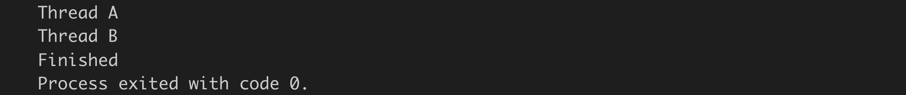

```cpp
#include <iostream>
#include <thread>
#include <mutex>

std::mutex mutex1, mutex2;

void ThreadA()
{
    // Solves deadlock problem
    mutex1.lock();
    std::cout << "Thread A" << std::endl;
    mutex2.lock();
    mutex2.unlock();
    mutex1.unlock();
}

void ThreadB()
{
    // Solves deadlock problem
    mutex1.lock();
    std::cout << "Thread B" << std::endl;
    mutex2.lock();
    mutex1.unlock();
    mutex2.unlock();
}

void ExecuteThreads()
{
    std::thread t1( ThreadA );
    std::thread t2( ThreadB );

    t1.join();
    t2.join();

    std::cout << "Finished" << std::endl;
}

int main()
{
    ExecuteThreads();

    return 0;
}
```

As you have seen, avoiding such a deadlock is possible but requires time and a great deal of experience. In the next section, we will look at ways to avoid deadlocks - both of this type as well as the previous type, where a call to unlock the mutex had not been issued.

## Using locks to avoid deadlocks

### Lock Guard

In the previous example, we have directly called the `lock()` and `unlock()` functions of a mutex. The idea of "working under the lock" is to block unwanted access by other threads to the same resource. Only the thread which acquired the lock can unlock the mutex and give all remaining threads the chance to acquire the lock. In practice however, direct calls to `lock()` should be avoided at all cost! Imagine that while working under the lock, a thread would throw an exception and exit the critical section without calling the unlock function on the mutex. In such a situation, the program would most likely freeze as no other thread could acquire the mutex any more. This is exactly what we have seen in the function `divideByNumber` from the previous example.

We can avoid this problem by creating a `std::lock_guard` object, which keeps an associated mutex locked during the entire object life time. The lock is acquired on construction and released automatically on destruction. This makes it impossible to forget unlocking a critical section. Also, `std::lock_guard` guarantees exception safety because any critical section is automatically unlocked when an exception is thrown. In our previous example, we can simply replace `_mutex.lock()` and `_mutex.unlock()` with the following code:

```cpp
#include <iostream>
#include <thread>
#include <vector>
#include <future>
#include <mutex>
#include<algorithm>

std::mutex mtx;
double result;

void printResult(int denom)
{
    std::cout << "for denom = " << denom << ", the result is " << result << std::endl;
}

void divideByNumber(double num, double denom)
{
    try
    {
        // divide num by denom but throw an exception if division by zero is attempted
        if (denom != 0) 
        {
            std::lock_guard<std::mutex> lck(mtx);
            
            result = num / denom;
            std::this_thread::sleep_for(std::chrono::milliseconds(1)); 
            printResult(denom);
        }
        else
        {
            throw std::invalid_argument("Exception from thread: Division by zero!");
        }
    }
    catch (const std::invalid_argument &e)
    {
        // notify the user about the exception and return
        std::cout << e.what() << std::endl;
        return; 
    }
}

int main()
{
    // create a number of threads which execute the function "divideByNumber" with varying parameters
    std::vector<std::future<void>> futures;
    for (double i = -5; i <= +5; ++i)
    {
        futures.emplace_back(std::async(std::launch::async, divideByNumber, 50.0, i));
    }

    // wait for the results
    std::for_each(futures.begin(), futures.end(), [](std::future<void> &ftr) {
        ftr.wait();
    });

    return 0;
}
```

Note that there is no direct call to lock or unlock the mutex anymore. We now have a std::lock_guard object that takes the mutex as an argument and locks it at creation. When the method divideByNumber exits, the mutex is automatically unlocked by the std::lock_guard object as soon as it is destroyed - which happens, when the local variable gets out of scope.

### Unique Lock
The problem with the previous example is that we can only lock the mutex once and the only way to control lock and unlock is by invalidating the scope of the std::lock_guard object. But what if we wanted (or needed) a finer control of the locking mechanism?

A more flexible alternative to std::lock_guard is _unique_lock_, that also provides support for more advanced mechanisms, such as deferred locking, time locking, recursive locking, transfer of lock ownership and use of condition variables (which we will discuss later). It behaves similar to lock_guard but provides much more flexibility, especially with regard to the timing behavior of the locking mechanism.

Let us take a look at an adapted version of the code from the previous section above:
```cpp
#include <iostream>
#include <thread>
#include <vector>
#include <future>
#include <mutex>
#include<algorithm>

std::mutex mtx;
double result;

void printResult(int denom)
{
    std::cout << "for denom = " << denom << ", the result is " << result << std::endl;
}

void divideByNumber(double num, double denom)
{
    std::unique_lock<std::mutex> lck(mtx);
    try
    {
        // divide num by denom but throw an exception if division by zero is attempted
        if (denom != 0) 
        {   
            result = num / denom;
            std::this_thread::sleep_for(std::chrono::milliseconds(100)); 
            printResult(denom);
            lck.unlock();

            // do something outside of the lock
            std::this_thread::sleep_for(std::chrono::milliseconds(100)); 

            lck.lock(); 
            // do someting else under the lock
            std::this_thread::sleep_for(std::chrono::milliseconds(100)); 
        }
        else
        {
            throw std::invalid_argument("Exception from thread: Division by zero!");
        }
    }
    catch (const std::invalid_argument &e)
    {
        // notify the user about the exception and return
        std::cout << e.what() << std::endl;
        return; 
    }
}

int main()
{
    // create a number of threads which execute the function "divideByNumber" with varying parameters
    std::vector<std::future<void>> futures;
    for (double i = -5; i <= +5; ++i)
    {
        futures.emplace_back(std::async(std::launch::async, divideByNumber, 50.0, i));
    }

    // wait for the results
    std::for_each(futures.begin(), futures.end(), [](std::future<void> &ftr) {
        ftr.wait();
    });

    return 0;
}
```
In this version of the code, `std::lock_guard` has been replaced with `std::unique_lock`. As before, the lock object `lck` will unlock the mutex in its destructor, i.e. when the function `divideByNumber` returns and `lck` gets out of scope. In addition to this automatic unlocking, `std::unique_lock` offers the additional flexibility to engage and disengage the lock as needed by manually calling the methods `lock()` and `unlock()`. This ability can greatly improve the performance of a concurrent program, especially when many threads are waiting for access to a locked resource. In the example, the lock is released before some non-critical work is performed (simulated by `sleep_for`) and re-engaged before some other work is performed in the critical section and thus under the lock again at the end of the function. This is particularly useful for optimizing performance and responsiveness when a significant amount of time passes between two accesses to a critical resource.

The main advantages of using `std::unique_lock<>` over `std::lock_guard` are briefly summarized in the following. Using `std::unique_lock` allows you to…

1. …construct an instance without an associated mutex using the default constructor
2. …construct an instance with an associated mutex while leaving the mutex unlocked at first using the deferred-locking constructor
3. …construct an instance that tries to lock a mutex, but leaves it unlocked if the lock failed using the try-lock constructor
4. …construct an instance that tries to acquire a lock for either a specified time period or until a specified point in time

Despite the advantages of `std::unique_lock<>` and `std::lock_guard` over accessing the mutex directly, however, the deadlock situation where two mutexes are accessed simultaneously (see the last section) will still occur.

### Avoiding deadlocks with std lock
In most cases, your code should only hold one lock on a mutex at a time. Occasionally you can nest your locks, for example by calling a subsystem that protects its internal data with a mutex while holding a lock on another mutex, but it is generally better to avoid locks on multiple mutexes at the same time, if possible. Sometimes, however, it is necessary to hold a lock on more than one mutex because you need to perform an operation on two different data elements, each protected by its own mutex.

In the last section, we have seen that using several mutexes at once can lead to a deadlock, if the order of locking them is not carefully managed. To avoid this problem, the system must be told that both mutexes should be locked at the same time, so that one of the threads takes over both locks and blocking is avoided. That's what the `std::lock()` function is for - you provide a set of `lock_guard` or `unique_lock` objects and the system ensures that they are all locked when the function returns.

In the following example, which is a version of the code we saw in the last section were `std::mutex` has been replaced with `std::lock_guard`.

```cpp
#include <iostream>
#include <thread>
#include <mutex>
 
std::mutex mutex1, mutex2;
 
void ThreadA()
{
    // Creates deadlock problem
    std::lock_guard<std::mutex> lock2(mutex2);
    std::cout << "Thread A" << std::endl;
    std::lock_guard<std::mutex> lock1(mutex1);
    
}
 
void ThreadB()
{
    // Creates deadlock problem
    std::lock_guard<std::mutex> lock1(mutex1);
    std::cout << "Thread B" << std::endl;
    std::lock_guard<std::mutex> lock2(mutex2);
}
 
void ExecuteThreads()
{
    std::thread t1( ThreadA );
    std::thread t2( ThreadB );
 
    t1.join();
    t2.join();
 
    std::cout << "Finished" << std::endl;
}
 
int main()
{
    ExecuteThreads();
 
    return 0;
}
```

Note that when executing this code, it still produces a deadlock, despite the use of std::lock_guard.

In the following deadlock-free code, `std::lock` is used to ensure that the mutexes are always locked in the same order, regardless of the order of the arguments. Note that `std::adopt_lock` option allows us to use `std::lock_guard` on an already locked mutex.

```cpp
#include <iostream>
#include <thread>
#include <mutex>
 
std::mutex mutex1, mutex2;
 
void ThreadA()
{
    // Ensure that locks are always executed in the same order
    std::lock(mutex1, mutex2);
    std::lock_guard<std::mutex> lock2(mutex2, std::adopt_lock);
    std::cout << "Thread A" << std::endl;
    std::lock_guard<std::mutex> lock1(mutex1, std::adopt_lock);
    
}
 
void ThreadB()
{
    std::lock(mutex1, mutex2);
    std::lock_guard<std::mutex> lock1(mutex1, std::adopt_lock);
    std::cout << "Thread B" << std::endl;
    std::lock_guard<std::mutex> lock2(mutex2, std::adopt_lock);
}
 
void ExecuteThreads()
{
    std::thread t1( ThreadA );
    std::thread t2( ThreadB );
 
    t1.join();
    t2.join();
 
    std::cout << "Finished" << std::endl;
}
 
int main()
{
    ExecuteThreads();
 
    return 0;
}
```
As a rule of thumb, programmers should try to avoid using several mutexes at once. Practice shows that this can be achieved in the majority of cases. For the remaining cases though, using `std::lock` is a safe way to avoid a deadlock situation.

## Lesson 3 Exercise

- **Task L3.1** : In class `WaitingVehicles`, safeguard all accesses to the private members `_vehicles` and `_promises` with an appropriate locking mechanism, that will not cause a deadlock situation where access to the resources is accidentally blocked.
    
- **Task L2.2** : Add a static mutex to the base class `TrafficObject` (called `_mtxCout`) and properly instantiate it in the source file. This mutex will be used in the next task to protect standard-out.
    
- **Task L2.3** : In method `Intersection::addVehicleToQueue` and in `Vehicle::drive()` ensure that the text output locks the console as a shared resource. Use the mutex `_mtxCout` you have added to the base class `TrafficObject` in the previous task. Make sure that in between the two calls to `std::cout` at the beginning and at the end of `addVehicleToQueue` the lock is not held.

# Condition Variables and Message Queues
## The Monitor Object Pattern
In the previous sections we have learned that data protection is a critical element in concurrent programming. After looking at several ways to achieve this, we now want to build on these concepts to devise a method for a controlled and finely-grained data exchange between threads - a concurrent message queue. One important step towards such a construct is to implement a monitor object, which is a design pattern that synchronizes concurrent method execution to ensure that only one method at a time runs within an object. It also allows an object's methods to cooperatively schedule their execution sequences. The problem solved by this pattern is based on the observation that many applications contain objects whose methods are invoked concurrently by multiple client threads. These methods often modify the state of their objects, for example by adding data to an internal vector. For such concurrent programs to execute correctly, it is necessary to synchronize and schedule access to the objects very carefully. The idea of a monitor object is to synchronize the access to an object's methods so that only one method can execute at any one time.

In a previous section, we have looked at a code example which came pretty close to the functionality of a monitor object : the class `WaitingVehicles`.

Let us modify and partially reimplement this class, which we want to use as a shared place where concurrent threads may store data, in our case instances of the class `Vehicle`. As we will be using the same `WaitingVehicles` object for all the threads, we have to pass it to them by reference - and as all threads will be writing to this object at the same time (which is a mutating operation) we will pass it as a shared pointer. Keep in mind that there will be many threads that will try to pass data to the `WaitingVehicles` object simultaneously and thus there is the danger of a data race.

Before we take a look at the implementation of `WaitingVehicles`, let us look at the main function first where all the threads are spawned. We need a vector to store the futures as there is no data to be returned from the threads. Also, we need to call `wait()` on the futures at the end of `main()` so the program will not prematurely exit before the thread executions are complete.

```cpp
#include <iostream>
#include <thread>
#include <vector>
#include <future>
#include <mutex>
#include <algorithm>

class Vehicle
{
public:
    Vehicle(int id) : _id(id) {}
    int getID() { return _id; }

private:
    int _id;
};

class WaitingVehicles
{
public:
    WaitingVehicles() {}

    void printIDs()
    {
        std::lock_guard<std::mutex> myLock(_mutex); // lock is released when myLock goes out of scope
        for(auto &v : _vehicles)
            std::cout << "   Vehicle #" << v.getID() << " is now waiting in the queue" << std::endl;
        
    }

    void pushBack(Vehicle &&v)
    {
        // perform vector modification under the lock
        std::lock_guard<std::mutex> uLock(_mutex);
        std::cout << "   Vehicle #" << v.getID() << " will be added to the queue" << std::endl; 
        _vehicles.emplace_back(std::move(v));

        // simulate some work
        std::this_thread::sleep_for(std::chrono::milliseconds(500));
    }

private:
    std::vector<Vehicle> _vehicles; // list of all vehicles waiting to enter this intersection
    std::mutex _mutex;
};

int main()
{
    // create monitor object as a shared pointer to enable access by multiple threads
    std::shared_ptr<WaitingVehicles> queue(new WaitingVehicles);

    std::cout << "Spawning threads..." << std::endl;
    std::vector<std::future<void>> futures;
    for (int i = 0; i < 10; ++i)
    {
        // create a new Vehicle instance and move it into the queue
        Vehicle v(i);
        futures.emplace_back(std::async(std::launch::async, &WaitingVehicles::pushBack, queue, std::move(v)));
    }

    std::for_each(futures.begin(), futures.end(), [](std::future<void> &ftr) {
        ftr.wait();
    });

    std::cout << "Collecting results..." << std::endl;
    queue->printIDs();

    return 0;
}
```

Instead of using `push_back` we will again be using `emplace_back` to construct the futures in place rather than moving them into the vector. After constructing a new `Vehicle` object within the for-loop, we start a new task by passing it a reference to the `pushBack` function, a shared pointer to our `WaitingVehicles` object and the newly created vehicle. Note that the latter is passed using move semantics.

Now let us take a look at the implementation of the `WaitingVehicle` object.

We need to enable it to process write requests from several threads at the same time. Every time a request comes in from a thread, the object needs to add the new data to its internal storage. Our storage container will be an `std::vector`. As we need to protect the vector from simultaneous access later, we also need to integrate a mutex into the class. As we already know, a mutex has the methods lock and unlock. In order to avoid data races, the mutex needs to be locked every time a thread wants to access the vector and it needs to be unlocked once the write operation is complete. In order to avoid a program freeze due to a missing unlock operation, we will be using a lock guard object, which automatically unlocks once the lock object gets out of scope.

In our modified `pushBack` function, we will first create a lock guard object and pass it the mutex member variable. Now we can freely move the Vehicle object into our vector without the danger of a data race. At the end of the function, there is a call to `std::sleep_for`, which simulates some work and helps us to better expose potential concurrency problems. With each new Vehicle object that is passed into the queue, we will see an output to the console.

Another function within the `WaitingVehicle` class is `printIDs()`, which loops over all the elements of the vector and prints their respective IDs to the console. One major difference between `pushBack()` and `printIDs()` is that the latter function accesses all `Vehicle` objects by looping through the vector while `pushBack` only accesses a single object - which is the newest addition to the `Vehicle` vector.

When the program is executed, the following output is printed to the console:

```
Spawning threads...
   Vehicle #1 will be added to the queue
   Vehicle #0 will be added to the queue
   Vehicle #2 will be added to the queue
   Vehicle #3 will be added to the queue
   Vehicle #4 will be added to the queue
   Vehicle #5 will be added to the queue
   Vehicle #6 will be added to the queue
   Vehicle #7 will be added to the queue
   Vehicle #8 will be added to the queue
   Vehicle #9 will be added to the queue
Collecting results...
   Vehicle #1 is now waiting in the queue
   Vehicle #0 is now waiting in the queue
   Vehicle #2 is now waiting in the queue
   Vehicle #3 is now waiting in the queue
   Vehicle #4 is now waiting in the queue
   Vehicle #5 is now waiting in the queue
   Vehicle #6 is now waiting in the queue
   Vehicle #7 is now waiting in the queue
   Vehicle #8 is now waiting in the queue
   Vehicle #9 is now waiting in the queue
```

As can be seen, the `Vehicle` objects are added one at a time, with all threads duly waiting for their turn. Then, once all `Vehicle` objects have been stored, the call to `printIDs` prints the entire content of the vector all at once.

While the functionality of the monitor object we have constructed is an improvement over many other methods that allow passing data to threads, it has one significant disadvantage: The main thread has to wait until all worker threads have completed their jobs and only then can it access the added data in bulk. A system which is truly interactive however has to react to events as they arrive - it should not wait until all threads have completed their jobs but instead act immediately as soon as new data arrives. In the following, we want to add this functionality to our monitor object.

## Creating an Infinite Polling Loop
While the `pushBack` method is used by the threads to add data to the monitor incrementally, the main thread uses `printSize` at the end to display all the results at once. Our goal is to change the code in a way that the main thread gets notified every time new data becomes available. But how can the main thread know whether new data has become available? The solution is to write a new method that regularly checks for the arrival of new data.

In the code listed below, a new method `dataIsAvailable()` has been added while `printIDs()` has been removed. This method returns true if data is available in the vector and false otherwise. Once the `main` thread has found out via `dataIsAvailable()` that new data is in the vector, it can call the method `popBack()` to retrieve the data from the monitor object. Note that instead of copying the data, it is moved from the vector to the `main` method.

```cpp
#include <iostream>
#include <thread>
#include <vector>
#include <future>
#include <mutex>
#include <algorithm>

class Vehicle
{
public:
    Vehicle(int id) : _id(id) {}
    int getID() { return _id; }

private:
    int _id;
};

class WaitingVehicles
{
public:
    WaitingVehicles() {}

    bool dataIsAvailable()
    {
        std::lock_guard<std::mutex> myLock(_mutex);
        return !_vehicles.empty();
    }

    Vehicle popBack()
    {
        // perform vector modification under the lock
        std::lock_guard<std::mutex> uLock(_mutex);

        // remove last vector element from queue
        Vehicle v = std::move(_vehicles.back());
        _vehicles.pop_back();

        return v; // will not be copied due to return value optimization (RVO) in C++
    }

    void pushBack(Vehicle &&v)
    {
        // simulate some work
        std::this_thread::sleep_for(std::chrono::milliseconds(100));

        // perform vector modification under the lock
        std::lock_guard<std::mutex> uLock(_mutex);

        // add vector to queue
        std::cout << "   Vehicle #" << v.getID() << " will be added to the queue" << std::endl;
        _vehicles.emplace_back(std::move(v));
    }

private:
    std::vector<Vehicle> _vehicles; // list of all vehicles waiting to enter this intersection
    std::mutex _mutex;
};

int main()
{
    // create monitor object as a shared pointer to enable access by multiple threads
    std::shared_ptr<WaitingVehicles> queue(new WaitingVehicles);

    std::cout << "Spawning threads..." << std::endl;
    std::vector<std::future<void>> futures;
    for (int i = 0; i < 10; ++i)
    {
        // create a new Vehicle instance and move it into the queue
        Vehicle v(i);
        futures.emplace_back(std::async(std::launch::async, &WaitingVehicles::pushBack, queue, std::move(v)));
    }

    std::cout << "Collecting results..." << std::endl;
    while (true)
    {
        if (queue->dataIsAvailable())
        {
            Vehicle v = queue->popBack();
            std::cout << "   Vehicle #" << v.getID() << " has been removed from the queue" << std::endl;
        }
    }

    std::for_each(futures.begin(), futures.end(), [](std::future<void> &ftr) {
        ftr.wait();
    });

    std::cout << "Finished processing queue" << std::endl;

    return 0;
}
```
In the `main` thread, we will use an infinite while-loop to frequently poll the monitor object and check whether new data has become available. Contrary to before, we will now perform the read operation before the workers are done - so we have to integrate our loop before `wait()` is called on the futures at the end of `main()`. Once a new `Vehicle` object becomes available, we want to print it within the loop.

When we execute the code, we get a console output similar to the one listed below:

```
Spawning threads...
Collecting results...
   Vehicle #0 will be added to the queue
   Vehicle #0 has been removed from the queue
   Vehicle #1 will be added to the queue
   Vehicle #5 will be added to the queue
   Vehicle #4 will be added to the queue
   Vehicle #9 will be added to the queue
   Vehicle #6 will be added to the queue
   Vehicle #7 will be added to the queue
   Vehicle #2 will be added to the queue
   Vehicle #8 will be added to the queue
   Vehicle #3 will be added to the queue
   Vehicle #3 has been removed from the queue
   Vehicle #8 has been removed from the queue
   Vehicle #2 has been removed from the queue
   Vehicle #7 has been removed from the queue
   Vehicle #6 has been removed from the queue
   Vehicle #9 has been removed from the queue
   Vehicle #4 has been removed from the queue
   Vehicle #5 has been removed from the queue
   Vehicle #1 has been removed from the queue
```

From the output it can easily be seen, that adding and removing to and from the monitor object is now interleaved. When executed repeatedly, the order of the vehicles will most probably differ between executions.

## Writing a Vehicle Counter

Note that the program in the example above did not terminate - even though no new Vehicles are added to the queue, the infinite while-loop will not exit.

One possible solution to this problem would be to integrate a vehicle counter into the `WaitingVehicles` class, that is incremented each time a Vehicle object is added and decremented when it is removed. The while-loop could then be terminated as soon as the counter reaches zero. Please go ahead and implement this functionality - but remember to protect the counter as it will also be accessed by several threads at once. Also, it will be a good idea to introduce a small delay between spawning threads and collecting results. Otherwise, the queue will be empty by default and the program will terminate prematurely. At the end of `main()`, please also print the number of remaining Vehicle objects in the vector.

```cpp
#include <iostream>
#include <thread>
#include <vector>
#include <future>
#include <mutex>
#include <algorithm>

class Vehicle
{
public:
    Vehicle(int id) : _id(id) {}
    int getID() { return _id; }

private:
    int _id;
};

class WaitingVehicles
{
public:
    WaitingVehicles() : _numVehicles(0) {}

    int getNumVehicles() 
    { 
        std::lock_guard<std::mutex> uLock(_mutex);
        return _numVehicles; 
    }

    bool dataIsAvailable()
    {
        std::lock_guard<std::mutex> myLock(_mutex);
        return !_vehicles.empty();
    }

    Vehicle popBack()
    {
        // perform vector modification under the lock
        std::lock_guard<std::mutex> uLock(_mutex);

        // remove last vector element from queue
        Vehicle v = std::move(_vehicles.back());
        _vehicles.pop_back();
        --_numVehicles;

        return v; // will not be copied due to return value optimization (RVO) in C++
    }

    void pushBack(Vehicle &&v)
    {
        // simulate some work
        std::this_thread::sleep_for(std::chrono::milliseconds(100));

        // perform vector modification under the lock
        std::lock_guard<std::mutex> uLock(_mutex);

        // add vector to queue
        std::cout << "   Vehicle #" << v.getID() << " will be added to the queue" << std::endl;
        _vehicles.emplace_back(std::move(v));
        ++_numVehicles;
    }

private:
    std::vector<Vehicle> _vehicles; // list of all vehicles waiting to enter this intersection
    std::mutex _mutex;
    int _numVehicles;
};

int main()
{
    // create monitor object as a shared pointer to enable access by multiple threads
    std::shared_ptr<WaitingVehicles> queue(new WaitingVehicles);

    std::cout << "Spawning threads..." << std::endl;
    std::vector<std::future<void>> futures;
    for (int i = 0; i < 10; ++i)
    {
        // create a new Vehicle instance and move it into the queue
        Vehicle v(i);
        futures.emplace_back(std::async(std::launch::async, &WaitingVehicles::pushBack, queue, std::move(v)));
    }

    std::cout << "Collecting results..." << std::endl;
    while (true)
    {
        if (queue->dataIsAvailable())
        {
            Vehicle v = queue->popBack();
            std::cout << "   Vehicle #" << v.getID() << " has been removed from the queue" << std::endl;

            if(queue->getNumVehicles()<=0)
            {
                std::this_thread::sleep_for(std::chrono::milliseconds(200));
                break;
            }
        }
    }

    std::for_each(futures.begin(), futures.end(), [](std::future<void> &ftr) {
        ftr.wait();
    });

    std::cout << "Finished : " << queue->getNumVehicles() << " vehicle(s) left in the queue" << std::endl;

    return 0;
}
```

## Building a Concurrent Message Queue

### Condition Variables

The polling loop we have used in the previous example has not been programmed optimally: As long as the program is running, the while-loop will keep the processor busy, constantly asking wether new data is available. In the following, we will look at a better way to solve this problem without putting too much load on the processor.

The alternative to a polling loop is for the main thread to block and wait for a signal that new data is available. This would prevent the infinite loop from keeping the processor busy. We have already discussed a mechanism that would fulfill this purpose - the promise-future construct. The problem with futures is that they can only be used a single time. Once a future is ready and `get()` has been called, it can not be used any more. For our purpose, we need a signaling mechanism that can be re-used. The C++ standard offers such a construct in the form of "condition variables".

A `std::condition_variable` has a method `wait()`, which blocks, when it is called by a thread. The condition variable is kept blocked until it is released by another thread. The release works via the method `notify_one()` or the `notify_all` method. The key difference between the two methods is that notify_one will only wake up a single waiting thread while `notify_all` will wake up all the waiting threads at once.

A condition variable is a low-level building block for more advanced communication protocols. It neither has a memory of its own nor does it remember notifications. Imagine that one thread calls `wait()` before another thread calls `notify()`, the condition variable works as expected and the first thread will wake up. Imagine the case however where the call order is reversed such that `notify()` is called before `wait()`, the notification will be lost and the thread will block indefinitely. So in more sophisticated communication protocols a condition variable should always be used in conjunction with another shared state that can be checked independently. Notifying a condition variable in this case would then only mean to proceed and check this other shared state.

Let us pretend our shared variable was a boolean called `dataIsAvailable`. Now let’s discuss two scenarios for the protocol depending on who acts first, the producer or the consumer thread.

**Scenario 1**
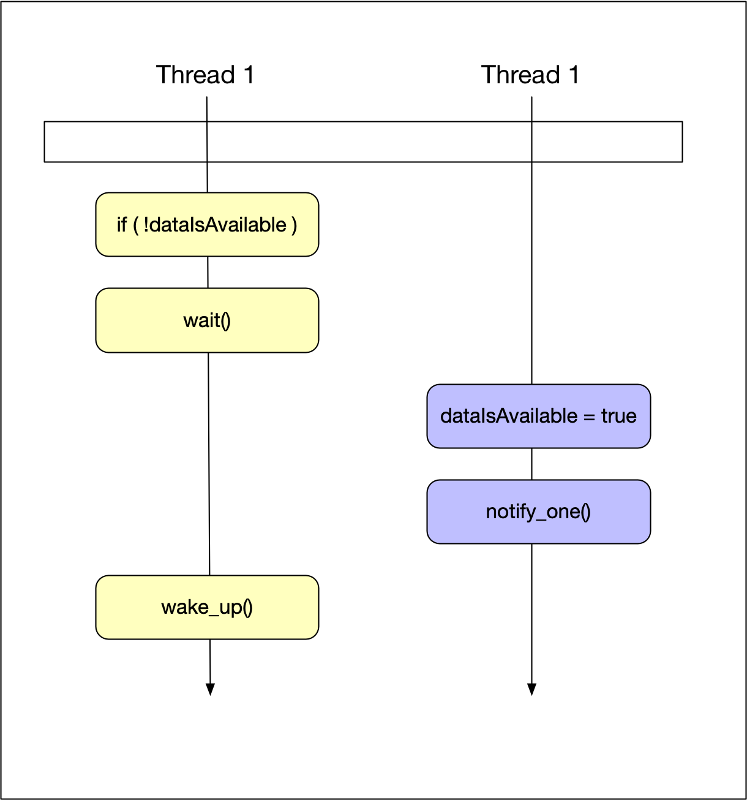

The consumer thread checks `dataIsAvailable()` and since it is false, the consumer thread blocks and waits on the condition variable. Later in time, the producer thread sets dataIsAvailable to true and calls `notify_one` on the condition variable. At this point, the consumer wakes up and proceeds with its work.

**Scenario 2**
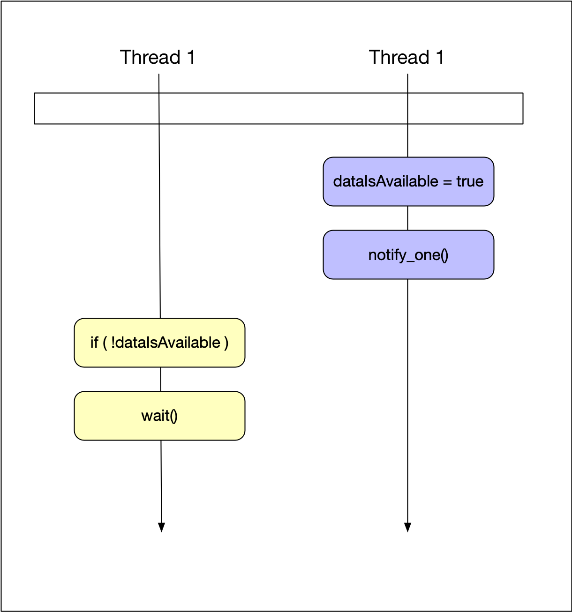

Here, the producer thread comes first, sets `dataIsAvailable()` to true and calls `notify_one`. Then, the consumer thread comes and checks `dataIsAvailable()` and finds it to be true - so it does not call wait and proceeds directly with its work. Even though the notification is lost, it does not cause a problem in this construct - the message has been passed successfully through dataIsAvailable and the wait-lock has been avoided.

In an ideal (non-concurrent) world, these two scenarios would most probably be sufficient to describe to possible combinations. But in concurrent programming, things are not so easy. As seen in the diagrams, there are four atomic operations, two for each thread. So when executed often enough, all possible interleavings will show themselves - and we have to find the ones that still cause a problem.

Here is one combination that will cause the program to lock:


The consumer thread reads `dataIsAvailable()`, which is false in the example. Then, the producer sets `dataIsAvailable()` to true and calls notify. Due to this unlucky interleaving of actions, the consumer thread calls wait because it has seen `dataIsAvailable()` as false. This is possible because the consumer thread tasks are not a joint atomic operation but may be separated by the scheduler and interleaved with some other tasks - in this case the two actions performed by the producer thread. The problem here is that after calling wait, the consumer thread will never wake up again. Also, as you may have noticed, the shared variable dataReady is not protected by a mutex here - which makes it even more likely that something will go wrong.

One quick idea for a solution which might come to mind would be to perform the two operations dataIsAvailable and wait under a locked mutex. While this would effectively prevent the interleaving of tasks between different threads, it would also prevent another thread from ever modifying dataIsAvailable again.

One reason for discussing these failed scenarios in such depth is to make you aware of the complexity of concurrent behavior - even with a simple protocol like the one we are discussing right now.

So let us now look at the final solution to the above problems and thus a working version of our communication protocol.


As seen above, we are closing the gap between reading the state and entering the wait. We are reading the state under the lock (red bar) and we call wait still under the lock. Then, we let wait release the lock and enter the wait state in one atomic step. This is only possible because the `wait()` method is able to take a lock as an argument. The lock that we can pass to wait however is not the `lock_guard` we have been using so often until now but instead it has to be a lock that can be temporarily unlocked inside wait - a suitable lock for this purpose would be the `unique_lock` type which we have discussed in the previous section.

### Implementing the WaitingVehicles Queue

Now that we have all the ingredients to implement the concurrent queue to store waiting Vehicle objects, let us start with the implementation according to the diagram above.

1. The first step is to add a condition variable to `WaitingVehicles` class as a private member - just as the mutex.

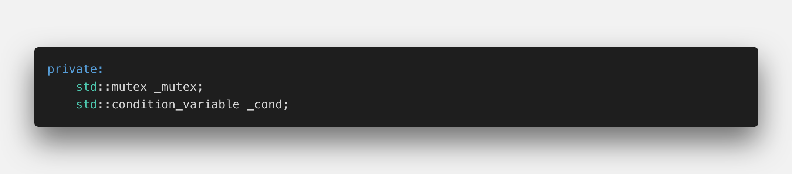

2. The next step is to notify the client after pushing a new Vehicle into the vector.

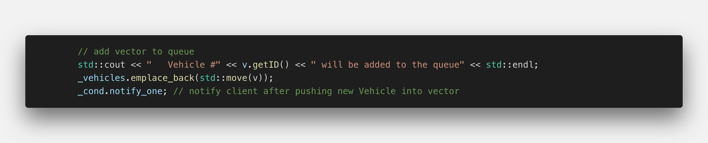

3. In the method `popBack`, we need to create the lock first - it can not be a `lock_guard` any more as we need to pass it to the condition variable - to its method wait. Thus it must be a `unique_lock`. Now we can enter the wait state while at same time releasing the lock. It is only inside wait, that the mutex is temporarily unlocked - which is a very important point to remember: We are holding the lock before AND after our call to wait - which means that we are free to access whatever data is protected by the mutex. In our example, this will be `dataIsAvailable()`.
    
    Before we continue, we need to discuss the problem of "spurious wake-ups": Once in a while, the system will - for no obvious reason - wake up a thread. If such a spurious wake-up happened with taking proper precautions, we would issue wait without new data being available (because the wake-up has not been caused by the condition variable but by the system in this case). To prevent the call to wait in this case, we have to modify the code slightly:

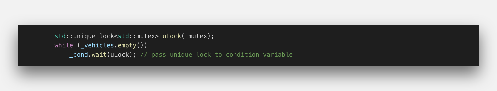

3. (continued) In this code, even after a spurious wake-up, we are now checking wether data really is available. If so, we would be issuing the call to wait on the condition variable. And only if we are inside wait, may other threads modify and access `dataIsAvailable`.
    
    If the vector is empty, `wait` is called. When the thread wakes up again, the condition is immediately re-checked and - in case it has not been a spurious wake-up we can continue with our job and retrieve the vector.
    
    We can further simplify this code by letting the `wait()` function do the testing as well as the looping for us. Instead of the while loop, we can just pass a Lambda to `wait()`, which repeatedly checks wether the vector contains elements (thus the inverted logical expression):

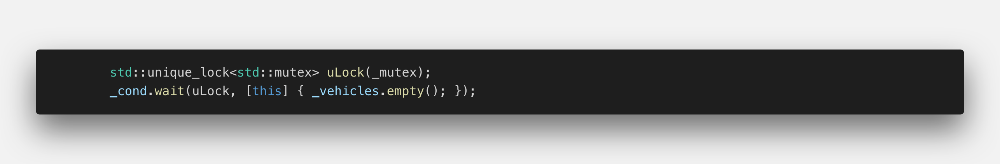

3. (continued) When `wait()` finishes, we are guaranteed to find a new element in the vector this time. Also, we are still holding the lock and thus no other thread is able to access the vector - so there is no danger of a data race in this situation. As soon as we are out of scope, the lock will be automatically released.
    
4. In the main() function, there is still the polling loop that infinitely queries the availability of new Vehicle objects. But contrary to the example before, a call to popBack now puts the main() thread into a wait state and only resumes when new data is available - thus significantly reducing the load to the processor.
    

Let us now take a look at the complete code…

```cpp
#include <iostream>
#include <thread>
#include <vector>
#include <future>
#include <mutex>
#include <algorithm>

class Vehicle
{
public:
    Vehicle(int id) : _id(id) {}
    int getID() { return _id; }

private:
    int _id;
};

class WaitingVehicles
{
public:
    WaitingVehicles() {}

    Vehicle popBack()
    {
        // perform vector modification under the lock
        std::unique_lock<std::mutex> uLock(_mutex);
        _cond.wait(uLock, [this] { return !_vehicles.empty(); }); // pass unique lock to condition variable

        // remove last vector element from queue
        Vehicle v = std::move(_vehicles.back());
        _vehicles.pop_back();

        return v; // will not be copied due to return value optimization (RVO) in C++
    }

    void pushBack(Vehicle &&v)
    {
        // simulate some work
        std::this_thread::sleep_for(std::chrono::milliseconds(100));

        // perform vector modification under the lock
        std::lock_guard<std::mutex> uLock(_mutex);

        // add vector to queue
        std::cout << "   Vehicle #" << v.getID() << " will be added to the queue" << std::endl;
        _vehicles.push_back(std::move(v));
        _cond.notify_one(); // notify client after pushing new Vehicle into vector
    }

private:
    std::mutex _mutex;
    std::condition_variable _cond;
    std::vector<Vehicle> _vehicles; // list of all vehicles waiting to enter this intersection
};

int main()
{
    // create monitor object as a shared pointer to enable access by multiple threads
    std::shared_ptr<WaitingVehicles> queue(new WaitingVehicles);

    std::cout << "Spawning threads..." << std::endl;
    std::vector<std::future<void>> futures;
    for (int i = 0; i < 10; ++i)
    {
        // create a new Vehicle instance and move it into the queue
        Vehicle v(i);
        futures.emplace_back(std::async(std::launch::async, &WaitingVehicles::pushBack, queue, std::move(v)));
    }

    std::cout << "Collecting results..." << std::endl;
    while (true)
    {
        // popBack wakes up when a new element is available in the queue
        Vehicle v = queue->popBack();
        std::cout << "   Vehicle #" << v.getID() << " has been removed from the queue" << std::endl;
    }

    std::for_each(futures.begin(), futures.end(), [](std::future<void> &ftr) {
        ftr.wait();
    });

    std::cout << "Finished!" << std::endl;

    return 0;
}
```

And the console output:

```
Spawning threads...
Collecting results...
   Vehicle #0 will be added to the queue
   Vehicle #3 will be added to the queue
   Vehicle #7 will be added to the queue
   Vehicle #1 will be added to the queue
   Vehicle #1 has been removed from the queue
   Vehicle #7 has been removed from the queue
   Vehicle #3 has been removed from the queue
   Vehicle #0 has been removed from the queue
   Vehicle #4 will be added to the queue
   Vehicle #5 will be added to the queue
   Vehicle #6 will be added to the queue
   Vehicle #2 will be added to the queue
   Vehicle #9 will be added to the queue
   Vehicle #8 will be added to the queue
   Vehicle #8 has been removed from the queue
   Vehicle #9 has been removed from the queue
   Vehicle #2 has been removed from the queue
   Vehicle #6 has been removed from the queue
   Vehicle #5 has been removed from the queue
   Vehicle #4 has been removed from the queue
```

The code we have produced to manage waiting vehicles in our traffic simulation is in fact a very generic piece of code. Instead of passing Vehicle objects, it could very easily be modified to pass almost any kind of object or data type between two vector. So what we have created could be easily described as a generic message queue.

The following changes are required to turn the `WaitingVehicles` queue into a generic message queue:

1. Enable the class for templates by prepending `template<class T>` and change the name of the class to `MessageQueue`
2. Replace the `std::vector` by a `std::deque` as it makes more sense to retrieve the objects in the order "first-in, first-out (FIFO)". Also, rename it to `_messages`.
3. Adapt the method `pushBack` for use with templates and rename it `send`. Do the same with `popBack` and rename it to `receive`.
4. Test the queue by executing the following code in main:

```cpp
#include <iostream>
#include <thread>
#include <queue>
#include <future>
#include <mutex>
#include <algorithm>

template <class T>
class MessageQueue
{
public:
    T receive()
    {
        // perform queue modification under the lock
        std::unique_lock<std::mutex> uLock(_mutex);
        _cond.wait(uLock, [this] { return !_messages.empty(); }); // pass unique lock to condition variable

        // remove last vector element from queue
        T msg = std::move(_messages.back());
        _messages.pop_back();

        return msg; // will not be copied due to return value optimization (RVO) in C++
    }

    void send(T &&msg)
    {
        // simulate some work
        std::this_thread::sleep_for(std::chrono::milliseconds(100));

        // perform vector modification under the lock
        std::lock_guard<std::mutex> uLock(_mutex);

        // add vector to queue
        std::cout << "   Message " << msg << " has been sent to the queue" << std::endl;
        _messages.push_back(std::move(msg));
        _cond.notify_one(); // notify client after pushing new Vehicle into vector
    }

private:
    std::mutex _mutex;
    std::condition_variable _cond;
    std::deque<T> _messages;
};

int main()
{
    // create monitor object as a shared pointer to enable access by multiple threads
    std::shared_ptr<MessageQueue<int>> queue(new MessageQueue<int>);

    std::cout << "Spawning threads..." << std::endl;
    std::vector<std::future<void>> futures;
    for (int i = 0; i < 10; ++i)
    {
        int message = i;
        futures.emplace_back(std::async(std::launch::async, &MessageQueue<int>::send, queue, std::move(message)));
    }

    std::cout << "Collecting results..." << std::endl;
    while (true)
    {
        int message = queue->receive();
        std::cout << "   Message #" << message << " has been removed from the queue" << std::endl;
    }

    std::for_each(futures.begin(), futures.end(), [](std::future<void> &ftr) {
        ftr.wait();
    });

    std::cout << "Finished!" << std::endl;

    return 0;
}
```

A message queue is an effective and very useful mechanism to enable a safe and reusable communication channel between threads. In the final project, we will use shorty use this construct to integrate another component into our simulation - traffic lights at intersections.

# Project Concurrent Traffic Simulation

Project code is [here](https://github.com/kraudust/CppND-Program-a-Concurrent-Traffic-Simulation/tree/master).

Task description video is [here](https://youtu.be/ie1CM5ms2O8).

Program schematic is below:

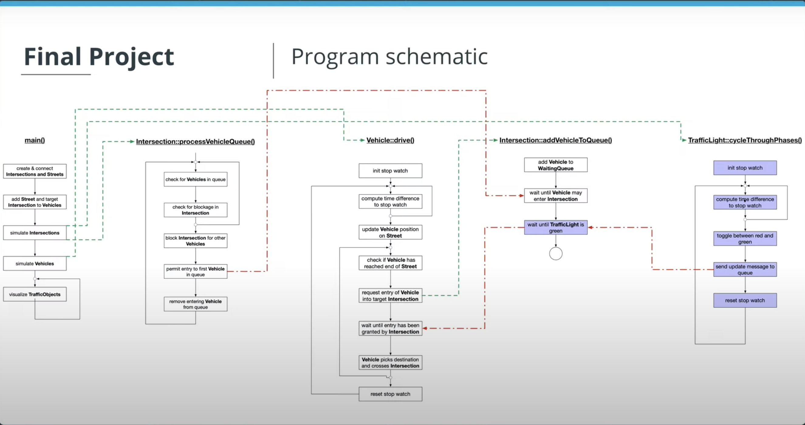

## Task List

- **Task FP.1** : Define a class `TrafficLight` which is a child class of `TrafficObject`. The class shall have the public methods `void waitForGreen()` and `void simulate()` as well as `TrafficLightPhase getCurrentPhase()`, where `TrafficLightPhase` is an enum that can be either `red` or `green`. Also, add the private method `void cycleThroughPhases()`. Furthermore, there shall be the private member `_currentPhase` which can take `red` or `green` as its value.
- **Task FP.2** : Implement the function with an infinite loop that measures the time between two loop cycles and toggles the current phase of the traffic light between red and green and sends an update method to the message queue using move semantics. The cycle duration should be a random value between 4 and 6 seconds. Also, the while-loop should use `std::this_thread::sleep_for` to wait 1ms between two cycles. Finally, the private method `cycleThroughPhases` should be started in a thread when the public method `simulate` is called. To do this, use the thread queue in the base class. Rubric Tip: Don't forget to use `std::this_thread::sleep_for` to wait 1ms between two cycles.
- **Task FP.3** : Define a class `MessageQueue` which has the public methods send and receive. Send should take an rvalue reference of type TrafficLightPhase whereas receive should return this type. Also, the class should define an `std::dequeue` called `_queue`, which stores objects of type `TrafficLightPhase`. Finally, there should be an `std::condition_variable` as well as an `std::mutex` as private members.
- **Task FP.4** : Implement the method `Send`, which should use the mechanisms `std::lock_guard<std::mutex>` as well as `_condition.notify_one()` to add a new message to the queue and afterwards send a notification. Also, in class `TrafficLight`, create a private member of type `MessageQueue` for messages of type `TrafficLightPhase` and use it within the infinite loop to push each new `TrafficLightPhase` into it by calling send in conjunction with move semantics.
- **Task FP.5** : The method receive should use `std::unique_lock<std::mutex>` and `_condition.wait()` to wait for and receive new messages and pull them from the queue using move semantics. The received object should then be returned by the receive function. Then, add the implementation of the method `waitForGreen`, in which an infinite while-loop runs and repeatedly calls the `receive` function on the message queue. Once it receives `TrafficLightPhase::green`, the method returns.
- **Task FP.6**: In class Intersection, add a private member `_trafficLight` of type `TrafficLight`. In method `Intersection::simulate()`, start the simulation of `_trafficLight`. Then, in method `Intersection::addVehicleToQueue`, use the methods `TrafficLight::getCurrentPhase` and `TrafficLight::waitForGreen` to block the execution until the traffic light turns green.

You can submit your project using the "SUBMIT PROJECT" button in the terminal.

This project can only be submitted through the workspace. This is done to ensure that you are able to test your code in an environment similar to what reviewers will use.

However, if you want to work on your local machine, you can download the starter code from [this](https://github.com/udacity/CppND-Program-a-Concurrent-Traffic-Simulation) Github repository and upload your finished project back into the classroom workspace for submission.

Code overview video is [here](https://youtu.be/XVQt4iKEQwo).

## Project Rubric

## FP.1 Create a TrafficLight class

|Success Criteria|Specifications|
|---|---|
|The `TrafficLight` class is defined|A `TrafficLight` class is is defined which is a child class of `TrafficObject`.|
|The `TrafficLight` class methods are completed|The class shall have the public methods `void waitForGreen()` and `void simulate()` as well as `TrafficLightPhase getCurrentPhase()`, where `TrafficLightPhase` is an enum that can be either `red` or `green`.<br><br>Also, there should be a private method `void cycleThroughPhases()` and a private member `_currentPhase` which can take `red` or `green` as its value.|

## FP.2: Implement a cycleThroughPhases method

|Success Criteria|Specifications|
|---|---|
|The `cycleThroughPhases()` method is implemented.|Implement the function with an infinite loop that measures the time between two loop cycles and toggles the current phase of the traffic light between red and green.<br><br>The cycle duration should be a random value between 4 and 6 seconds, and the while-loop should use std:: this_thread:: sleep_for to wait 1ms between two cycles.<br><br>> Tip:<br><br>- We would recommend referring to the implementation of sleep_for() used in the while loop with a 1 ms condition for each cycle within the drive() function in the vehicle.cpp file.<br>- Don't forget to implement both parts of FP.2|
|The `cycleThroughPhases()` method is started correctly.|The private `cycleThroughPhases()` method should be started in a thread when the public method `simulate` is called. To do this, a thread queue should be used in the base class.|

## FP.3 Define class MessageQueue

|Success Criteria|Specifications|
|---|---|
|A `MessageQueue` class is defined|A `MessageQueue` class is defined in the header of class `TrafficLight` which has the public methods `send` and `receive`.|
|The `MessageQueue` class methods and members are declared correctly|`send` should take an `rvalue` reference of type `TrafficLightPhase` whereas `receive` should return this type.<br><br>Also, the `MessageQueue` class should define a `std::dequeue` called `_queue`, which stores objects of type `TrafficLightPhase`.<br><br>Also, there should be a `std::condition_variable` as well as an `std::mutex` as private members.|

## FP.4 Implement the method `send`

|Success Criteria|Specifications|
|---|---|
|The method `send` is correctly implemented|The method `send` should use the mechanisms `std::lock_guard<std::mutex>` as well as `_condition.notify_one()` to add a new message to the queue and afterwards send a notification.
<br><br>In the class `TrafficLight`, a private member of type `MessageQueue` should be created and used within the infinite loop to push each new `TrafficLightPhase` into it by calling `send` in conjunction with move semantics.|

## FP.5 Implement the methods `receive` and `waitForGreen`

|Success Criteria|Specifications|
|---|---|
|The method `receive` is correctly implemented|The method receive should use `std::unique_lock<std::mutex>` and `_condition.wait()` to wait for and receive new messages and pull them from the queue using move semantics. The received object should then be returned by the `receive` function.|
|The method `waitForGreen` is correctly implemented|The method waitForGreen is completed, in which an infinite while loop runs and repeatedly calls the receive function on the message queue. Once it receives TrafficLightPhase::green, the method returns.<br><br>> Note: Don't forget to implement both parts of FP.5|

## FP.6 Implement message exchange

|Success Criteria|Specifications|
|---|---|
|The message exchange is correctly implemented|In class Intersection, a private member _trafficLight of type TrafficLight should exist.<br><br>The method Intersection::simulate() should start the simulation of _trafficLight.<br><br>The method Intersection::addVehicleToQueue, should use the methods TrafficLight::getCurrentPhase and TrafficLight::waitForGreen to block the execution until the traffic light turns green.<br><br>> Note:<br><br>- The position where the intersection starts simulating shall also be the position where the traffic light is fired up.<br>- Don't forget to implement both parts of FP.6|