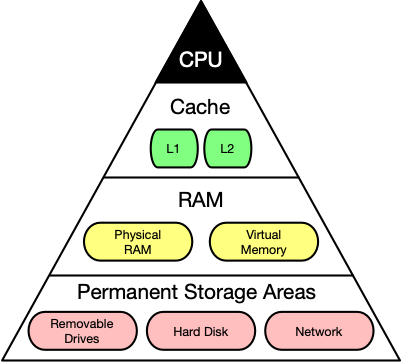
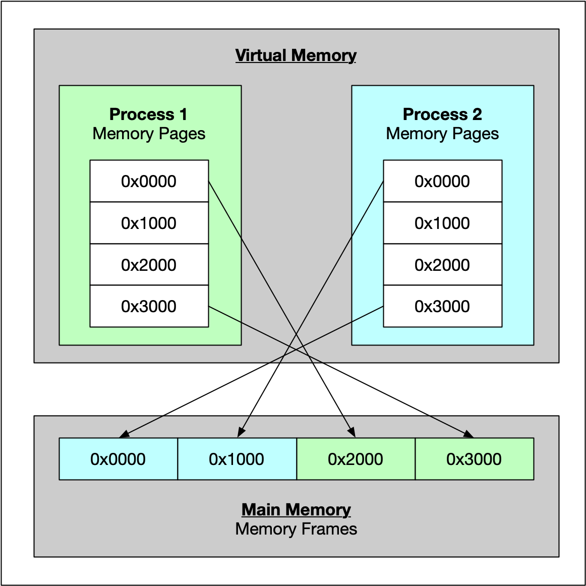
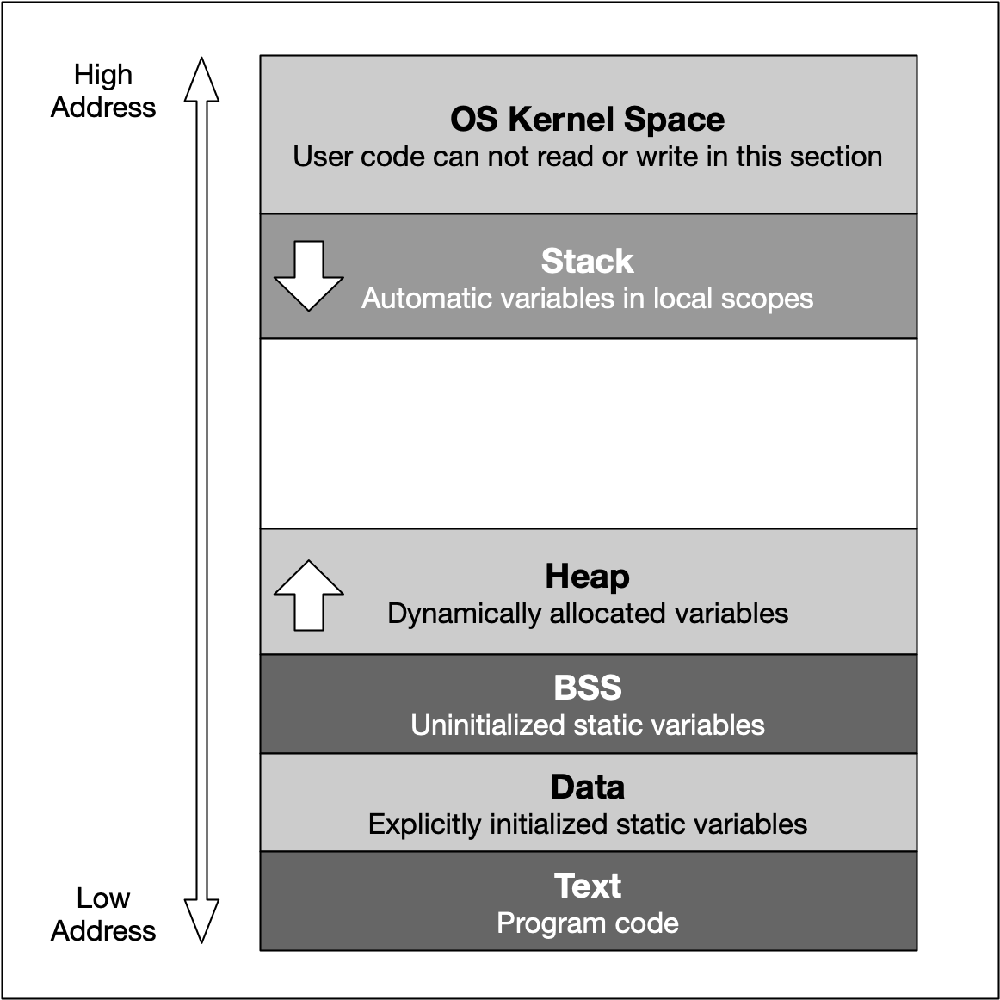
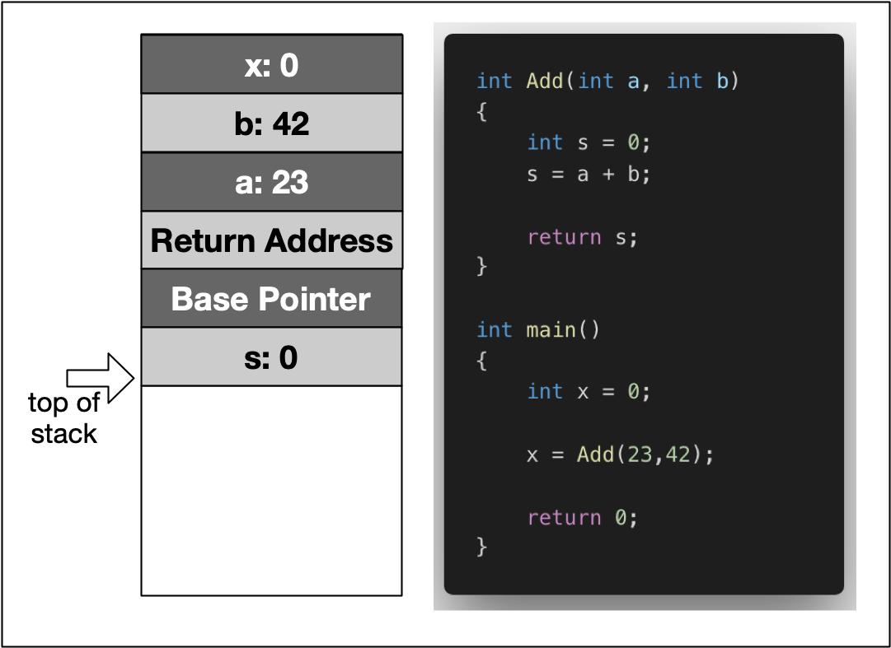
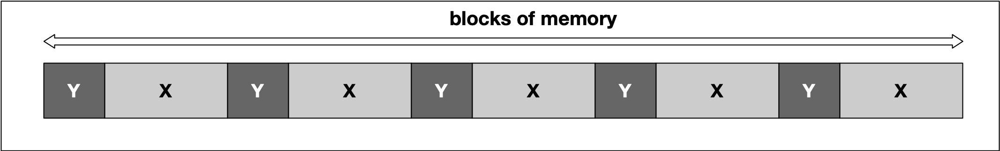
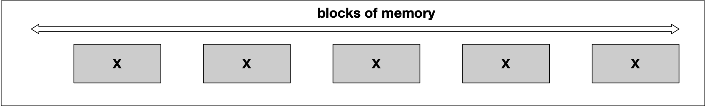

# Memory Management Table of Contents
1. [Overview of Memory Types](#overview-of-memory-types)
	1. [Memory Addresses and Hexadecimal Numbers](#memory-addresses-and-hexadecimal-numbers)
	2. [Using the GDB Debugger to Analyze Memory](#Using-the-GDB-Debugger-to-Analyze-Memory)
	3. [Types of Computer Memory](#Types-of-Computer-Memory)
	4. [Cache Memory](#Cache-Memory)
	5. [Virtual Memory](#Virtual-Memory)
2. [Variables and Memory](#Variables-and-Memory)
	1. [The Process Memory Model](#The-Process-Memory-Model)
	2. [Memory Allocation in C++](#Memory-Allocation-in-C++)
	3. [Automatic Memory Allocation The Stack](#Automatic-Memory-Allocation-The-Stack)
	4. [Call By Value vs Call By Reference](#Call-By-Value-vs-Call-By-Reference)
3. [Dynamic Memory Allocation The Heap](#Dynamic-Memory-Allocation-The-Heap)
	1. [Heap Memory](#Heap-Memory)
	2. [Using malloc and free](#Using-malloc-and-free)
	3. [Using new and delete](#Using-new-and-delete)
	4. [Typical Memory Management Problems](#Typical-Memory-Management-Problems)
4. [Resource Copying Policies](#Resource-Copying-Policies)
	1. [Copy Semantics](#Copy-Semantics)
	2. [Lvalues and rvalues](#Lvalues-and-rvalues)
	3. [Move Semantics](#Move-Semantics)
5. [Smart Pointers](#Smart-Pointers)
	1. [Resource Acquisition Is Initialization RAII](#Resource-Acquisition-Is-Initialization-RAII)
	2. [Smart pointers](#Smart-pointers)
	3. [Transferring ownership](#Transferring-ownership)
6. [Project Memory Management Chatbot](#Project-Memory-Management-Chatbot)

# Overview of Memory Types
## Memory Addresses and Hexadecimal Numbers

Inside each computer, all numbers, characters, commands and every imaginable type of information are represented in binary form. Over the years, many coding schemes and techniques were invented to manipulate these 0s and 1s effectively. One of the most widely used schemes is called ASCII (_American Standard Code for Information Interchange_), which lists the binary code for a set of 127 characters. The idea was to represent each letter with a sequence of binary numbers so that storing texts on in computer memory and on hard (or floppy) disks would be possible.


There are several reasons why it is preferable to use hex numbers instead of binary numbers (which computers store at the lowest level), three of which are given below:

1. **Readability**: It is significantly easier for a human to understand hex numbers as they resemble the decimal numbers we are used to. It is simply not intuitive to look at binary numbers and decide how big they are and how they relate to another binary number.
    
2. **Information density**: A hex number with two digits can express any number from 0 to 255 (because 16^2 is 256). To do the same in the binary system, we would require 8 digits. This difference is even more pronounced as numbers get larger and thus harder to deal with.
    
3. **Conversion into bytes**: Bytes are units of information consisting of 8 bits. Almost all computers are byte-addressed, meaning all memory is referenced by byte, instead of by bit. Therefore, using a counting system that can easily convert into bytes is an important requirement. We will shortly see why grouping bits into a byte plays a central role in understanding how computer memory works.

## Using the GDB Debugger to Analyze Memory

See [debugger_analyze_memory.cpp](debugger_analyze_memory.cpp) for an example of how to debug. To build with debugging symbols
```
g++ -g debugger_analyze_memory.cpp
```

To start gdb debugger:
```
gdb a.out
```
When gdb displays the line `Type <RET> for more, q to quit, c to continue without paging`, be sure to press the RETURN key to continue.

See [GDB Cheat Sheet](gdb_cheat_sheet.pdf) for gdb commands.

For this example, to set a breakpoint at line 5, run the program, step to the next line, and display variable value and address of variable, do the following:
```
break 5
run
step
p str1
p &str1
```

Now to print what's at the memory addresses:
```
(gdb) p str1
$3 = "UDACITY"
(gdb) p &str1
$4 = (char (*)[8]) 0x7fffffffdc60
(gdb) x/7tb 0x7fffffffdc60
0x7fffffffdc60: 01010101        01000100        01000001        01000011        01001001        01010100        01011001
(gdb) x/7xb 0x7fffffffdc60
0x7fffffffdc60: 0x55    0x44    0x41    0x43    0x49    0x54    0x59
(gdb) x/7cb 0x7fffffffdc60
0x7fffffffdc60: 85 'U'  68 'D'  65 'A'  67 'C'  73 'I'  84 'T'  89 'Y'
(gdb) x/7db 0x7fffffffdc60
0x7fffffffdc60: 85      68      65      67      73      84      89
```
The 7 says to print 7 units, the t stands for binary, the x stands for hex, the c stands for char (read as int, but use ascii to print char), the d is just as an int. And the b in the 3rd character stands for bytes. See GDB Cheat Sheet (linked above) for more options.

There is also an [online gdb application](https://www.onlinegdb.com) you can use to debug code.

## Types of Computer Memory

Below you will find a small list of some common memory types that you will surely have heard of:
- RAM / ROM
- Cache (L1, L2)
- Registers
- Virtual Memory
- Hard Disks, USB drives

Regrettably though, low latency and large memory are not compatible with each other (at least not at a reasonable price). In practice, the decision for low latency usually results in a reduction of the available storage capacity (and vice versa). This is the reason why a computer has multiple memory types that are arranged hierarchically. The following pyramid illustrates the principle, fast and low storage at top, and slow and more storage at bottom:


Stuff that needs accessed often or soon should be closer to the top of the pyramid while stuff that isn't accessed often should be near the bottom.

## Cache Memory

Cache memory is much faster but also significantly smaller than standard RAM. It holds the data that will (or might) be used by the CPU more often. In the memory hierarchy we have seen in the last section, the cache plays an intermediary role between fast CPU and slow RAM and hard disk. The figure below gives a rough overview of a typical system architecture:

The central CPU chip is connected to the outside world by a number of buses. There is a cache bus, which leads to a block denoted as L2 cache, and there is a system bus as well as a memory bus that leads to the computer main memory. The latter holds the comparatively large RAM while the L2 cache as well as the L1 cache are very small with the latter also being a part of the CPU itself.


1. **Level 1 cache** is the fastest and smallest memory type in the cache hierarchy. In most systems, the L1 cache is not very large. Mostly it is in the range of 16 to 64 kBytes, where the memory areas for instructions and data are separated from each other (L1i and L1d, where "i" stands for "instruction" and "d" stands for "data". Also see "[Harvard architecture](https://en.wikipedia.org/wiki/Harvard_architecture)" for further reference). The importance of the L1 cache grows with increasing speed of the CPU. In the L1 cache, the most frequently required instructions and data are buffered so that as few accesses as possible to the slow main memory are required. This cache avoids delays in data transmission and helps to make optimum use of the CPU's capacity.
    
2. **Level 2 cache** is located close to the CPU and has a direct connection to it. The information exchange between L2 cache and CPU is managed by the L2 controller on the computer main board. The size of the L2 cache is usually at or below 2 megabytes. On modern multi-core processors, the L2 cache is often located within the CPU itself. The choice between a processor with more clock speed or a larger L2 cache can be answered as follows: With a higher clock speed, individual programs run faster, especially those with high computing requirements. As soon as several programs run simultaneously, a larger cache is advantageous. Usually normal desktop computers with a processor that has a large cache are better served than with a processor that has a high clock rate.
    
3. **Level 3 cache** is shared among all cores of a multicore processor. With the L3 cache, the [cache coherence](https://en.wikipedia.org/wiki/Cache_coherence) protocol of multicore processors can work much faster. This protocol compares the caches of all cores to maintain data consistency so that all processors have access to the same data at the same time. The L3 cache therefore has less the function of a cache, but is intended to simplify and accelerate the cache coherence protocol and the data exchange between the cores.

On Mac, information about the system cache can be obtained by executing the command `sysctl -a hw` in a terminal. On Debian Linux linux, this information can be found with `lscpu | grep cache`.

While L1 access operations are close to the speed of a photon traveling at light speed for a distance of 1 foot, the latency of L2 access is roughly one order of magnitude slower already while access to main memory is two orders of magnitude slower.

In algorithm design, programmers can exploit two principles to increase runtime performance:

1. **Temporal locality** means that address ranges that are accessed are likely to be used again in the near future. In the course of time, the same memory address is accessed relatively frequently (e.g. in a loop). This property can be used at all levels of the memory hierarchy to keep memory areas accessible as quickly as possible.
    
2. **Spatial locality** means that after an access to an address range, the next access to an address in the immediate vicinity is highly probable (e.g. in arrays). In the course of time, memory addresses that are very close to each other are accessed again multiple times. This can be exploited by moving the adjacent address areas upwards into the next hierarchy level during a memory access.
    
Let us consider the following code example:

```cpp
#include <chrono>
#include <iostream>

int main()
{
    // create array 
    const int size = 4000;
    static int x[size][size];

    auto t1 = std::chrono::high_resolution_clock::now();
    for (int i = 0; i < size; i++)
    {
        for (int j = 0; j < size; j++)
        {
            x[j][i] = i + j;
            //std::cout << &x[j][i] << ": i=" << i << ", j=" << j << std::endl;
        }
    }

    // print execution time to console
    auto t2 = std::chrono::high_resolution_clock::now(); // stop time measurement
    auto duration = std::chrono::duration_cast<std::chrono::microseconds>(t2 - t1).count();
    std::cout << "Execution time: " << duration << " microseconds" << std::endl;

    return 0;
}
```

Changing the order of j and i when indexing x x[i][j] instead of x[j][i] is more cache friendly code and runs way more quickly.

## Virtual Memory

The idea of virtual memory stems back from a (not so long ago) time, when the random access memory (RAM) of most computers was severely limited. Programers needed to treat memory as a precious resource and use it most efficiently. Also, they wanted to be able to run programs even if there was not enough RAM available. At the time of writing (August 2019), the amount of RAM is no longer a large concern for most computers and programs usually have enough memory available to them. But in some cases, for example when trying to do video editing or when running multiple large programs at the same time, the RAM memory can be exhausted. In such a case, the computer can slow down drastically.

There are several other memory-related problems, that programmers need to know about:

1. **Holes in address space** : If several programs are started one after the other and then shortly afterwards some of these are terminated again, it must be ensured that the freed-up space in between the remaining programs does not remain unused. If memory becomes too fragmented, it might not be possible to allocate a large block of memory due to a large-enough free contiguous block not being available any more.
    
2. **Programs writing over each other** : If several programs are allowed to access the same memory address, they will overwrite each others' data at this location. In some cases, this might even lead to one program reading sensitive information (e.g. bank account info) that was written by another program. This problem is of particular concern when writing concurrent programs which run several threads at the same time.
    

The basic idea of virtual memory is to separate the addresses a program may use from the addresses in physical computer memory. By using a mapping function, an access to (virtual) program memory can be redirected to a real address which is guaranteed to be protected from other programs.

In the following, you will see, how virtual memory solves the problems mentioned above and you will also learn about the concepts of memory pages, frames and mapping. A sound knowledge on virtual memory will help you understand the C++ memory model, which will be introduced in the next lesson of this course.

With virtual memory, the RAM acts as a cache for the virtual memory space which resides on secondary storage devices. On Windows systems, the file `pagefile.sys` is such a virtual memory container of varying size. To speed up your system, it makes sense to adjust the system settings in a way that this file is stored on an SSD instead of a slow magnetic hard drive, thus reducing the latency. On a Mac, swap files are stored in`/private/var/vm/`.

In a nutshell, virtual memory guarantees us a fixed-size address space which is largely independent of the system configuration. Also, the OS guarantees that the virtual address spaces of different programs do not interfere with each other.

The task of mapping addresses and of providing each program with its own virtual address space is performed entirely by the operating system, so from a programmer’s perspective, we usually don’t have to bother much about memory that is being used by other processes.

Before we take a closer look at an example though, let us define two important terms which are often used in the context of caches and virtual memory:

- A **memory page** is a number of directly successive memory locations in virtual memory defined by the computer architecture and by the operating system. The computer memory is divided into memory pages of equal size. The use of memory pages enables the operating system to perform virtual memory management. The entire working memory is divided into tiles and each address in this computer architecture is interpreted by the Memory Management Unit (MMU) as a logical address and converted into a physical address.
- A **memory frame** is mostly identical to the concept of a memory page with the key difference being its location in the physical main memory instead of the virtual memory.



# Variables and Memory
## The Process Memory Model

As we have seen in the previous lesson, each program is assigned its own virtual memory by the operating system. This address space is arranged in a linear fashion with one block of data being stored at each address. It is also divided into several distinct areas as illustrated by the figure below:

1. The **stack** is a contiguous memory block with a fixed maximum size. If a program exceeds this size, it will crash. The stack is used for storing automatically allocated variables such as local variables or function parameters. If there are multiple threads in a program, then each thread has its own stack memory. New memory on the stack is allocated when the path of execution enters a scope and freed again once the scope is left. It is important to know that the stack is managed "automatically" by the compiler, which means we do not have to concern ourselves with allocation and deallocation.
2. The **heap** (also called "free store" in C++) is where data with dynamic storage lives. It is shared among multiple threads in a program, which means that memory management for the heap needs to take concurrency into account. This makes memory allocations in the heap more complicated than stack allocations. In general, managing memory on the heap is more (computationally) expensive for the operating system, which makes it slower than stack memory. Contrary to the stack, the heap is not managed automatically by the system, but by the programmer. If memory is allocated on the heap, it is the programmer’s responsibility to free it again when it is no longer needed. If the programmer manages the heap poorly or not at all, there will be trouble.
3. The **BSS** (Block Started by Symbol) segment is used in many compilers and linkers for a segment that contains global and static variables that are initialized with zero values. This memory area is suitable, for example, for arrays that are not initialized with predefined values.
4. The **Data** segment serves the same purpose as the BSS segment with the major difference being that variables in the Data segment have been initialized with a value other than zero. Memory for variables in the Data segment (and in BSS) is allocated once when a program is run and persists throughout its lifetime.

## Memory Allocation in C++

Now that we have an understanding of the available process memory, let us take a look at memory allocation in C++.

Not every variable in a program has a permanently assigned area of memory. The term **allocate** refers to the process of assigning an area of memory to a variable to store its value. A variable is **deallocated** when the system reclaims the memory from the variable, so it no longer has an area to store its value.

Generally, three basic types of memory allocation are supported:

1. **Static memory allocation** is performed for static and global variables, which are stored in the BSS and Data segment. Memory for these types of variables is allocated once when your program is run and persists throughout the life of your program.
2. **Automatic memory allocation** is performed for function parameters as well as local variables, which are stored on the stack. Memory for these types of variables is allocated when the path of execution enters a scope and freed again once the scope is left.
3. **Dynamic memory allocation** is a possibility for programs to request memory from the operating system at runtime when needed. This is the major difference between automatic and static allocation, where the size of the variable must be known at compile time. Dynamic memory allocation is not performed on the limited stack but on the heap and is thus (almost) only limited by the size of the address space.

From a programmer’s perspective, stack and heap are the most important areas of program memory. Hence, in the following lessons, let us look at these two in turn.

## Automatic Memory Allocation The Stack

As mentioned in the last section, the stack is the place in virtual memory where the local variables reside, including arguments to functions. Each time a function is called, the stack grows (from top to bottom) and each time a function returns, the stack contracts. When using multiple threads (as in concurrent programming), it is important to know that each thread has its own stack memory - which can be considered thread-safe.

In the following, a short list of key properties of the stack is listed:

1. The stack is a **contiguous block of memory**. It will not become fragmented (as opposed to the heap) and it has a fixed maximum size.
    
2. When the **maximum size of the stack** memory is exceeded, a program will crash.
    
3. Allocating and deallocating **memory is fast** on the stack. It only involves moving the stack pointer to a new position.

The following diagram shows the stack memory during a function call:

In the example, the variable `x` is created on the stack within the scope of main. Then, a stack frame which represents the function `Add` and its variables is pushed to the stack, moving the stack pointer further downwards. It can be seen that this includes the local variables `a` and `b`, as well as the return address, a base pointer and finally the return value `s`.

The following shows how the stack can grow and contract:
```cpp
#include <stdio.h>

void MyFunc()
{
    int k = 3; 
    printf ("3: %p \n",&k);
}

int main()
{
    int i = 1; 
    printf ("1: %p \n",&i);

    int j = 2; 
    printf ("2: %p \n",&j);

    MyFunc();

    int l = 4; 
    printf ("4: %p \n",&l);

    return 0; 
}
```

Within the main function, we see two declarations of local variables `i` and `j` followed by a call to `MyFunc`, where another local variable is allocated. After `MyFunc` returns, another local variable is allocated in `main`. The program generates the following output:

`1: 0x7ffeefbff688`  
`2: 0x7ffeefbff684`
`3: 0x7ffeefbff65c`
`4: 0x7ffeefbff680` 

Between 1 and 2, the stack address is reduced by 4 bytes, which corresponds to the allocation of memory for the int `j`.

Between 2 and 3, the address pointer is moved by 0x28. We can easily see that calling a function causes a significant amount of memory to be allocated. In addition to the local variable of `MyFunc`, the compiler needs to store additional data such as the return address.

Between 3 and 4, `MyFunc` has returned and a third local variable `k` has been allocated on the stack. The stack pointer now has moved back to a location which is 4 bytes relative to position 2. This means that after returning from `MyFunc`, the stack has contracted to the size it had before the function call.

When a thread is created, stack memory is allocated by the operating system as a contiguous block. With each new function call or local variable allocation, the stack pointer is moved until eventually it will reach the bottom of said memory block. Once it exceeds this limit (which is called "stack overflow"), the program will crash. We will try to find out the limit of your computer’s stack memory in the following exercise.

```cpp
#include <iostream>

int calls = 0;

void myFunc(int& y)
{
    calls++;
    int x = 3;
    std::cout << calls << ": stack bottom : " << &y << ", current : " << &x << std::endl;
    myFunc(y);
}

int main()
{
    int y = 10;
    myFunc(y);
    return 0;
}
```

`ulimit -s` prints the stack size `8192` for my linux machine. The program above prints:

```
171157: stack bottom : 0x7f2071c4ee14, current : 0x7f2071479234
171158: stack bottom : 0x7f2071c4ee14, current : 0x7f2071479204
171159: stack bottom : 0x7f2071c4ee14, current : 0x7f20714791d4
Segmentation fault
```

The difference between the current stack position and the stack bottom right before the segmentation fault should match the stack size for the machine indicating a stack overflow.

## Call By Value vs Call By Reference

Pass by value example below. the value printed is 2 instead of 4 since AddTwo doesn't affect the variable passed in by value.
```cpp
#include <iostream>

void AddTwo(int val)
{
    val += 2;
}

int main()
{
    int val = 0;
    AddTwo(val);
    val += 2;

    std::cout << "val = " << val << std::endl;
 
    return 0;
}
```
 You can get around this by passing in a pointer to the variable. This still passes by value, in that it makes a local copy of the memory address that can be used to modify the variable at the address like below. The val printed is 5.
```cpp
#include <iostream>

void AddThree(int *val)
{
    *val += 3;
}

int main()
{
    int val = 0;
    AddThree(&val);
    val += 2;

    std::cout << "val = " << val << std::endl;
 
    return 0;
}
```
The 2nd major way to pass variables is by reference. This is faster and more memory efficient than passing a pointer as no information needs to be copied. Example below where val returned is 6.
```cpp
#include <iostream>

void AddFour(int &val)
{
    val += 4;
}

int main()
{
    int val = 0;
    AddFour(val);
    val += 2;

    std::cout << "val = " << val << std::endl;
 
    return 0;
}
```

Passing by reference also makes it easy to modify several variables. If you wanted to use the function return value for such a purpose, returning several variables can be cumbersome. For example the following prints a val = 7 and success = 1

```cpp
#include <iostream>

void AddFive(int& value, bool& succeeded)
{
    value += 5;
    succeeded = true;
}

int main()
{
    int val = 0;
    bool success = false;
    AddFive(val, success);
    val += 2;

    std::cout << "val = " << val << ", success = " << success << std::endl;
 
    return 0;
}
```

When passing pointers vs. references, consider the following:
- Pointers can be declared without initialization. This means we can pass an uninitialized pointer to a function who then internally performs the initialization for us.
    
- Pointers can be reassigned to another memory block on the heap.
    
- References are usually easier to use (depending on the expertise level of the programmer). Sometimes however, if a third-party function is used without properly looking at the parameter definition, it might go unnoticed that a value has been modified.

Closer examination at stack memory usage with 3 strategies (call by value, call by pointer, call by reference):
```cpp
#include <stdio.h>
    
void CallByValue(int i)
{
    int j = 1; 
    printf ("call-by-value: %p\n",&j);
}

void CallByPointer(int *i)
{
    int j = 1; 
    printf ("call-by-pointer: %p\n",&j);
}

void CallByReference(int &i)
{
    int j = 1; 
    printf ("call-by-reference: %p\n",&j);
}

int main()
{
    int i = 0;
    printf ("stack bottom: %p\n",&i);
    
    CallByValue(i);

    CallByPointer(&i);

    CallByReference(i);

    return 0;
}
```

This outputs:
```
stack bottom:      0x7ffeefbff698
call-by-value:     0x7ffeefbff678
call-by-pointer:   0x7ffeefbff674
call-by-reference: 0x7ffeefbff674
```

1. `CallByValue` requires 32 bytes of memory. As discussed before, this is reserved for e.g. the function return address and for the local variables within the function (including the copy of `i`).
    
2. `CallByPointer` on the other hand requires - perhaps surprisingly - 36 bytes of memory. Let us complete the examination before going into more details on this result.
    
3. `CallByReference` finally has the same memory requirements as `CallByPointer`

In this section, we have argued at length that passing a parameter by reference avoids a costly copy and should - in many situations - be preferred over passing a parameter by value. Yet, in the experiment above, we have witnessed the exact opposite.

Let us take a look at the size of the various parameter types using the `sizeof` command:

`printf("size of int: %lu\n", sizeof(int)); printf("size of *int: %lu\n", sizeof(int *));`

The output here is

`size of int: 4 size of *int: 8`

Obviously, the size of the pointer variable is larger than the actual data type. As my machine has a 64 bit architecture, an address requires 8 byte.

As an experiment, you could use the `-m32` compiler flag to build a 32 bit version of the program. This yields the following output:

`size of int: 4 size of *int: 4`

In order to benefit from call-by-reference, the size of the data type passed to the function has to surpass the size of the pointer on the respective architecture (i.e. 32 bit or 64 bit).

# Dynamic Memory Allocation The Heap
## Heap Memory

Heap memory, also know as dynamic memory , is an important resource available to programs (and programmers) to store data.


As mentioned earlier, the heap memory grows upwards while the stack grows in the opposite direction. We have seen in the last lesson that the automatic stack memory shrinks and grows with each function call and local variable. As soon as the scope of a variable is left, it is automatically deallocated and the stack pointer is shifted upwards accordingly.

Heap memory is different in many ways: The programmer can request the allocation of memory by issuing a command such as `malloc` or `new` (more on that shortly). This block of memory will remain allocated until the programmer explicitly issues a command such as `free` or `delete`. The huge advantage of heap memory is the high degree of control a programmer can exert, albeit at the price of greater responsibility since memory on the heap must be actively managed.

Let us take a look at some properties of heap memory:

1. As opposed to local variables on the stack, memory can now be allocated in an arbitrary scope (e.g. inside a function) without it being deleted when the scope is left. Thus, as long as the address to an allocated block of memory is returned by a function, the caller can freely use it.
    
2. Local variables on the stack are allocated at compile-time. Thus, the size of e.g. a string variable might not be appropriate as the length of the string will not be known until the program is executed and the user inputs it. With local variables, a solution would be to allocate a long-enough array of and hope that the actual length does not exceed the buffer size. With dynamically allocated heap memory, variables are allocated at run-time. This means that the size of the above-mentioned string variable can be tailored to the actual length of the user input.
    
3. Heap memory is only constrained by the size of the address space and by the available memory. With modern 64 bit operating systems and large RAM memory and hard disks the programmer commands a vast amount of memory. However, if the programmer forgets to deallocate a block of heap memory, it will remain unused until the program is terminated. This is called a "memory leak".
    
4. Unlike the stack, the heap is shared among multiple threads, which means that memory management for the heap needs to take concurrency into account as several threads might compete for the same memory resource.
    
5. When memory is allocated or deallocated on the stack, the stack pointer is simply shifted upwards or downwards. Due to the sequential structure of stack memory management, stack memory can be managed (by the operating system) easily and securely. With heap memory, allocation and deallocation can occur arbitrarily, depending on the lifetime of the variables. This can result in fragmented memory over time, which is much more difficult and expensive to manage.

**Memory Fragmentation**

Let us construct a theoretic example of how memory on the heap can become fragmented: Suppose we are interleaving the allocation of two data types `X` and `Y` in the following fashion: First, we allocate a block of memory for a variable of type `X`, then another block for `Y` and so on in a repeated manner until some upper bound is reached. At the end of this operation, the heap might look like the following:

At some point, we might then decide to deallocate all variables of type `Y`, leading to empty spaces in between the remaining variables of type `X`. In between two blocks of type "X", no memory for an additional "X" could now be squeezed in this example.

A classic symptom of memory fragmentation is that you try to allocate a large block and you can’t, even though you appear to have enough memory free. On systems with virtual memory however, this is less of a problem, because large allocations only need to be contiguous in virtual address space, not in physical address space.

When memory is heavily fragmented however, memory allocations will likely take longer because the memory allocator has to do more work to find a suitable space for the new object.

At compile time, only the space for the pointer is reserved (on the stack). When the pointer is initialized, a block of memory of `sizeof(int)` bytes is allocated (on the heap) at program runtime. The pointer on the stack then points to this memory location on the heap.

## Using malloc and free

So far we only considered primitive data types, whose storage space requirement was already fixed at compile time and could be scheduled with the building of the program executable. However, it is not always possible to plan the memory requirements exactly in advance, and it is inefficient to reserve the maximum memory space each time just to be on the safe side. C and C++ offer the option to reserve memory areas during the program execution, i.e. at runtime. It is important that the reserved memory areas are released again at the "appropriate point" to avoid memory leaks. It is one of the major challenges in memory management to always locate this "appropriate point" though.

To allocate dynamic memory on the heap means to make a contiguous memory area accessible to the program at runtime and to mark this memory as occupied so that no one else can write there by mistake.

To reserve memory on the heap, one of the two functions `malloc` (stands for _Memory Allocation_) or `calloc` (stands for _Cleared Memory Allocation_) is used. The header file `stdlib.h` or `malloc.h` must be included to use the functions.

Here is the syntax of `malloc` and `calloc` in C/C++:

`pointer_name = (cast-type*) malloc(size); pointer_name = (cast-type*) calloc(num_elems, size_elem);`

`malloc` is used to dynamically allocate a single large block of memory with the specified size. It returns a pointer of type `void` which can be cast into a pointer of any form.

`calloc` is used to dynamically allocate the specified number of blocks of memory of the specified type. It initializes each block with a default value '0'.

Both functions return a pointer of type `void` which can be cast into a pointer of any form. If the space for the allocation is insufficient, a NULL pointer is returned.

The problem with `void` pointers is that there is no way of knowing the offset to the end of the allocated memory block. For an int, this would be 4 bytes but for a double, the offset would be 8 bytes. So in order to retrieve the entire block of memory that has been reserved, we need to know the data type and the way to achieve this with `malloc` is by casting the return pointer.

Since arrays and pointers are displayed and processed identically internally, individual blocks of data can also be accessed using array syntax:

```cpp
#include <stdio.h> 
#include <stdlib.h> 
  
int main() 
{
    // reserve memory for 1 integer
    int* p = static_cast<int*>(malloc(sizeof(int)));
    // prints 'address=0x602010, value=0'
    printf("address=%p, value=%d\n", p, *p);
    
    // reserve memory for 3 integers
    int *p2 = (int*)malloc(3*sizeof(int));
    p2[0] = 1; p2[1] = 2; p2[2] = 3;
    // prints 'address=0x602440, second_value=2'
    printf("address=%p, second value=%d\n", p2, p2[1]);
    
    struct MyStruct
    {
        int i;
        double d;
        char a[5];
    };

    MyStruct* p3 = static_cast<MyStruct*>(calloc(4,sizeof(MyStruct)));
    p3[0].i = 1; p3[0].d = 3.14159; p3[0].a[0] = 'a';
    // prints 'address=0x602460, second_value=3.14159'
    printf("address=%p, second value=%f\n", p3, p3[0].d);
    return 0; 
}
```

The size of the memory area reserved with `malloc` or `calloc` can be increased or decreased with the `realloc` function.

`pointer_name = (cast-type*) realloc( (cast-type*)old_memblock, new_size );`

To do this, the function must be given a pointer to the previous memory area and the new size in bytes. Depending on the compiler, the reserved memory area is either (a) expanded or reduced internally (if there is still enough free heap after the previously reserved memory area) or (b) a new memory area is reserved in the desired size and the old memory area is released afterwards.

The data from the old memory area is retained, i.e. if the new memory area is larger, the data will be available within new memory area as well. If the new memory area is smaller, the data from the old area will be available only up until the site of the new area - the rest is lost.

In the example on the right, a block of memory of initially 8 bytes (two integers) is resized to 16 bytes (four integers) using `realloc`.

Note that realloc has been used to increase the memory size and then decrease it immediately after assigning the values 3 and 4 to the new blocks. The output looks like the following:

```
address=0x100300060, value=1
address=0x100300064, value=2
address=0x100300068, value=3
address=0x10030006c, value=4
```

Interestingly, the pointers `p+2` and `p+3` can still access the memory location they point to. Also, the original data (numbers 3 and 4) is still there. So `realloc` will not erase memory but merely mark it as "available" for future allocations. It should be noted however that accessing a memory location _after_ such an operation must be avoided as it could cause a segmentation fault. We will encounter segmentation faults soon when we discuss "dangling pointers" in one of the next lessons.

If memory has been reserved, it should also be released as soon as it is no longer needed. If memory is reserved regularly without releasing it again, the memory capacity may be exhausted at some point. If the RAM memory is completely used up, the data is swapped out to the hard disk, which slows down the computer significantly.

The `free` function releases the reserved memory area so that it can be used again or made available to other programs. To do this, the pointer pointing to the memory area to be freed is specified as a parameter for the function. In the `free_example.cpp`, a memory area is reserved and immediately released again.

```cpp
#include <stdio.h>
#include <stdlib.h>

int main()
{
    void *p = malloc(100); 
    free(p);

    return 0;
}
```

1. `free` can only free memory that was reserved with `malloc` or `calloc`.
    
2. `free` can only release memory that has not been released before. Releasing the same block of memory twice will result in an error.
3. Memory allocated with `malloc` or `calloc` is not subject to the familiar rules of variables in their respective scopes. This means that they exist independently of block limits until they are released again or the program is terminated. However, the pointers which refer to such heap-allocated memory are created on the stack and thus only exist within a limited scope. As soon as the scope is left, the pointer variable will be lost - but not the heap memory it refers to.

Common issue examples:
```cpp
#include <stdio.h> 
#include <stdlib.h> 

int main()
{
    // Generates a memory leak
    int *m = (int*)malloc(sizeof(int)); 
    m = NULL; 

    // Uses a dangling pointer
    int *n = (int*)malloc(sizeof(int)); 
    free(n);
    *n = 23;

    // Uses an uninitialized pointer
    char *o;
    *o = 'a'; 

    return 0;
}
```

## Using new and delete

The functions `malloc` and `free` are library function and represent the default way of allocating and deallocating memory in C. In C++, they are also part of the standard and can be used to allocate blocks of memory on the heap.

With the introduction of classes and object oriented programming in C++ however, memory allocation and deallocation has become more complex: When an object is created, its constructor needs to be called to allow for member initialization. Also, on object deletion, the destructor is called to free resources and to allow for programmer-defined clean-up tasks. For this reason, C++ introduces the operators `new` / `delete`, which represent the object-oriented counterpart to memory management with `malloc` / `free`.

If we were to create a C++ object with `malloc`, the constructor and destructor of such an object would not be called. Consider the class below. The constructor allocates memory for the private element `_number` (yes, we could have simply used `int` instead of `int*`, but that's for educational purposes only), and the destructor releases memory again. The setter method `setNumber` finally assigns a value to `_number` under the assumption that memory has been allocated previously.

In main, we will allocate memory for an instance of MyClass using both `malloc`/ `free` and `new`/`delete`.

With `malloc`, the program crashes on calling the method `setNumber`, as no memory has been allocated for `_number` - because the constructor has not been called. Hence, an `EXC_BAD_ACCESS` error occurs, when trying to access the memory location to which `_number` is pointing. With `_new`, the output looks like the following:

```
Allocate memory
Number: 42
Delete memory
```

```cpp
#include <stdlib.h>
#include <iostream>

class MyClass
{
private:
    int *_number;

public:
    MyClass()
    {
        std::cout << "Allocate memory\n";
        _number = (int *)malloc(sizeof(int));
    }
    ~MyClass()
    {
        std::cout << "Delete memory\n";
        free(_number);
    }
    void setNumber(int number)
    {
        *_number = number;
        std::cout << "Number: " << *_number << "\n";
    }
};


int main()
{
    // allocate memory using malloc
    // comment these lines out to run the example below
    MyClass* myClass = (MyClass*)malloc(sizeof(MyClass));
    myClass->setNumber(42); // EXC_BAD_ACCESS
    free(myClass);
	  
	// allocate memory using new
    MyClass *myClass = new MyClass();
    myClass->setNumber(42); // works as expected
    delete myClass;

    return 0;
}
```

Before we go into further details of `new`/`delete`, let us briefly summarize the major differences between `malloc`/`free` and `new`/`delete`:

1. **Constructors / Destructors** Unlike `malloc( sizeof(MyClass) )`, the call `new MyClass()` calls the constructor. Similarly, `delete` calls the destructor.
2. **Type safety** `malloc` returns a void pointer, which needs to be cast into the appropriate data type it points to. This is not type safe, as you can freely vary the pointer type without any warnings or errors from the compiler as in the following small example: `MyObject *p = (MyObject*)malloc(sizeof(int));` In C++, the call `MyObject *p = new MyObject()` returns the correct type automatically - it is thus type-safe.
3. **Operator Overloading** As `malloc` and `free` are functions defined in a library, their behavior can not be changed easily. The new and delete operators however can be overloaded by a class in order to include optional proprietary behavior. We will look at an example of overloading `new` further down in this section.

As with `malloc` and `free`, a call to `new` always has to be followed by a call to `delete` to ensure that memory is properly deallocated. If the programmer forgets to call `delete` on the object (which happens quite often, even with experienced programmers), the object resides in memory until the program terminates at some point in the future causing a _memory leak_.

The call to `new` has the following consequences:

1. Memory is allocated to hold a new object of type `MyClass`
2. A new object of type `MyClass` is constructed within the allocated memory by calling the constructor of `MyClass`

The call to `delete` causes the following:

1. The object of type `MyClass` is destroyed by calling its destructor
2. The memory which the object was placed in is deallocated

**Optimizing Performance with placement new**

In some cases, it makes sense to separate memory allocation from object construction. Consider a case where we need to reconstruct an object several times. If we were to use the standard `new`/`delete` construct, memory would be allocated and freed unnecessarily as only the content of the memory block changes but not its size. By separating allocation from construction, we can get a significant performance increase.

C++ allows us to do this by using a construct called _placement new_: With `placement new`, we can pass a preallocated memory and construct an object at that memory location. Consider the following code:

`void *memory = malloc(sizeof(MyClass)); MyClass *object = new (memory) MyClass;`

The syntax `new (memory)` is denoted as _placement new_. The difference to the "conventional" `new` we have been using so far is that that no memory is allocated. The call constructs an object and places it in the assigned memory location. There is however, no `delete` equivalent to `placement new`, so we have to call the destructor explicitly in this case instead of using `delete` as we would have done with a regular call to `new`:

`object->~MyClass(); free(memory);` 

**Important**: Note that this should never be done outside of `placement new`.

In the next section, we will look at how to overload the new operator and show the performance difference between `placement new` and `new`

**Overloading new and delete**

One of the major advantages of `new`/`delete` over `free`/`malloc` is the possibility of overloading. While both `malloc` and `free` are function calls and thus can not be changed easily, `new` and `delete` are operators and can thus be overloaded to integrate customized functionality, if needed.

The syntax for **overloading the new operator** looks as follows:

`void* operator new(size_t size);`

The operator receives a parameter `size` of type `size_t`, which specifies the number of bytes of memory to be allocated. The return type of the overloaded `new` is a void pointer, which references the beginning of the block of allocated memory.

The syntax for **overloading the delete operator** looks as follows:

`void operator delete(void*);`

The operator takes a pointer to the object which is to be deleted. As opposed to `new`, the operator `delete` does not have a return value.

Let us consider the example below:
```cpp
#include <iostream>
#include <stdlib.h>

class MyClass
{
    int _mymember;

public:
    MyClass()
    {
        std::cout << "Constructor is called\n";
    }

    ~MyClass()
    {
        std::cout << "Destructor is called\n";
    }

    void *operator new(size_t size)
    {
        std::cout << "new: Allocating " << size << " bytes of memory" << std::endl;
        void *p = malloc(size);

        return p;
    }

    void operator delete(void *p)
    {
        std::cout << "delete: Memory is freed again " << std::endl;
        free(p);
    }
};

int main()
{
    MyClass *p = new MyClass();
    delete p;
}
```

In the code above, both the `new` and the `delete` operator are overloaded. In `new`, the size of the class object in bytes is printed to the console. Also, a block of memory of that size is allocated on the heap and the pointer to this block is returned. In `delete`, the block of memory is freed again. The console output of this example looks as follows:

```
new: Allocating 4 bytes of memory 
Constructor is called 
Destructor is called 
delete: Memory is freed again
```

As can be seen from the order of text output, memory is instantiated in `new` before the constructor is called, while the order is reversed for the destructor and the call to `delete`.

**Overloading new[] and delete[]**

In addition to the `new` and `delete` operators we have seen so far, we can use the following code to create an array of objects:

`void* operator new[](size_t size);`
`void operator delete[](void*);`

Let us consider the example below, which has been slightly modified to allocate an array of objects instead of a single one.

```cpp
#include <iostream>
#include <stdlib.h>

class MyClass
{
    int _mymember;

public:
    MyClass()
    {
        std::cout << "Constructor is called\n";
    }

    ~MyClass()
    {
        std::cout << "Destructor is called\n";
    }

    void *operator new[](size_t size)
    {
        std::cout << "new: Allocating " << size << " bytes of memory" << std::endl;
        void *p = malloc(size);

        return p;
    }

    void operator delete[](void *p)
    {
        std::cout << "delete: Memory is freed again " << std::endl;
        free(p);
    }
};

int main()
{
    MyClass *p = new MyClass[3]();
    delete[] p;
}
```

In main, we are now creating an array of three objects of MyClass. Also, the overloaded `new` and `delete` operators have been changed to accept arrays. Let us take a look at the console output:

```
new: Allocating 20 bytes of memory 
Constructor is called 
Constructor is called 
Constructor is called 
Destructor is called 
Destructor is called 
Destructor is called 
delete: Memory is freed again
```

Interestingly, the memory requirement is larger than expected: With `new`, the block size was 4 bytes, which is exactly the space required for a single integer. Thus, with three integers, it should now be 12 bytes instead of 20 bytes. The reason for this is the memory allocation overhead that the compiler needs to keep track of the allocated blocks of memory - which in itself consumes memory. If we change the above call to e.g. `new MyClass[100]()`, we will see that the overhead of 8 bytes does not change:

```
new: Allocating 408 bytes of memory 
Constructor is called
… 
Destructor is called 
delete: Memory is freed again
```

**Reasons for overloading new and delete**

Now that we have seen how to overload the new and delete operators, let us summarize the major scenarios where it makes sense to do this:

1. The overloaded new operator function allows to **add additional parameters**. Therefore, a class can have multiple overloaded new operator functions. This gives the programmer more flexibility in customizing the memory allocation for objects.
    
2. Overloaded the new and delete operators provides an easy way to **integrate a mechanism similar to garbage collection** capabilities (such as in Java), as we will shorty see later in this course.
    
3. By adding **exception handling capabilities** into new and delete, the code can be made more robust.
    
4. It is very easy to add customized behavior, such as overwriting deallocated memory with zeros in order to increase the security of critical application data.

## Typical Memory Management Problems

# Resource Copying Policies
## Copy Semantics
## Lvalues and rvalues
## Move Semantics

# Smart Pointers
## Resource Acquisition Is Initialization RAII
## Smart pointers
## Transferring ownership

# Project Memory Management Chatbot
