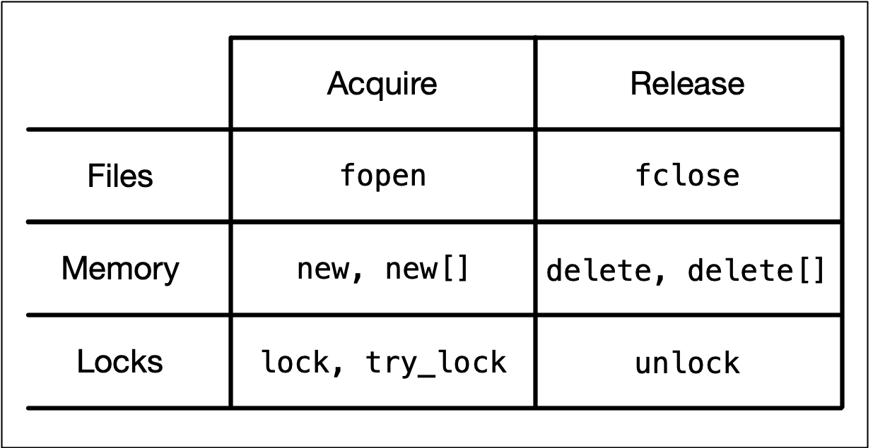
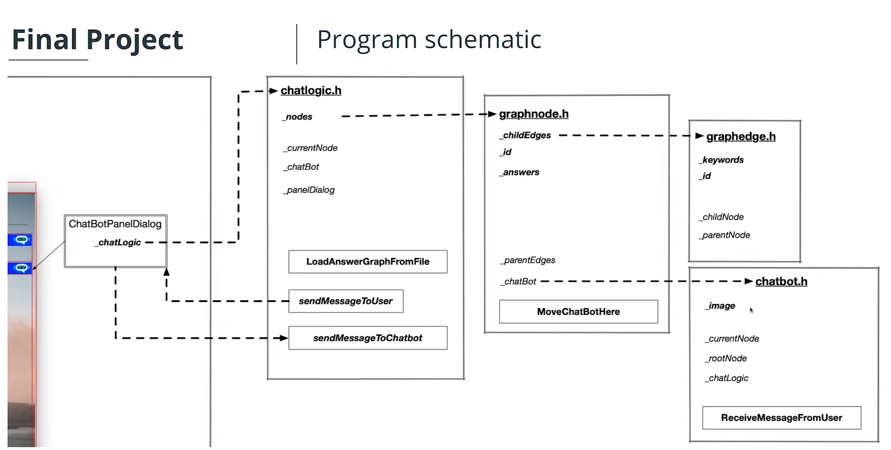

# Memory Management Table of Contents
1. [Overview of Memory Types](#overview-of-memory-types)
	1. [Memory Addresses and Hexadecimal Numbers](#memory-addresses-and-hexadecimal-numbers)
	2. [Using the GDB Debugger to Analyze Memory](#Using-the-GDB-Debugger-to-Analyze-Memory)
	3. [Types of Computer Memory](#Types-of-Computer-Memory)
	4. [Cache Memory](#Cache-Memory)
	5. [Virtual Memory](#Virtual-Memory)
2. [Variables and Memory](#Variables-and-Memory)
	1. [The Process Memory Model](#The-Process-Memory-Model)
	2. [Memory Allocation in C++](#Memory-Allocation-in-C++)
	3. [Automatic Memory Allocation The Stack](#Automatic-Memory-Allocation-The-Stack)
	4. [Call By Value vs Call By Reference](#Call-By-Value-vs-Call-By-Reference)
3. [Dynamic Memory Allocation The Heap](#Dynamic-Memory-Allocation-The-Heap)
	1. [Heap Memory](#Heap-Memory)
	2. [Using malloc and free](#Using-malloc-and-free)
	3. [Using new and delete](#Using-new-and-delete)
	4. [Typical Memory Management Problems](#Typical-Memory-Management-Problems)
		1. [Debugging memory leaks with Valgrind](#Debugging-memory-leaks-with-Valgrind)
4. [Resource Copying Policies](#Resource-Copying-Policies)
	1. [Copy Semantics](#Copy-Semantics)
		1. [No copying policy](#no-copying-policy)
		2. [Exclusive ownership policy](#exclusive-ownership-policy)
		3. [Deep copying policy](#deep-copying-policy)
		4. [Shared ownership policy](#shared-ownership-policy)
	2. [Lvalues and rvalues](#Lvalues-and-rvalues)
		1. [Lvalue references](#Lvalue-references)
		2. [Rvalue references](#Rvalue-references)
	3. [Move Semantics](#Move-Semantics)
		1. [The rule of three](#The-rule-of-three)
		2. [The move constructor and assignment operator](#The-move-constructor-and-assignment-operator)
		3. [The rule of five](#The-rule-of-five)
		4. [When to use move semantics](#When-to-use-move-semantics)
		5. [Moving lvalues](#Moving-lvalues)
		6. [More move semantic use examples](#More-move-semantic-use-examples)
5. [Smart Pointers](#Smart-Pointers)
	1. [Resource Acquisition Is Initialization RAII](#Resource-Acquisition-Is-Initialization-RAII)
		1. [Common errors with new and delete](#Common-errors-with-new-and-delete)
		2. [The benefits of smart pointers](#The-benefits-of-smart-pointers)
		3. [RAII](#RAII)
	2. [Smart pointers](#Smart-pointers)
		1. [RAII and smart pointers](#RAII-and-smart-pointers)
		2. [Smart Pointer Overview](#Smart-Pointer-Overview)
		3. [Unique Pointer](#Unique-Pointer)
		4. [Shared Pointer](#Shared-Pointer)
		5. [Weak Pointer](#Weak-Pointer)
		6. [Converting between smart pointers](#Converting-between-smart-pointers)
		7. [When to use raw pointers and smart pointers](#When-to-use-raw-pointers-and-smart-pointers)
	3. [Transferring ownership](#Transferring-ownership)
		1. [Passing smart pointers to functions](#Passing-smart-pointers-to-functions)
		2. [Returning smart pointers from functions](#Returning-smart-pointers-from-functions)
6. [Project Memory Management Chatbot](#Project-Memory-Management-Chatbot)
	1. [Project Introduction](#Project-Introduction)
	2. [Project Rubric](#Project-Rubric)
	3. [Program Schematic](#Program-Schematic)
	4. [Program Knowledge Base](#Program-Knowledge-Base)
	5. [Project Tasks Overview](#Project-Tasks-Overview)
	6. [Code Walkthrough](#Code-Walkthrough)
	7. [Task Details](#Task-Details)

# Overview of Memory Types
## Memory Addresses and Hexadecimal Numbers

Inside each computer, all numbers, characters, commands and every imaginable type of information are represented in binary form. Over the years, many coding schemes and techniques were invented to manipulate these 0s and 1s effectively. One of the most widely used schemes is called ASCII (_American Standard Code for Information Interchange_), which lists the binary code for a set of 127 characters. The idea was to represent each letter with a sequence of binary numbers so that storing texts on in computer memory and on hard (or floppy) disks would be possible.


There are several reasons why it is preferable to use hex numbers instead of binary numbers (which computers store at the lowest level), three of which are given below:

1. **Readability**: It is significantly easier for a human to understand hex numbers as they resemble the decimal numbers we are used to. It is simply not intuitive to look at binary numbers and decide how big they are and how they relate to another binary number.
    
2. **Information density**: A hex number with two digits can express any number from 0 to 255 (because 16^2 is 256). To do the same in the binary system, we would require 8 digits. This difference is even more pronounced as numbers get larger and thus harder to deal with.
    
3. **Conversion into bytes**: Bytes are units of information consisting of 8 bits. Almost all computers are byte-addressed, meaning all memory is referenced by byte, instead of by bit. Therefore, using a counting system that can easily convert into bytes is an important requirement. We will shortly see why grouping bits into a byte plays a central role in understanding how computer memory works.

## Using the GDB Debugger to Analyze Memory

See [debugger_analyze_memory.cpp](debugger_analyze_memory.cpp) for an example of how to debug. To build with debugging symbols
```
g++ -g debugger_analyze_memory.cpp
```

To start gdb debugger:
```
gdb a.out
```
When gdb displays the line `Type <RET> for more, q to quit, c to continue without paging`, be sure to press the RETURN key to continue.

See [GDB Cheat Sheet](gdb_cheat_sheet.pdf) for gdb commands.

For this example, to set a breakpoint at line 5, run the program, step to the next line, and display variable value and address of variable, do the following:
```
break 5
run
step
p str1
p &str1
```

Now to print what's at the memory addresses:
```
(gdb) p str1
$3 = "UDACITY"
(gdb) p &str1
$4 = (char (*)[8]) 0x7fffffffdc60
(gdb) x/7tb 0x7fffffffdc60
0x7fffffffdc60: 01010101        01000100        01000001        01000011        01001001        01010100        01011001
(gdb) x/7xb 0x7fffffffdc60
0x7fffffffdc60: 0x55    0x44    0x41    0x43    0x49    0x54    0x59
(gdb) x/7cb 0x7fffffffdc60
0x7fffffffdc60: 85 'U'  68 'D'  65 'A'  67 'C'  73 'I'  84 'T'  89 'Y'
(gdb) x/7db 0x7fffffffdc60
0x7fffffffdc60: 85      68      65      67      73      84      89
```
The 7 says to print 7 units, the t stands for binary, the x stands for hex, the c stands for char (read as int, but use ascii to print char), the d is just as an int. And the b in the 3rd character stands for bytes. See GDB Cheat Sheet (linked above) for more options.

There is also an [online gdb application](https://www.onlinegdb.com) you can use to debug code.

## Types of Computer Memory

Below you will find a small list of some common memory types that you will surely have heard of:
- RAM / ROM
- Cache (L1, L2)
- Registers
- Virtual Memory
- Hard Disks, USB drives

Regrettably though, low latency and large memory are not compatible with each other (at least not at a reasonable price). In practice, the decision for low latency usually results in a reduction of the available storage capacity (and vice versa). This is the reason why a computer has multiple memory types that are arranged hierarchically. The following pyramid illustrates the principle, fast and low storage at top, and slow and more storage at bottom:


Stuff that needs accessed often or soon should be closer to the top of the pyramid while stuff that isn't accessed often should be near the bottom.

## Cache Memory

Cache memory is much faster but also significantly smaller than standard RAM. It holds the data that will (or might) be used by the CPU more often. In the memory hierarchy we have seen in the last section, the cache plays an intermediary role between fast CPU and slow RAM and hard disk. The figure below gives a rough overview of a typical system architecture:

The central CPU chip is connected to the outside world by a number of buses. There is a cache bus, which leads to a block denoted as L2 cache, and there is a system bus as well as a memory bus that leads to the computer main memory. The latter holds the comparatively large RAM while the L2 cache as well as the L1 cache are very small with the latter also being a part of the CPU itself.


1. **Level 1 cache** is the fastest and smallest memory type in the cache hierarchy. In most systems, the L1 cache is not very large. Mostly it is in the range of 16 to 64 kBytes, where the memory areas for instructions and data are separated from each other (L1i and L1d, where "i" stands for "instruction" and "d" stands for "data". Also see "[Harvard architecture](https://en.wikipedia.org/wiki/Harvard_architecture)" for further reference). The importance of the L1 cache grows with increasing speed of the CPU. In the L1 cache, the most frequently required instructions and data are buffered so that as few accesses as possible to the slow main memory are required. This cache avoids delays in data transmission and helps to make optimum use of the CPU's capacity.
    
2. **Level 2 cache** is located close to the CPU and has a direct connection to it. The information exchange between L2 cache and CPU is managed by the L2 controller on the computer main board. The size of the L2 cache is usually at or below 2 megabytes. On modern multi-core processors, the L2 cache is often located within the CPU itself. The choice between a processor with more clock speed or a larger L2 cache can be answered as follows: With a higher clock speed, individual programs run faster, especially those with high computing requirements. As soon as several programs run simultaneously, a larger cache is advantageous. Usually normal desktop computers with a processor that has a large cache are better served than with a processor that has a high clock rate.
    
3. **Level 3 cache** is shared among all cores of a multicore processor. With the L3 cache, the [cache coherence](https://en.wikipedia.org/wiki/Cache_coherence) protocol of multicore processors can work much faster. This protocol compares the caches of all cores to maintain data consistency so that all processors have access to the same data at the same time. The L3 cache therefore has less the function of a cache, but is intended to simplify and accelerate the cache coherence protocol and the data exchange between the cores.

On Mac, information about the system cache can be obtained by executing the command `sysctl -a hw` in a terminal. On Debian Linux linux, this information can be found with `lscpu | grep cache`.

While L1 access operations are close to the speed of a photon traveling at light speed for a distance of 1 foot, the latency of L2 access is roughly one order of magnitude slower already while access to main memory is two orders of magnitude slower.

In algorithm design, programmers can exploit two principles to increase runtime performance:

1. **Temporal locality** means that address ranges that are accessed are likely to be used again in the near future. In the course of time, the same memory address is accessed relatively frequently (e.g. in a loop). This property can be used at all levels of the memory hierarchy to keep memory areas accessible as quickly as possible.
    
2. **Spatial locality** means that after an access to an address range, the next access to an address in the immediate vicinity is highly probable (e.g. in arrays). In the course of time, memory addresses that are very close to each other are accessed again multiple times. This can be exploited by moving the adjacent address areas upwards into the next hierarchy level during a memory access.
    
Let us consider the following code example:

```cpp
#include <chrono>
#include <iostream>

int main()
{
    // create array 
    const int size = 4000;
    static int x[size][size];

    auto t1 = std::chrono::high_resolution_clock::now();
    for (int i = 0; i < size; i++)
    {
        for (int j = 0; j < size; j++)
        {
            x[j][i] = i + j;
            //std::cout << &x[j][i] << ": i=" << i << ", j=" << j << std::endl;
        }
    }

    // print execution time to console
    auto t2 = std::chrono::high_resolution_clock::now(); // stop time measurement
    auto duration = std::chrono::duration_cast<std::chrono::microseconds>(t2 - t1).count();
    std::cout << "Execution time: " << duration << " microseconds" << std::endl;

    return 0;
}
```

Changing the order of j and i when indexing x x[i][j] instead of x[j][i] is more cache friendly code and runs way more quickly.

## Virtual Memory

The idea of virtual memory stems back from a (not so long ago) time, when the random access memory (RAM) of most computers was severely limited. Programers needed to treat memory as a precious resource and use it most efficiently. Also, they wanted to be able to run programs even if there was not enough RAM available. At the time of writing (August 2019), the amount of RAM is no longer a large concern for most computers and programs usually have enough memory available to them. But in some cases, for example when trying to do video editing or when running multiple large programs at the same time, the RAM memory can be exhausted. In such a case, the computer can slow down drastically.

There are several other memory-related problems, that programmers need to know about:

1. **Holes in address space** : If several programs are started one after the other and then shortly afterwards some of these are terminated again, it must be ensured that the freed-up space in between the remaining programs does not remain unused. If memory becomes too fragmented, it might not be possible to allocate a large block of memory due to a large-enough free contiguous block not being available any more.
    
2. **Programs writing over each other** : If several programs are allowed to access the same memory address, they will overwrite each others' data at this location. In some cases, this might even lead to one program reading sensitive information (e.g. bank account info) that was written by another program. This problem is of particular concern when writing concurrent programs which run several threads at the same time.
    

The basic idea of virtual memory is to separate the addresses a program may use from the addresses in physical computer memory. By using a mapping function, an access to (virtual) program memory can be redirected to a real address which is guaranteed to be protected from other programs.

In the following, you will see, how virtual memory solves the problems mentioned above and you will also learn about the concepts of memory pages, frames and mapping. A sound knowledge on virtual memory will help you understand the C++ memory model, which will be introduced in the next lesson of this course.

With virtual memory, the RAM acts as a cache for the virtual memory space which resides on secondary storage devices. On Windows systems, the file `pagefile.sys` is such a virtual memory container of varying size. To speed up your system, it makes sense to adjust the system settings in a way that this file is stored on an SSD instead of a slow magnetic hard drive, thus reducing the latency. On a Mac, swap files are stored in`/private/var/vm/`.

In a nutshell, virtual memory guarantees us a fixed-size address space which is largely independent of the system configuration. Also, the OS guarantees that the virtual address spaces of different programs do not interfere with each other.

The task of mapping addresses and of providing each program with its own virtual address space is performed entirely by the operating system, so from a programmer’s perspective, we usually don’t have to bother much about memory that is being used by other processes.

Before we take a closer look at an example though, let us define two important terms which are often used in the context of caches and virtual memory:

- A **memory page** is a number of directly successive memory locations in virtual memory defined by the computer architecture and by the operating system. The computer memory is divided into memory pages of equal size. The use of memory pages enables the operating system to perform virtual memory management. The entire working memory is divided into tiles and each address in this computer architecture is interpreted by the Memory Management Unit (MMU) as a logical address and converted into a physical address.
- A **memory frame** is mostly identical to the concept of a memory page with the key difference being its location in the physical main memory instead of the virtual memory.


# Variables and Memory
## The Process Memory Model

As we have seen in the previous lesson, each program is assigned its own virtual memory by the operating system. This address space is arranged in a linear fashion with one block of data being stored at each address. It is also divided into several distinct areas as illustrated by the figure below:

1. The **stack** is a contiguous memory block with a fixed maximum size. If a program exceeds this size, it will crash. The stack is used for storing automatically allocated variables such as local variables or function parameters. If there are multiple threads in a program, then each thread has its own stack memory. New memory on the stack is allocated when the path of execution enters a scope and freed again once the scope is left. It is important to know that the stack is managed "automatically" by the compiler, which means we do not have to concern ourselves with allocation and deallocation.
2. The **heap** (also called "free store" in C++) is where data with dynamic storage lives. It is shared among multiple threads in a program, which means that memory management for the heap needs to take concurrency into account. This makes memory allocations in the heap more complicated than stack allocations. In general, managing memory on the heap is more (computationally) expensive for the operating system, which makes it slower than stack memory. Contrary to the stack, the heap is not managed automatically by the system, but by the programmer. If memory is allocated on the heap, it is the programmer’s responsibility to free it again when it is no longer needed. If the programmer manages the heap poorly or not at all, there will be trouble.
3. The **BSS** (Block Started by Symbol) segment is used in many compilers and linkers for a segment that contains global and static variables that are initialized with zero values. This memory area is suitable, for example, for arrays that are not initialized with predefined values.
4. The **Data** segment serves the same purpose as the BSS segment with the major difference being that variables in the Data segment have been initialized with a value other than zero. Memory for variables in the Data segment (and in BSS) is allocated once when a program is run and persists throughout its lifetime.

## Memory Allocation in C++

Now that we have an understanding of the available process memory, let us take a look at memory allocation in C++.

Not every variable in a program has a permanently assigned area of memory. The term **allocate** refers to the process of assigning an area of memory to a variable to store its value. A variable is **deallocated** when the system reclaims the memory from the variable, so it no longer has an area to store its value.

Generally, three basic types of memory allocation are supported:

1. **Static memory allocation** is performed for static and global variables, which are stored in the BSS and Data segment. Memory for these types of variables is allocated once when your program is run and persists throughout the life of your program.
2. **Automatic memory allocation** is performed for function parameters as well as local variables, which are stored on the stack. Memory for these types of variables is allocated when the path of execution enters a scope and freed again once the scope is left.
3. **Dynamic memory allocation** is a possibility for programs to request memory from the operating system at runtime when needed. This is the major difference between automatic and static allocation, where the size of the variable must be known at compile time. Dynamic memory allocation is not performed on the limited stack but on the heap and is thus (almost) only limited by the size of the address space.

From a programmer’s perspective, stack and heap are the most important areas of program memory. Hence, in the following lessons, let us look at these two in turn.

## Automatic Memory Allocation The Stack

As mentioned in the last section, the stack is the place in virtual memory where the local variables reside, including arguments to functions. Each time a function is called, the stack grows (from top to bottom) and each time a function returns, the stack contracts. When using multiple threads (as in concurrent programming), it is important to know that each thread has its own stack memory - which can be considered thread-safe.

In the following, a short list of key properties of the stack is listed:

1. The stack is a **contiguous block of memory**. It will not become fragmented (as opposed to the heap) and it has a fixed maximum size.
    
2. When the **maximum size of the stack** memory is exceeded, a program will crash.
    
3. Allocating and deallocating **memory is fast** on the stack. It only involves moving the stack pointer to a new position.

The following diagram shows the stack memory during a function call:

In the example, the variable `x` is created on the stack within the scope of main. Then, a stack frame which represents the function `Add` and its variables is pushed to the stack, moving the stack pointer further downwards. It can be seen that this includes the local variables `a` and `b`, as well as the return address, a base pointer and finally the return value `s`.

The following shows how the stack can grow and contract:
```cpp
#include <stdio.h>

void MyFunc()
{
    int k = 3; 
    printf ("3: %p \n",&k);
}

int main()
{
    int i = 1; 
    printf ("1: %p \n",&i);

    int j = 2; 
    printf ("2: %p \n",&j);

    MyFunc();

    int l = 4; 
    printf ("4: %p \n",&l);

    return 0; 
}
```

Within the main function, we see two declarations of local variables `i` and `j` followed by a call to `MyFunc`, where another local variable is allocated. After `MyFunc` returns, another local variable is allocated in `main`. The program generates the following output:

`1: 0x7ffeefbff688`  
`2: 0x7ffeefbff684`
`3: 0x7ffeefbff65c`
`4: 0x7ffeefbff680` 

Between 1 and 2, the stack address is reduced by 4 bytes, which corresponds to the allocation of memory for the int `j`.

Between 2 and 3, the address pointer is moved by 0x28. We can easily see that calling a function causes a significant amount of memory to be allocated. In addition to the local variable of `MyFunc`, the compiler needs to store additional data such as the return address.

Between 3 and 4, `MyFunc` has returned and a third local variable `k` has been allocated on the stack. The stack pointer now has moved back to a location which is 4 bytes relative to position 2. This means that after returning from `MyFunc`, the stack has contracted to the size it had before the function call.

When a thread is created, stack memory is allocated by the operating system as a contiguous block. With each new function call or local variable allocation, the stack pointer is moved until eventually it will reach the bottom of said memory block. Once it exceeds this limit (which is called "stack overflow"), the program will crash. We will try to find out the limit of your computer’s stack memory in the following exercise.

```cpp
#include <iostream>

int calls = 0;

void myFunc(int& y)
{
    calls++;
    int x = 3;
    std::cout << calls << ": stack bottom : " << &y << ", current : " << &x << std::endl;
    myFunc(y);
}

int main()
{
    int y = 10;
    myFunc(y);
    return 0;
}
```

`ulimit -s` prints the stack size `8192` for my linux machine. The program above prints:

```
171157: stack bottom : 0x7f2071c4ee14, current : 0x7f2071479234
171158: stack bottom : 0x7f2071c4ee14, current : 0x7f2071479204
171159: stack bottom : 0x7f2071c4ee14, current : 0x7f20714791d4
Segmentation fault
```

The difference between the current stack position and the stack bottom right before the segmentation fault should match the stack size for the machine indicating a stack overflow.

## Call By Value vs Call By Reference

Pass by value example below. the value printed is 2 instead of 4 since AddTwo doesn't affect the variable passed in by value.
```cpp
#include <iostream>

void AddTwo(int val)
{
    val += 2;
}

int main()
{
    int val = 0;
    AddTwo(val);
    val += 2;

    std::cout << "val = " << val << std::endl;
 
    return 0;
}
```
 You can get around this by passing in a pointer to the variable. This still passes by value, in that it makes a local copy of the memory address that can be used to modify the variable at the address like below. The val printed is 5.
```cpp
#include <iostream>

void AddThree(int *val)
{
    *val += 3;
}

int main()
{
    int val = 0;
    AddThree(&val);
    val += 2;

    std::cout << "val = " << val << std::endl;
 
    return 0;
}
```
The 2nd major way to pass variables is by reference. This is faster and more memory efficient than passing a pointer as no information needs to be copied. Example below where val returned is 6.
```cpp
#include <iostream>

void AddFour(int &val)
{
    val += 4;
}

int main()
{
    int val = 0;
    AddFour(val);
    val += 2;

    std::cout << "val = " << val << std::endl;
 
    return 0;
}
```

Passing by reference also makes it easy to modify several variables. If you wanted to use the function return value for such a purpose, returning several variables can be cumbersome. For example the following prints a val = 7 and success = 1

```cpp
#include <iostream>

void AddFive(int& value, bool& succeeded)
{
    value += 5;
    succeeded = true;
}

int main()
{
    int val = 0;
    bool success = false;
    AddFive(val, success);
    val += 2;

    std::cout << "val = " << val << ", success = " << success << std::endl;
 
    return 0;
}
```

When passing pointers vs. references, consider the following:
- Pointers can be declared without initialization. This means we can pass an uninitialized pointer to a function who then internally performs the initialization for us.
    
- Pointers can be reassigned to another memory block on the heap.
    
- References are usually easier to use (depending on the expertise level of the programmer). Sometimes however, if a third-party function is used without properly looking at the parameter definition, it might go unnoticed that a value has been modified.

Closer examination at stack memory usage with 3 strategies (call by value, call by pointer, call by reference):
```cpp
#include <stdio.h>
    
void CallByValue(int i)
{
    int j = 1; 
    printf ("call-by-value: %p\n",&j);
}

void CallByPointer(int *i)
{
    int j = 1; 
    printf ("call-by-pointer: %p\n",&j);
}

void CallByReference(int &i)
{
    int j = 1; 
    printf ("call-by-reference: %p\n",&j);
}

int main()
{
    int i = 0;
    printf ("stack bottom: %p\n",&i);
    
    CallByValue(i);

    CallByPointer(&i);

    CallByReference(i);

    return 0;
}
```

This outputs:
```
stack bottom:      0x7ffeefbff698
call-by-value:     0x7ffeefbff678
call-by-pointer:   0x7ffeefbff674
call-by-reference: 0x7ffeefbff674
```

1. `CallByValue` requires 32 bytes of memory. As discussed before, this is reserved for e.g. the function return address and for the local variables within the function (including the copy of `i`).
    
2. `CallByPointer` on the other hand requires - perhaps surprisingly - 36 bytes of memory. Let us complete the examination before going into more details on this result.
    
3. `CallByReference` finally has the same memory requirements as `CallByPointer`

In this section, we have argued at length that passing a parameter by reference avoids a costly copy and should - in many situations - be preferred over passing a parameter by value. Yet, in the experiment above, we have witnessed the exact opposite.

Let us take a look at the size of the various parameter types using the `sizeof` command:

`printf("size of int: %lu\n", sizeof(int)); printf("size of *int: %lu\n", sizeof(int *));`

The output here is

`size of int: 4 size of *int: 8`

Obviously, the size of the pointer variable is larger than the actual data type. As my machine has a 64 bit architecture, an address requires 8 byte.

As an experiment, you could use the `-m32` compiler flag to build a 32 bit version of the program. This yields the following output:

`size of int: 4 size of *int: 4`

In order to benefit from call-by-reference, the size of the data type passed to the function has to surpass the size of the pointer on the respective architecture (i.e. 32 bit or 64 bit).

# Dynamic Memory Allocation The Heap
## Heap Memory

Heap memory, also know as dynamic memory , is an important resource available to programs (and programmers) to store data.


As mentioned earlier, the heap memory grows upwards while the stack grows in the opposite direction. We have seen in the last lesson that the automatic stack memory shrinks and grows with each function call and local variable. As soon as the scope of a variable is left, it is automatically deallocated and the stack pointer is shifted upwards accordingly.

Heap memory is different in many ways: The programmer can request the allocation of memory by issuing a command such as `malloc` or `new` (more on that shortly). This block of memory will remain allocated until the programmer explicitly issues a command such as `free` or `delete`. The huge advantage of heap memory is the high degree of control a programmer can exert, albeit at the price of greater responsibility since memory on the heap must be actively managed.

Let us take a look at some properties of heap memory:

1. As opposed to local variables on the stack, memory can now be allocated in an arbitrary scope (e.g. inside a function) without it being deleted when the scope is left. Thus, as long as the address to an allocated block of memory is returned by a function, the caller can freely use it.
    
2. Local variables on the stack are allocated at compile-time. Thus, the size of e.g. a string variable might not be appropriate as the length of the string will not be known until the program is executed and the user inputs it. With local variables, a solution would be to allocate a long-enough array of and hope that the actual length does not exceed the buffer size. With dynamically allocated heap memory, variables are allocated at run-time. This means that the size of the above-mentioned string variable can be tailored to the actual length of the user input.
    
3. Heap memory is only constrained by the size of the address space and by the available memory. With modern 64 bit operating systems and large RAM memory and hard disks the programmer commands a vast amount of memory. However, if the programmer forgets to deallocate a block of heap memory, it will remain unused until the program is terminated. This is called a "memory leak".
    
4. Unlike the stack, the heap is shared among multiple threads, which means that memory management for the heap needs to take concurrency into account as several threads might compete for the same memory resource.
    
5. When memory is allocated or deallocated on the stack, the stack pointer is simply shifted upwards or downwards. Due to the sequential structure of stack memory management, stack memory can be managed (by the operating system) easily and securely. With heap memory, allocation and deallocation can occur arbitrarily, depending on the lifetime of the variables. This can result in fragmented memory over time, which is much more difficult and expensive to manage.

**Memory Fragmentation**

Let us construct a theoretic example of how memory on the heap can become fragmented: Suppose we are interleaving the allocation of two data types `X` and `Y` in the following fashion: First, we allocate a block of memory for a variable of type `X`, then another block for `Y` and so on in a repeated manner until some upper bound is reached. At the end of this operation, the heap might look like the following:

At some point, we might then decide to deallocate all variables of type `Y`, leading to empty spaces in between the remaining variables of type `X`. In between two blocks of type "X", no memory for an additional "X" could now be squeezed in this example.

A classic symptom of memory fragmentation is that you try to allocate a large block and you can’t, even though you appear to have enough memory free. On systems with virtual memory however, this is less of a problem, because large allocations only need to be contiguous in virtual address space, not in physical address space.

When memory is heavily fragmented however, memory allocations will likely take longer because the memory allocator has to do more work to find a suitable space for the new object.

At compile time, only the space for the pointer is reserved (on the stack). When the pointer is initialized, a block of memory of `sizeof(int)` bytes is allocated (on the heap) at program runtime. The pointer on the stack then points to this memory location on the heap.

## Using malloc and free

So far we only considered primitive data types, whose storage space requirement was already fixed at compile time and could be scheduled with the building of the program executable. However, it is not always possible to plan the memory requirements exactly in advance, and it is inefficient to reserve the maximum memory space each time just to be on the safe side. C and C++ offer the option to reserve memory areas during the program execution, i.e. at runtime. It is important that the reserved memory areas are released again at the "appropriate point" to avoid memory leaks. It is one of the major challenges in memory management to always locate this "appropriate point" though.

To allocate dynamic memory on the heap means to make a contiguous memory area accessible to the program at runtime and to mark this memory as occupied so that no one else can write there by mistake.

To reserve memory on the heap, one of the two functions `malloc` (stands for _Memory Allocation_) or `calloc` (stands for _Cleared Memory Allocation_) is used. The header file `stdlib.h` or `malloc.h` must be included to use the functions.

Here is the syntax of `malloc` and `calloc` in C/C++:

`pointer_name = (cast-type*) malloc(size); pointer_name = (cast-type*) calloc(num_elems, size_elem);`

`malloc` is used to dynamically allocate a single large block of memory with the specified size. It returns a pointer of type `void` which can be cast into a pointer of any form.

`calloc` is used to dynamically allocate the specified number of blocks of memory of the specified type. It initializes each block with a default value '0'.

Both functions return a pointer of type `void` which can be cast into a pointer of any form. If the space for the allocation is insufficient, a NULL pointer is returned.

The problem with `void` pointers is that there is no way of knowing the offset to the end of the allocated memory block. For an int, this would be 4 bytes but for a double, the offset would be 8 bytes. So in order to retrieve the entire block of memory that has been reserved, we need to know the data type and the way to achieve this with `malloc` is by casting the return pointer.

Since arrays and pointers are displayed and processed identically internally, individual blocks of data can also be accessed using array syntax:

```cpp
#include <stdio.h> 
#include <stdlib.h> 
  
int main() 
{
    // reserve memory for 1 integer
    int* p = static_cast<int*>(malloc(sizeof(int)));
    // prints 'address=0x602010, value=0'
    printf("address=%p, value=%d\n", p, *p);
    
    // reserve memory for 3 integers
    int *p2 = (int*)malloc(3*sizeof(int));
    p2[0] = 1; p2[1] = 2; p2[2] = 3;
    // prints 'address=0x602440, second_value=2'
    printf("address=%p, second value=%d\n", p2, p2[1]);
    
    struct MyStruct
    {
        int i;
        double d;
        char a[5];
    };

    MyStruct* p3 = static_cast<MyStruct*>(calloc(4,sizeof(MyStruct)));
    p3[0].i = 1; p3[0].d = 3.14159; p3[0].a[0] = 'a';
    // prints 'address=0x602460, second_value=3.14159'
    printf("address=%p, second value=%f\n", p3, p3[0].d);
    return 0; 
}
```

The size of the memory area reserved with `malloc` or `calloc` can be increased or decreased with the `realloc` function.

`pointer_name = (cast-type*) realloc( (cast-type*)old_memblock, new_size );`

To do this, the function must be given a pointer to the previous memory area and the new size in bytes. Depending on the compiler, the reserved memory area is either (a) expanded or reduced internally (if there is still enough free heap after the previously reserved memory area) or (b) a new memory area is reserved in the desired size and the old memory area is released afterwards.

The data from the old memory area is retained, i.e. if the new memory area is larger, the data will be available within new memory area as well. If the new memory area is smaller, the data from the old area will be available only up until the site of the new area - the rest is lost.

In the example on the right, a block of memory of initially 8 bytes (two integers) is resized to 16 bytes (four integers) using `realloc`.

Note that realloc has been used to increase the memory size and then decrease it immediately after assigning the values 3 and 4 to the new blocks. The output looks like the following:

```
address=0x100300060, value=1
address=0x100300064, value=2
address=0x100300068, value=3
address=0x10030006c, value=4
```

Interestingly, the pointers `p+2` and `p+3` can still access the memory location they point to. Also, the original data (numbers 3 and 4) is still there. So `realloc` will not erase memory but merely mark it as "available" for future allocations. It should be noted however that accessing a memory location _after_ such an operation must be avoided as it could cause a segmentation fault. We will encounter segmentation faults soon when we discuss "dangling pointers" in one of the next lessons.

If memory has been reserved, it should also be released as soon as it is no longer needed. If memory is reserved regularly without releasing it again, the memory capacity may be exhausted at some point. If the RAM memory is completely used up, the data is swapped out to the hard disk, which slows down the computer significantly.

The `free` function releases the reserved memory area so that it can be used again or made available to other programs. To do this, the pointer pointing to the memory area to be freed is specified as a parameter for the function. In the `free_example.cpp`, a memory area is reserved and immediately released again.

```cpp
#include <stdio.h>
#include <stdlib.h>

int main()
{
    void *p = malloc(100); 
    free(p);

    return 0;
}
```

1. `free` can only free memory that was reserved with `malloc` or `calloc`.
    
2. `free` can only release memory that has not been released before. Releasing the same block of memory twice will result in an error.
3. Memory allocated with `malloc` or `calloc` is not subject to the familiar rules of variables in their respective scopes. This means that they exist independently of block limits until they are released again or the program is terminated. However, the pointers which refer to such heap-allocated memory are created on the stack and thus only exist within a limited scope. As soon as the scope is left, the pointer variable will be lost - but not the heap memory it refers to.

Common issue examples:
```cpp
#include <stdio.h> 
#include <stdlib.h> 

int main()
{
    // Generates a memory leak
    int *m = (int*)malloc(sizeof(int)); 
    m = NULL; 

    // Uses a dangling pointer
    int *n = (int*)malloc(sizeof(int)); 
    free(n);
    *n = 23;

    // Uses an uninitialized pointer
    char *o;
    *o = 'a'; 

    return 0;
}
```

## Using new and delete

The functions `malloc` and `free` are library function and represent the default way of allocating and deallocating memory in C. In C++, they are also part of the standard and can be used to allocate blocks of memory on the heap.

With the introduction of classes and object oriented programming in C++ however, memory allocation and deallocation has become more complex: When an object is created, its constructor needs to be called to allow for member initialization. Also, on object deletion, the destructor is called to free resources and to allow for programmer-defined clean-up tasks. For this reason, C++ introduces the operators `new` / `delete`, which represent the object-oriented counterpart to memory management with `malloc` / `free`.

If we were to create a C++ object with `malloc`, the constructor and destructor of such an object would not be called. Consider the class below. The constructor allocates memory for the private element `_number` (yes, we could have simply used `int` instead of `int*`, but that's for educational purposes only), and the destructor releases memory again. The setter method `setNumber` finally assigns a value to `_number` under the assumption that memory has been allocated previously.

In main, we will allocate memory for an instance of MyClass using both `malloc`/ `free` and `new`/`delete`.

With `malloc`, the program crashes on calling the method `setNumber`, as no memory has been allocated for `_number` - because the constructor has not been called. Hence, an `EXC_BAD_ACCESS` error occurs, when trying to access the memory location to which `_number` is pointing. With `_new`, the output looks like the following:

```
Allocate memory
Number: 42
Delete memory
```

```cpp
#include <stdlib.h>
#include <iostream>

class MyClass
{
private:
    int *_number;

public:
    MyClass()
    {
        std::cout << "Allocate memory\n";
        _number = (int *)malloc(sizeof(int));
    }
    ~MyClass()
    {
        std::cout << "Delete memory\n";
        free(_number);
    }
    void setNumber(int number)
    {
        *_number = number;
        std::cout << "Number: " << *_number << "\n";
    }
};


int main()
{
    // allocate memory using malloc
    // comment these lines out to run the example below
    MyClass* myClass = (MyClass*)malloc(sizeof(MyClass));
    myClass->setNumber(42); // EXC_BAD_ACCESS
    free(myClass);
	  
	// allocate memory using new
    MyClass *myClass = new MyClass();
    myClass->setNumber(42); // works as expected
    delete myClass;

    return 0;
}
```

Before we go into further details of `new`/`delete`, let us briefly summarize the major differences between `malloc`/`free` and `new`/`delete`:

1. **Constructors / Destructors** Unlike `malloc( sizeof(MyClass) )`, the call `new MyClass()` calls the constructor. Similarly, `delete` calls the destructor.
2. **Type safety** `malloc` returns a void pointer, which needs to be cast into the appropriate data type it points to. This is not type safe, as you can freely vary the pointer type without any warnings or errors from the compiler as in the following small example: `MyObject *p = (MyObject*)malloc(sizeof(int));` In C++, the call `MyObject *p = new MyObject()` returns the correct type automatically - it is thus type-safe.
3. **Operator Overloading** As `malloc` and `free` are functions defined in a library, their behavior can not be changed easily. The new and delete operators however can be overloaded by a class in order to include optional proprietary behavior. We will look at an example of overloading `new` further down in this section.

As with `malloc` and `free`, a call to `new` always has to be followed by a call to `delete` to ensure that memory is properly deallocated. If the programmer forgets to call `delete` on the object (which happens quite often, even with experienced programmers), the object resides in memory until the program terminates at some point in the future causing a _memory leak_.

The call to `new` has the following consequences:

1. Memory is allocated to hold a new object of type `MyClass`
2. A new object of type `MyClass` is constructed within the allocated memory by calling the constructor of `MyClass`

The call to `delete` causes the following:

1. The object of type `MyClass` is destroyed by calling its destructor
2. The memory which the object was placed in is deallocated

**Optimizing Performance with placement new**

In some cases, it makes sense to separate memory allocation from object construction. Consider a case where we need to reconstruct an object several times. If we were to use the standard `new`/`delete` construct, memory would be allocated and freed unnecessarily as only the content of the memory block changes but not its size. By separating allocation from construction, we can get a significant performance increase.

C++ allows us to do this by using a construct called _placement new_: With `placement new`, we can pass a preallocated memory and construct an object at that memory location. Consider the following code:

`void *memory = malloc(sizeof(MyClass)); MyClass *object = new (memory) MyClass;`

The syntax `new (memory)` is denoted as _placement new_. The difference to the "conventional" `new` we have been using so far is that that no memory is allocated. The call constructs an object and places it in the assigned memory location. There is however, no `delete` equivalent to `placement new`, so we have to call the destructor explicitly in this case instead of using `delete` as we would have done with a regular call to `new`:

`object->~MyClass(); free(memory);` 

**Important**: Note that this should never be done outside of `placement new`.

In the next section, we will look at how to overload the new operator and show the performance difference between `placement new` and `new`

**Overloading new and delete**

One of the major advantages of `new`/`delete` over `free`/`malloc` is the possibility of overloading. While both `malloc` and `free` are function calls and thus can not be changed easily, `new` and `delete` are operators and can thus be overloaded to integrate customized functionality, if needed.

The syntax for **overloading the new operator** looks as follows:

`void* operator new(size_t size);`

The operator receives a parameter `size` of type `size_t`, which specifies the number of bytes of memory to be allocated. The return type of the overloaded `new` is a void pointer, which references the beginning of the block of allocated memory.

The syntax for **overloading the delete operator** looks as follows:

`void operator delete(void*);`

The operator takes a pointer to the object which is to be deleted. As opposed to `new`, the operator `delete` does not have a return value.

Let us consider the example below:
```cpp
#include <iostream>
#include <stdlib.h>

class MyClass
{
    int _mymember;

public:
    MyClass()
    {
        std::cout << "Constructor is called\n";
    }

    ~MyClass()
    {
        std::cout << "Destructor is called\n";
    }

    void *operator new(size_t size)
    {
        std::cout << "new: Allocating " << size << " bytes of memory" << std::endl;
        void *p = malloc(size);

        return p;
    }

    void operator delete(void *p)
    {
        std::cout << "delete: Memory is freed again " << std::endl;
        free(p);
    }
};

int main()
{
    MyClass *p = new MyClass();
    delete p;
}
```

In the code above, both the `new` and the `delete` operator are overloaded. In `new`, the size of the class object in bytes is printed to the console. Also, a block of memory of that size is allocated on the heap and the pointer to this block is returned. In `delete`, the block of memory is freed again. The console output of this example looks as follows:

```
new: Allocating 4 bytes of memory 
Constructor is called 
Destructor is called 
delete: Memory is freed again
```

As can be seen from the order of text output, memory is instantiated in `new` before the constructor is called, while the order is reversed for the destructor and the call to `delete`.

**Overloading new[] and delete[]**

In addition to the `new` and `delete` operators we have seen so far, we can use the following code to create an array of objects:

`void* operator new[](size_t size);`
`void operator delete[](void*);`

Let us consider the example below, which has been slightly modified to allocate an array of objects instead of a single one.

```cpp
#include <iostream>
#include <stdlib.h>

class MyClass
{
    int _mymember;

public:
    MyClass()
    {
        std::cout << "Constructor is called\n";
    }

    ~MyClass()
    {
        std::cout << "Destructor is called\n";
    }

    void *operator new[](size_t size)
    {
        std::cout << "new: Allocating " << size << " bytes of memory" << std::endl;
        void *p = malloc(size);

        return p;
    }

    void operator delete[](void *p)
    {
        std::cout << "delete: Memory is freed again " << std::endl;
        free(p);
    }
};

int main()
{
    MyClass *p = new MyClass[3]();
    delete[] p;
}
```

In main, we are now creating an array of three objects of MyClass. Also, the overloaded `new` and `delete` operators have been changed to accept arrays. Let us take a look at the console output:

```
new: Allocating 20 bytes of memory 
Constructor is called 
Constructor is called 
Constructor is called 
Destructor is called 
Destructor is called 
Destructor is called 
delete: Memory is freed again
```

Interestingly, the memory requirement is larger than expected: With `new`, the block size was 4 bytes, which is exactly the space required for a single integer. Thus, with three integers, it should now be 12 bytes instead of 20 bytes. The reason for this is the memory allocation overhead that the compiler needs to keep track of the allocated blocks of memory - which in itself consumes memory. If we change the above call to e.g. `new MyClass[100]()`, we will see that the overhead of 8 bytes does not change:

```
new: Allocating 408 bytes of memory 
Constructor is called
… 
Destructor is called 
delete: Memory is freed again
```

**Reasons for overloading new and delete**

Now that we have seen how to overload the new and delete operators, let us summarize the major scenarios where it makes sense to do this:

1. The overloaded new operator function allows to **add additional parameters**. Therefore, a class can have multiple overloaded new operator functions. This gives the programmer more flexibility in customizing the memory allocation for objects.
    
2. Overloaded the new and delete operators provides an easy way to **integrate a mechanism similar to garbage collection** capabilities (such as in Java), as we will shorty see later in this course.
    
3. By adding **exception handling capabilities** into new and delete, the code can be made more robust.
    
4. It is very easy to add customized behavior, such as overwriting deallocated memory with zeros in order to increase the security of critical application data.

## Typical Memory Management Problems

1. **Memory Leaks** Memory leaks occur when data is allocated on the heap at runtime, but not properly deallocated. A program that forgets to clear a memory block is said to have a memory leak - this may be a serious problem or not, depending on the circumstances and on the nature of the program. For a program that runs, computes something, and quits immediately, memory leaks are usually not a big concern. Memory leaks are mostly problematic for programs that run for a long time and/or use large data structures. In such a case, memory leaks can gradually fill the heap until allocation requests can no longer be properly met and the program stops responding or crashes completely. We will look at an example further down in this section.
    
2. **Buffer Overruns** Buffer overruns occur when memory outside the allocated limits is overwritten and thus corrupted. One of the resulting problems is that this effect may not become immediately visible. When a problem finally does occur, cause and effect are often hard to discern. It is also sometimes possible to inject malicious code into programs in this way, but this shall not be discussed here. In this example, the allocated stack memory is too small to hold the entire string, which results in a segmentation fault:
```cpp
char str[5];
strcpy(str,"BufferOverrun");
printf("%s",str);
```
3. **Uninitialized Memory** Depending on the C++ compiler, data structures are sometimes initialized (most often to zero) and sometimes not. So when allocating memory on the heap without proper initialization, it might sometimes contain garbage that can cause problems.
```cpp
int a;
int b=a*42;
printf("%d",b);
```
4. **Incorrect pairing of allocation and deallocation** Freeing a block of memory more than once will cause a program to crash. This can happen when a block of memory is freed that has never been allocated or has been freed before. Such behavior could also occur when improper pairings of allocation and deallocation are used such as using `malloc()` with `delete` or `new` with `free()`.

In this first example, the wrong `new` and `delete` are paired
```cpp
double *pDbl=new double[5];
delete pDbl;
```
In this second example, the pairing is correct but a double deletion is performed:
```cpp
char *pChr=new char[5];
delete[] pChr;
delete[] pChr;
```
5. **Invalid memory access** This error occurs then trying to access a block of heap memory that has not yet or has already been deallocated.

In this example, the heap memory has already been deallocated at the time when `strcpy()` tries to access it:
```cpp
char *pStr=new char[25];
delete[] pStr;
strcpy(pStr, "Invalid Access");
```

### Debugging memory leaks with Valgrind

See [here](https://youtu.be/y0m_6V8fvzA) for an example with 2nd video [here](https://youtu.be/K2PQTpldoIw).

In this section, we will look at _Valgrind_, a free software for Linux and Mac that is able to automatically detect memory. Windows programers can for example use the Visual Studio debugger and C Run-time Library (CRT) to detect and identify memory leaks. More information on how to do this can be found here: [Find memory leaks with the CRT Library - Visual Studio | Microsoft Docs](https://docs.microsoft.com/en-us/visualstudio/debugger/finding-memory-leaks-using-the-crt-library?view=vs-2019)

With recent versions of MacOS, occasional difficulties have been reported with installing Valgrind. A working version for MacOS Mojave can be downloaded from GitHub via Homebrew: [GitHub - sowson/valgrind: Experimental Version of Valgrind for macOS 10.14.6 Mojave](https://github.com/sowson/valgrind)

Valgrind is a framework that facilitates the development of tools for the dynamic analysis of programs. Dynamic analysis examines the behavior of a program at runtime, in contrast to static analysis, which often checks programs for various criteria or potential errors at the source code level before, during, or after translation. More information on Valgrind can be found here: [Valgrind: About](http://valgrind.org/info/)

The Memcheck tool within Valgrind can be used to detect typical errors in programs written in C or C++ that occur in connection with memory management. It is probably the best-known tool in the Valgrind suite, and the name Valgrind is often used as a synonym for Memcheck.

The following code generates a memory leak as the integer array has been allocated on the heap but the deallocation has been forgotten by the programmer:

```cpp
int main()
{
    int *pInt = new int[10];
    return 0; 
}
```

The array of integers on the heap to which `pInt` is pointing has a size of `10 * sizeof(int)`, which is 40 bytes. Let us now use Valgrind to search for this leak.

After compiling the `memory_leaks_debugging.cpp` code file on the right to `a.out`, the terminal can be used to start Valgrind with the following command:

`valgrind --leak-check=full --show-leak-kinds=all --track-origins=yes --verbose --log-file=/home/workspace/valgrind-out.txt /home/workspace/a.out`

Let us look at the call parameters one by one:

- **--leak-check** : Controls the search for memory leaks when the client program finishes. If set to `summary`, it says how many leaks occurred. If set to `full`, each individual leak will be shown in detail.
- **--show-leak-kinds** : controls the set of leak kinds to show when —leak-check=full is specified. Options are `definite`, `indirect`, `possible` `reachable`, `all` and `none`
- **--track-origins** : can be used to see where uninitialised values come from.
    
You can read the file into the terminal with:
`cat valgrind-out.txt`

This displays:
```
workspace root$ cat valgrind-out.txt
==1416== Memcheck, a memory error detector
==1416== Copyright (C) 2002-2015, and GNU GPL'd, by Julian Seward et al.
==1416== Using Valgrind-3.11.0 and LibVEX; rerun with -h for copyright info
==1416== Command: /home/workspace/a.out
==1416== Parent PID: 1249
==1416== 
==1416== 
==1416== HEAP SUMMARY:
==1416==     in use at exit: 72,744 bytes in 2 blocks
==1416==   total heap usage: 2 allocs, 0 frees, 72,744 bytes allocated
==1416== 
==1416== 40 bytes in 1 blocks are definitely lost in loss record 1 of 2
==1416==    at 0x4C2E80F: operator new[](unsigned long) (in /usr/lib/valgrind/vgpreload_memcheck-amd64-linux.so)
==1416==    by 0x4005B8: main (in /workspace/home/a.out)
==1416== 
==1416== 72,704 bytes in 1 blocks are still reachable in loss record 2 of 2
==1416==    at 0x4C2DB8F: malloc (in /usr/lib/valgrind/vgpreload_memcheck-amd64-linux.so)
==1416==    by 0x4EDC365: ??? (in /usr/lib/x86_64-linux-gnu/libstdc++.so.6.0.28)
==1416==    by 0x40106F9: call_init.part.0 (dl-init.c:72)
==1416==    by 0x401080A: call_init (dl-init.c:30)
==1416==    by 0x401080A: _dl_init (dl-init.c:120)
==1416==    by 0x4000C69: ??? (in /lib/x86_64-linux-gnu/ld-2.23.so)
==1416== 
==1416== LEAK SUMMARY:
==1416==    definitely lost: 40 bytes in 1 blocks
==1416==    indirectly lost: 0 bytes in 0 blocks
==1416==      possibly lost: 0 bytes in 0 blocks
==1416==    still reachable: 72,704 bytes in 1 blocks
==1416==         suppressed: 0 bytes in 0 blocks
==1416== 
==1416== For counts of detected and suppressed errors, rerun with: -v
==1416== ERROR SUMMARY: 1 errors from 1 contexts (suppressed: 0 from 0)
```

Bjarn mentioned the following:

RAII, which stands for [**R**esource **A**cquisition **I**s **I**nitialization](https://en.cppreference.com/w/cpp/language/raii) is something you will learn about in a later part of the course.

# Resource Copying Policies
## Copy Semantics

In C++, a common way of safely accessing resources is by wrapping a manager class around the handle, which is initialized when the resource is acquired (in the class constructor) and released when it is deleted (in the class destructor). This concept is often referred to as _Resource Acquisition is Initialization (RAII)_, which we will discuss in greater depth in the next concept. One problem with this approach though is that copying the manager object will also copy the handle of the resource. This allows two objects access to the same resource - and this can mean trouble.

Example:
```cpp
#include <iostream>

class MyClass
{
private:
    int *_myInt;

public:
    MyClass()
    {
        _myInt = (int *)malloc(sizeof(int));
    };
    ~MyClass()
    {
        free(_myInt);
    };
    void printOwnAddress() { std::cout << "Own address on the stack is " << this << std::endl; }
    void printMemberAddress() { std::cout << "Managing memory block on the heap at " << _myInt << std::endl; }
};

int main()
{
    // instantiate object 1
    MyClass myClass1;
    myClass1.printOwnAddress();
    myClass1.printMemberAddress();

    // copy object 1 into object 2
    MyClass myClass2(myClass1); // copy constructor
    myClass2.printOwnAddress();
    myClass2.printMemberAddress();

    return 0;
}
```

The class `MyClass` has a private member, which is a pointer to a heap-allocated integer. Allocation is performed in the constructor, deallocation is done in the destructor. This means that the memory block of size `sizeof(int)` is allocated when the objects `myClass1` and `myClass2` are created on the stack and deallocated when their scope is left, which happens at the end of the main. The difference between `myClass1` and `myClass2` is that the latter is instantiated using the copy constructor, which duplicates the members in `myClass1` - including the pointer to the heap memory where `_myInt` resides.

The output of the program looks like the following:

`Own address on the stack is 0x7ffeefbff670 Managing memory block on the heap at 0x100300060 Own address on the stack is 0x7ffeefbff658 Managing memory block on the heap at 0x100300060 copy_constructor_1(87582,0x1000a95c0) malloc: *** error for object 0x100300060: pointer being freed was not allocated`

Note that in the workspace, the error will read: `*** Error in './a.out': double free or corruption (fasttop): 0x0000000001133c20 ***`

From the output we can see that the stack address is different for `myClass1` and `myClass2` - as was expected. The address of the managed memory block on the heap however is identical. This means that when the first object goes out of scope, it releases the memory resource by calling `free` in its destructor. The second object does the same - which causes the program to crash as the pointer is now referencing an invalid area of memory, which has already been freed.

Fortunately, in C++, the copying process can be controlled by defining a tailored copy constructor as well as a copy assignment operator. The copying process must be closely linked to the respective resource release mechanism and is often referred to as _copy-ownership policy_. Tailoring the copy constructor according to your memory management policy is an important choice you often need to make when designing a class. In the following, we will closely examine several well-known copy-ownership policies.

### No copying policy

The simplest policy of all is to forbid copying and assigning class instances all together. This can be achieved by declaring, but not defining a private copy constructor and assignment operator (see NoCopyClass1 below) or alternatively by making both public and assigning the delete operator (see NoCopyClass2 below). The second choice is more explicit and makes it clearer to the programmer that copying has been actively forbidden. Let us have a look at a code example below that illustrates both cases.

```cpp
class NoCopyClass1
{
private:
    NoCopyClass1(const NoCopyClass1 &);
    NoCopyClass1 &operator=(const NoCopyClass1 &);

public:
    NoCopyClass1(){};
};

class NoCopyClass2
{
public:
    NoCopyClass2(){}
    NoCopyClass2(const NoCopyClass2 &) = delete;
    NoCopyClass2 &operator=(const NoCopyClass2 &) = delete;
};

int main()
{
    NoCopyClass1 original1;
    NoCopyClass1 copy1a(original1); // copy c’tor
    NoCopyClass1 copy1b = original1; // assigment operator

    NoCopyClass2 original2;
    NoCopyClass2 copy2a(original2); // copy c’tor
    NoCopyClass2 copy2b = original2; // assigment operator

    return 0;
}
```
On compiling, we get the following error messages:

```
error: calling a private constructor of class 'NoCopyClass1'
    NoCopyClass1 copy1(original1);
    NoCopyClass1 copy1b = original1; 

error: call to deleted constructor of 'NoCopyClass2'
    NoCopyClass2 copy2(original2);
    NoCopyClass2 copy2b = original2; 
```

Both cases effectively prevent the original object from being copied or assigned. In the C++11 standard library, there are some classes for multi-threaded synchronization which use the no copying policy.

### Exclusive ownership policy

This policy states that whenever a resource management object is copied, the resource handle is transferred from the source pointer to the destination pointer. In the process, the source pointer is set to nullptr to make ownership exclusive. At any time, the resource handle belongs only to a single object, which is responsible for its deletion when it is no longer needed.

The code example below illustrates the basic idea of exclusive ownership.

```cpp
#include <iostream>

class ExclusiveCopy
{
private:
    int *_myInt;

public:
    ExclusiveCopy()
    {
        _myInt = (int *)malloc(sizeof(int));
        std::cout << "resource allocated" << std::endl;
    }
    ~ExclusiveCopy()
    {
        if (_myInt != nullptr)
        {
            free(_myInt);
            std::cout << "resource freed" << std::endl;
        }
            
    }
    ExclusiveCopy(ExclusiveCopy &source)
    {
        _myInt = source._myInt;
        source._myInt = nullptr;
    }
    ExclusiveCopy &operator=(ExclusiveCopy &source)
    {
        _myInt = source._myInt;
        source._myInt = nullptr;
        return *this;
    }
};

int main()
{
    ExclusiveCopy source;
    ExclusiveCopy destination(source);

    return 0;
}
```
The class MyClass overwrites both the copy constructor as well as the assignment operator. Inside, the handle to the resource _myInt is first copied from the source object and then set to null so that only a single valid handle exists. After copying, the new object is responsible for properly deleting the memory resource on the heap. The output of the program looks like the following:
```
resource allocated
resource freed
```
As can be seen, only a single resource is allocated and freed. So by passing handles and invalidating them, we can implement a basic version of an exclusive ownership policy. However, this example is not the way exclusive ownership is handled in the standard template library. One problem in this implementation is that for a short time there are effectively two valid handles to the same resource - after the handle has been copied and before it is set to nullptr. In concurrent programs, this would cause a data race for the resource. A much better alternative to handle exclusive ownership in C++ would be to use move semantics, which we will discuss shortly in a very detailed lesson.

### Deep copying policy

With this policy, copying and assigning class instances to each other is possible without the danger of resource conflicts. The idea is to allocate proprietary memory in the destination object and then to copy the content to which the source object handle is pointing into the newly allocated block of memory. This way, the content is preserved during copy or assignment. However, this approach increases the memory demands and the uniqueness of the data is lost: After the deep copy has been made, two versions of the same resource exist in memory.

Let us look at an example in the code below:

```cpp
#include <iostream>

class DeepCopy
{
private:
    int *_myInt;

public:
    DeepCopy(int val)
    {
        _myInt = (int *)malloc(sizeof(int));
        *_myInt = val;
        std::cout << "resource allocated at address " << _myInt << std::endl;
    }
    ~DeepCopy()
    {
        free(_myInt);
        std::cout << "resource freed at address " << _myInt << std::endl;
    }
    DeepCopy(DeepCopy &source)
    {
        _myInt = (int *)malloc(sizeof(int));
        *_myInt = *source._myInt;
        std::cout << "resource allocated at address " << _myInt << " with _myInt = " << *_myInt << std::endl;
    }
    DeepCopy &operator=(DeepCopy &source)
    {
        _myInt = (int *)malloc(sizeof(int));
        std::cout << "resource allocated at address " << _myInt << " with _myInt=" << *_myInt << std::endl;
        *_myInt = *source._myInt;
        return *this;
    }
};

int main()
{
    DeepCopy source(42);
    DeepCopy dest1(source);
    DeepCopy dest2 = dest1;

    return 0;
}
```

The deep-copy version of MyClass looks similar to the exclusive ownership policy: Both the assignment operator and the copy constructor have been overloaded with the source object passed by reference. But instead of copying the source handle (and then deleting it), a proprietary block of memory is allocated on the heap and the content of the source is copied into it.

The output of the program looks like the following:

```
resource allocated at address 0x100300060
resource allocated at address 0x100300070 with _myInt = 42
resource allocated at address 0x100300080 with _myInt = 42
resource freed at address 0x100300080
resource freed at address 0x100300070
resource freed at address 0x100300060
```

As can be seen, all copies have the same value of 42 while the address of the handle differs between source, dest1 and dest2.

### Shared ownership policy

The last ownership policy we will be discussing in this course implements a shared ownership behavior. The idea is to perform a copy or assignment similar to the default behavior, i.e. copying the handle instead of the content (as with a shallow copy) while at the same time keeping track of the number of instances that also point to the same resource. Each time an instance goes out of scope, the counter is decremented. Once the last object is about to be deleted, it can safely deallocate the memory resource. We will see later in this course that this is the central idea of `unique_ptr`, which is a representative of the group of smart pointers.

The example below illustrates the principle.

```cpp
#include <iostream>

class SharedCopy
{
private:
    int *_myInt;
    static int _cnt;

public:
    SharedCopy(int val);
    ~SharedCopy();
    SharedCopy(SharedCopy &source);
};

int SharedCopy::_cnt = 0;

SharedCopy::SharedCopy(int val)
{
    _myInt = (int *)malloc(sizeof(int));
    *_myInt = val;
    ++_cnt;
    std::cout << "resource allocated at address " << _myInt << std::endl;
}

SharedCopy::~SharedCopy()
{
    --_cnt;
    if (_cnt == 0)
    {
        free(_myInt);
        std::cout << "resource freed at address " << _myInt << std::endl;
    }
    else
    {
        std::cout << "instance at address " << this << " goes out of scope with _cnt = " << _cnt << std::endl;
    }
}

SharedCopy::SharedCopy(SharedCopy &source)
{
    _myInt = source._myInt;
    ++_cnt;
    std::cout << _cnt << " instances with handles to address " << _myInt << " with _myInt = " << *_myInt << std::endl;
}

int main()
{
    SharedCopy source(42);
    SharedCopy destination1(source);
    SharedCopy destination2(source);
    SharedCopy destination3(source);

    return 0;
}
```

Note that class `MyClass` now has a static member `_cnt`, which is incremented every time a new instance of `MyClass` is created and decrement once an instance is deleted. On deletion of the last instance, i.e. when `_cnt==0`, the block of memory to which the handle points is deallocated.

The output of the program is the following:

```
resource allocated at address 0x100300060
2 instances with handles to address 0x100300060 with _myInt = 42
3 instances with handles to address 0x100300060 with _myInt = 42
4 instances with handles to address 0x100300060 with _myInt = 42
instance at address 0x7ffeefbff6f8 goes out of scope with _cnt = 3
instance at address 0x7ffeefbff700 goes out of scope with _cnt = 2
instance at address 0x7ffeefbff718 goes out of scope with _cnt = 1
resource freed at address 0x100300060
```

As can be seen, the memory is released only once as soon as the reference counter reaches zero.

### The rule of three

In order to properly manage memory allocation, deallocation and copying behavior, we have seen that there is an intricate relationship between destructor, copy constructor and copy assignment operator. To this end, the **Rule of Three** states that if a class needs to have an overloaded copy constructor, copy assignment operator, ~~or~~ destructor, then it must also implement the other two as well to ensure that memory is managed consistently. As we have seen, the copy constructor and copy assignment operator (which are often almost identical) control how the resource gets copied between objects while the destructor manages the resource deletion.

You may have noted that in the previous code example, the class `SharedCopy` does not implement the assignment operator. This is a violation of the **Rule of Three** and thus, if we were to use something like `destination3 = source` instead of `SharedCopy destination3(source)`, the counter variable would not be properly decremented.

The copying policies discussed in this chapter are the basis for a powerful concept in C++11 - smart pointers. But before we discuss these, we need to go into further detail on move semantics, which is a prerequisite you need to learn more about so you can properly understand the exclusive ownership policy as well as the Rule of Five, both of which we will discuss very soon. But before we discuss move semantics, we need to look into the concept of lvalues and rvalues in the next section.

## Lvalues and rvalues

This is a good video on L and R values: [https://youtu.be/fbYknr-HPYE](https://youtu.be/fbYknr-HPYE).

To keep it short, we do not want to go into all categories, but limit ourselves to lvalues and prvalues:

- **Lvalues** have an address that can be accessed. They are expressions whose evaluation by the compiler determines the identity of objects or functions.
- **Prvalues** do not have an address that is accessible directly. They are temporary expressions used to initialize objects or compute the value of the operand of an operator.

For the sake of simplicity and for compliance with many tutorials, videos and books about the topic, let us refer to _prvalues_ as _rvalues_ from here on.

The two characters `l` and `r` are originally derived from the perspective of the assignment operator `=`, which always expects a rvalue on the right, and which it assigns to a lvalue on the left. In this case, the `l` stands for left and `r` for right:

`int i = 42; // lvalue = rvalue;`

With many other operators, however, this right-left view is not entirely correct. In more general terms, an lvalue is an entity that points to a specific memory location. An rvalue is usually a short-lived object, which is only needed in a narrow local scope. To simplify things a little, one could think of lvalues as _named containers_ for rvalues.

In the example above, the value `42` is an rvalue. It does not have a specific memory address which we know about. The rvalue is assigned to a variable `i` with a specific memory location known to us, which is what makes it an lvalue in this example.

Using the address operator `&` we can generate an lvalue from an rvalue and assign it to another lvalue:

`int *j = &i;`

In this small example, the expression `&i` generates the address of `i` as an rvalue and assigns it to `j`, which is an lvalue now holding the memory location of `i`.

Example:
```cpp
int main()
{
    // initialize some variables on the stack
    int i, j, *p;

    // correct usage of lvalues and rvalues
    
    i = 42; // i is an lvalue and 42 is an rvalue
    
    p = new int;
    *p = i; // the dereferenced pointer is an lvalue
    delete p; 
    
    ((i < 42) ? i : j) = 23; // the conditional operator returns an lvalue (eiter i or j)

    // incorrect usage of lvalues and rvalues
    //42 = i; // error : the left operand must be an lvalue
    //j * 42 = 23; // error : the left operand must be an lvalue

    return 0; 
}
```

### Lvalue references

An lvalue reference can be considered as an alternative name for an object. It is a reference that binds to an lvalue and is declared using an optional list of specifiers (which we will not further discuss here) followed by the reference declarator `&`. The short code sample on the right declares an integer `i` and a reference `j` which can be used as an alias for the existing object.

The output of the program is  
`i = 3, j = 3`

We can see that the lvalue reference `j` can be used just as `i` can. A change to either `i` or `j` will affect the same memory location on the stack.

```cpp
#include <iostream>

int main()
{
    int i = 1; 
    int &j = i; 
    ++i;
    ++j;

    std::cout << "i = " << i << ", j = " << j << std::endl;

    return 0;
}
```

### Rvalue references

You already know that an rvalue is a temporary expression which is - among other use-cases, a means of initializing objects. In the call `int i = 42`, 42 is the rvalue.

Let us consider an example similar to the last one, shown on the right.

As before, the function `myFunction` takes an lvalue reference as its argument. In `main`, the call `myFunction(j)` works just fine while `myFunction(42)` as well as `myFunction(j+k)` produces the following compiler error on Mac:

`candidate function not viable: expects an l-value for 1st argument`

and the following error in the workspace with g++:

`error: cannot bind non-const lvalue reference of type ‘int&’ to an rvalue of type ‘int’`

While the number `42` is obviously an rvalue, with `j+k` things might not be so obvious, as `j` and `k` are variables and thus lvalues. To compute the result of the addition, the compiler has to create a temporary object to place it in - and this object is an rvalue.

```cpp
#include <iostream>

void myFunction(int &val)
{
    std::cout << "val = " << val << std::endl;
}

int main()
{
    int j = 42;
    myFunction(j);

    myFunction(42);

    int k = 23; 
    myFunction(j+k);

    return 0; 
}
```

Since C++11, there is a new type available called _rvalue reference_, which can be identified from the double ampersand `&&` after a type name. With this operator, it is possible to store and even modify an rvalue, i.e. a temporary object which would otherwise be lost quickly.

But what do we need this for? Before we look into the answer to this question, let us consider the example below:

```cpp
#include <iostream>

int main()
{
    int i = 1; 
    int j = 2; 
    int k = i + j; 
    int &&l = i + j; 

    std::cout << "k = " << k << ", l = " << l << std::endl;

    return 0; 
}
```

After creating the integers `i` and `j` on the stack, the sum of both is added to a third integer `k`. Let us examine this simple example a little more closely. In the first and second assignment, `i` and `j` are created as lvalues, while `1` and `2` are rvalues, whose value is copied into the memory location of `i` and `j`. Then, a third lvalue, `k`, is created. The sum `i+j` is created as an rvalue, which holds the result of the addition before being copied into the memory location of `k`. This is quite a lot of copying and holding of temporary values in memory. With an rvalue reference, this can be done more efficiently.

The expression `int &&l` creates an rvalue reference, to which the address of the temporary object is assigned, that holds the result of the addition. So instead of first creating the rvalue `i+j` , then copying it and finally deleting it, we can now hold the temporary object in memory. This is much more efficient than the first approach, even though saving a few bytes of storage in the example might not seem like much at first glance. One of the most important aspects of rvalue references is that they pave the way for _move semantics_, which is a mighty technique in modern C++ to optimize memory usage and processing speed. Move semantics and rvalue references make it possible to write code that transfers resources such as dynamically allocated memory from one object to another in a very efficient manner and also supports the concept of exclusive ownership, as we will shortly see when discussing smart pointers. In the next section we will take a close look at move semantics and its benefits for memory management.

Here are some good resources to learn more about Lvalues and Rvalues:

- [How to crack the confusing world of lvalues and rvalues in C++? It is easy!](https://medium.com/@dhaneshvb/how-to-crack-the-confusing-world-of-lvalues-and-rvalues-in-c-it-is-easy-61c32ced51ce)
- [Lvalues and Rvalues (C++)](https://docs.microsoft.com/en-us/cpp/cpp/lvalues-and-rvalues-visual-cpp?view=msvc-160)

## Move Semantics

Let us consider the function below which takes an rvalue reference as its parameter.

The important message of the function argument of `myFunction` to the programmer is : The object that binds to the rvalue reference `&&val` is yours, it is not needed anymore within the scope of the caller (which is `main`). As discussed in the previous section on rvalue references, this is interesting from two perspectives:

1. Passing values like this **improves performance** as no temporary copy needs to be made anymore and
2. **ownership changes**, since the object the reference binds to has been abandoned by the caller and now binds to a handle which is available only to the receiver. This could not have been achieved with lvalue references as any change to the object that binds to the lvalue reference would also be visible on the caller side.

```cpp
#include <iostream>

void myFunction(int &&val)
{
    std::cout << "val = " << val << std::endl;
}

int main()
{
    myFunction(42);
    return 0; 
}
```

There is one more important aspect we need to consider: _rvalue references are themselves lvalues._ While this might seem confusing at first glance, it really is the mechanism that enables move semantics: A reference is always defined in a certain context (such as in the above example the variable `val`) . Even though the object it refers to (the number `42`) may be disposable in the context it has been created (the `main` function), it is not disposable in the context of the reference . So within the scope of `myFunction`, `val` is an lvalue as it gives access to the memory location where the number 42 is stored.

Note however that in the above code example we cannot pass an lvalue to `myFunction`, because an rvalue reference cannot bind to an lvalue. The code

```cpp
int i = 23;
myFunction(i)
```

would result in a compiler error. There is a solution to this problem though: The function `std::move` converts an lvalue into an rvalue (actually, to be exact, into an _xvalue_, which we will not discuss here for the sake of clarity), which makes it possible to use the lvalue as an argument for the function:
```cpp
int i = 23; 
myFunction(std::move(i));
```

In doing this, we state that in the scope of `main` we will not use i anymore, which now exists only in the scope of `myFunction`. 
```cpp
#include <iostream>

void myFunction(int &&val)
{
    val++;
    std::cout << "val = " << val << std::endl;
}

int main()
{
    myFunction(42);
    int i = 23;
    myFunction(std::move(i));
    std::cout << "main i: " << i << std::endl;
    i++;
    std::cout << "main i: " << i << std::endl;
    myFunction(std::move(i));
    return 0; 
}
```

prints:
```
val = 43
val = 24
main i: 24
main i: 25
val = 26
```

Using `std::move` in this way is one of the components of move semantics, which we will look into shortly. But first let us consider an example of the **Rule of Three**.

### The rule of three

When you implement the copy constructor, the copy assignment operator, or the destructor, you must implement the other 2 as well.

Consider the code example below:

```cpp
#include <stdlib.h>
#include <iostream>

class MyMovableClass
{
private:
    int _size;
    int *_data;

public:
    MyMovableClass(size_t size) // constructor
    {
        _size = size;
        _data = new int[_size];
        std::cout << "CREATING instance of MyMovableClass at " << this << " allocated with size = " << _size*sizeof(int)  << " bytes" << std::endl;
    }

    ~MyMovableClass() // 1 : destructor
    {
        std::cout << "DELETING instance of MyMovableClass at " << this << std::endl;
        delete[] _data;
    }
    
    MyMovableClass(const MyMovableClass &source) // 2 : copy constructor
    {
        _size = source._size;
        _data = new int[_size];
        *_data = *source._data;
        std::cout << "COPYING content of instance " << &source << " to instance " << this << std::endl;
    }
    
    MyMovableClass &operator=(const MyMovableClass &source) // 3 : copy assignment operator
    {
        std::cout << "ASSIGNING content of instance " << &source << " to instance " << this << std::endl;
        if (this == &source)
            return *this;
        delete[] _data;
        _data = new int[source._size];
        *_data = *source._data;
        _size = source._size;
        return *this;
    }
};

MyMovableClass createObject(int size){
  MyMovableClass obj(size); // regular constructor
  return obj; // return MyMovableClass object by value
}

int main()
{
    MyMovableClass obj1(10); // regular constructor
    MyMovableClass obj2(obj1); // copy constructor
    obj2 = obj1; // copy assignment operator

    // call to copy constructor, (alternate syntax)
    MyMovableClass obj3 = obj1;
    // Here, we are instantiating obj3 in the same statement; hence the copy assignment operator would not be called.

    // A special call to copy constructor
    // Try compiling and then running the rule_of_three.cpp to notice that MyMovableClass obj4 = createObject(10); 
    // would not print the cout statement of copy constructor on the console. This is because the copy constructor is 
    // called on the temporary object.
    MyMovableClass obj4 = createObject(10);
    obj4 = createObject(10);
    MyMovableClass obj5(createObject(10));
    // createObject(10) returns a temporary copy of the object as an rvalue, which is passed to the copy constructor.
    return 0;
}
```

Similar to an example in the section on copy semantics, the copy constructor takes an lvalue reference to the source instance, allocates a block of memory of the same size as in the source and then copies the data into its members (as a deep copy).

Next, let us take a look at the copy assignment operator. The if-statement at the top of the above implementation protects against self-assignment and is standard boilerplate code for the user-defined assignment operator. The remainder of the code is more or less identical to the copy constructor, apart from returning a reference to the own instance using `this`.

You might have noticed that both copy constructor and assignment operator take a `const` reference to the source object as an argument, by which they promise that they won’ (and can’t) modify the content of source.

In the `main` above, the object `obj1` is created using the regular constructor of `MyMovableClass`. Then, both the copy constructor as well as the assignment operator are used with the latter one not creating a new object but instead assigning the content of `obj1` to `obj2` as defined by our copying policy.

In the `main` above, the returned value of `createObject(10)` is passed to the copy constructor. The function `createObject()` returns an instance of `MyMovableClass` by value. In such a case, the compiler creates a temporary copy of the object as an rvalue, which is passed to the copy constructor.

In our current class design, while creating `obj4`, the data is dynamically allocated on the stack, which is then copied from the temporary object to its target destination. This means that **two expensive memory operations** are performed with the first occurring during the creation of the temporary rvalue and the second during the execution of the copy constructor.

In the above call to copy assignment operator, it would first erase the memory of `obj4`, then reallocate it during the creation of the temporary object; and then copy the data from the temporary object to `obj4`.

From a performance viewpoint, this code involves far too many copies, making it inefficient - especially with large data structures. Prior to C++11, the proper solution in such a case was to simply avoid returning large data structures by value to prevent the expensive and unnecessary copying process. With C++11 however, there is a way we can optimize this and return even large data structures by value. The solution is the move constructor and the **Rule of Five**.

The output of this textbook implementation of the **Rule of Three** looks like this:
```
CREATING instance of MyMovableClass at 0x7f4a75179150 allocated with size = 40 bytes
COPYING content of instance 0x7f4a75179150 to instance 0x7f4a75179160
ASSIGNING content of instance 0x7f4a75179150 to instance 0x7f4a75179160
COPYING content of instance 0x7f4a75179150 to instance 0x7f4a75179170
CREATING instance of MyMovableClass at 0x7f4a75179180 allocated with size = 40 bytes
CREATING instance of MyMovableClass at 0x7f4a75179190 allocated with size = 40 bytes
ASSIGNING content of instance 0x7f4a75179190 to instance 0x7f4a75179180
DELETING instance of MyMovableClass at 0x7f4a75179190
CREATING instance of MyMovableClass at 0x7f4a75179190 allocated with size = 40 bytes
DELETING instance of MyMovableClass at 0x7f4a75179190
DELETING instance of MyMovableClass at 0x7f4a75179180
DELETING instance of MyMovableClass at 0x7f4a75179170
DELETING instance of MyMovableClass at 0x7f4a75179160
DELETING instance of MyMovableClass at 0x7f4a75179150
```

### The move constructor and assignment operator

The basic idea to optimize the code from the last example is to "steal" the rvalue generated by the compiler during the return-by-value operation and move the expensive data in the source object to the target object - not by copying it but by redirecting the data handles. Moving data in such a way is always cheaper than making copies, which is why programmers are highly encouraged to make use of this powerful tool.

The following diagram illustrates the basic principle of moving a resource from a source object to a destination object:

In order to achieve this, we will be using a construct called _move constructor_, which is similar to the copy constructor with the key difference being the re-use of existing data without unnecessarily copying it. In addition to the move constructor, there is also a move assignment operator, which we need to look at.

Just like the copy constructor, the move constructor builds an instance of a class using a source instance. The key difference between the two is that with the move constructor, the source instance will no longer be usable afterwards. Let us take a look at an implementation of the move constructor for our `MyMovableClass`:

```cpp
MyMovableClass(MyMovableClass &&source) // 4 : move constructor
{
	std::cout << "MOVING (c’tor) instance " << &source << " to instance " << this << std::endl;
	_data = source._data;
	_size = source._size;
	source._data = nullptr;
	source._size = 0;
}
```

In this code, the move constructor takes as its input an rvalue reference to a `source` object of the same class. In doing so, we are able to use the object within the scope of the move constructor. As can be seen, the implementation copies the data handle from `source` to target and immediately invalidates `source` after copying is complete. Now, `this` is responsible for the data and must also release memory on destruction - the ownership has been successfully changed (or moved) without the need to copy the data on the heap.

The move assignment operator works in a similar way:
```cpp
MyMovableClass &operator=(MyMovableClass &&source) // 5 : move assignment operator
{
	std::cout << "MOVING (assign) instance " << &source << " to instance " << this << std::endl;
	if (this == &source)
		return *this;

	delete[] _data;

	_data = source._data;
	_size = source._size;

	source._data = nullptr;
	source._size = 0;

	return *this;
}
```
As with the move constructor, the data handle is copied from `source` to target which is coming in as an rvalue reference again. Afterwards, the data members of `source` are invalidated. The rest of the code is identical with the copy constructor we have already implemented.

### The rule of five

By adding both the move constructor and the move assignment operator to our `MyMovableClass`, we have adhered to the **Rule of Five**. This rule is an extension of the Rule of Three which we have already seen and exists since the introduction of the C++11 standard. The Rule of Five is especially important in resource management, where unnecessary copying needs to be avoided due to limited resources and performance reasons. Also, all the STL container classes such as `std::vector` implement the Rule of Five and use move semantics for increased efficiency.

The Rule of Five states that if you have to write one of the functions listed below then you should consider implementing all of them with a proper resource management policy in place. If you forget to implement one or more, the compiler will usually generate the missing ones (without a warning) but the default versions might not be suitable for the purpose you have in mind. The five functions are:

1. The **destructor**: Responsible for freeing the resource once the object it belongs to goes out of scope.
    
2. The **assignment operator**: The default assignment operation performs a member-wise shallow copy, which does not copy the content behind the resource handle. If a deep copy is needed, it has be implemented by the programmer.
    
3. The **copy constructor**: As with the assignment operator, the default copy constructor performs a shallow copy of the data members. If something else is needed, the programmer has to implement it accordingly.
    
4. The **move constructor**: Because copying objects can be an expensive operation which involves creating, copying and destroying temporary objects, rvalue references are used to bind to an rvalue. Using this mechanism, the move constructor transfers the ownership of a resource from a (temporary) rvalue object to a permanent lvalue object.
    
5. The **move assignment operator**: With this operator, ownership of a resource can be transferred from one object to another. The internal behavior is very similar to the move constructor.

### When to use move semantics

One of the primary areas of application are cases, where heavy-weight objects need to be passed around in a program. Copying these without move semantics can cause series performance issues. The idea in this scenario is to create the object a single time and then "simply" move it around using rvalue references and move semantics.

A second area of application are cases where ownership needs to be transferred (such as with unique pointers, as we will soon see). The primary difference to shared references is that with move semantics we are not sharing anything but instead we are ensuring through a smart policy that only a single object at a time has access to and thus owns the resource.

Code examples:

```cpp
#include <stdlib.h>
#include <iostream>

class MyMovableClass
{
private:
    int _size;
    int *_data;

public:
    MyMovableClass(size_t size) // constructor
    {
        _size = size;
        _data = new int[_size];
        std::cout << "CREATING instance of MyMovableClass at " << this << " allocated with size = " << _size*sizeof(int)  << " bytes" << std::endl;
    }

    ~MyMovableClass() // 1 : destructor
    {
        std::cout << "DELETING instance of MyMovableClass at " << this << std::endl;
        delete[] _data;
    }
    
    MyMovableClass(const MyMovableClass &source) // 2 : copy constructor
    {
        _size = source._size;
        _data = new int[_size];
        *_data = *source._data;
        std::cout << "COPYING content of instance " << &source << " to instance " << this << std::endl;
    }
    
    MyMovableClass &operator=(const MyMovableClass &source) // 3 : copy assignment operator
    {
        std::cout << "ASSIGNING content of instance " << &source << " to instance " << this << std::endl;
        if (this == &source)
            return *this;
        delete[] _data;
        _data = new int[source._size];
        *_data = *source._data;
        _size = source._size;
        return *this;
    }
    
    MyMovableClass(MyMovableClass &&source) // 4 : move constructor
    {
        std::cout << "MOVING (c’tor) instance " << &source << " to instance " << this << std::endl;
        _data = source._data;
        _size = source._size;
        source._data = nullptr;
        source._size = 0;
    }
    
    MyMovableClass &operator=(MyMovableClass &&source) // 5 : move assignment operator
    {
        std::cout << "MOVING (assign) instance " << &source << " to instance " << this << std::endl;
        if (this == &source)
            return *this;

        delete[] _data;

        _data = source._data;
        _size = source._size;

        source._data = nullptr;
        source._size = 0;

        return *this;
    }
};

int main()
{
    MyMovableClass obj1(100), obj2(200); // constructor
    MyMovableClass obj3(obj1); // copy constructor
    MyMovableClass obj4 = obj1; // copy constructor
    obj4 = obj2; // copy assignment operator
    return 0;
}
```
If you compile and run this code, be sure to use the `-std=c++11` flag. The reasons for this will be explained below.

In the code above, in total, four instances of `MyMovableClass` are constructed here. While `obj1` and `obj2` are created using the conventional constructor, `obj3` is created using the copy constructor instead according to our implementation. Interestingly, even though the creation of `obj4` looks like an assignment, the compiler calls the copy constructor int this case. Finally, the last line calls the copy assignment operator. The output of the above main function looks like the following:
```
CREATING instance of MyMovableClass at 0x7fc154ff1160 allocated with size = 400 bytes
CREATING instance of MyMovableClass at 0x7fc154ff1170 allocated with size = 800 bytes
COPYING content of instance 0x7fc154ff1160 to instance 0x7fc154ff1180
COPYING content of instance 0x7fc154ff1160 to instance 0x7fc154ff1190
ASSIGNING content of instance 0x7fc154ff1170 to instance 0x7fc154ff1190
DELETING instance of MyMovableClass at 0x7fc154ff1190
DELETING instance of MyMovableClass at 0x7fc154ff1180
DELETING instance of MyMovableClass at 0x7fc154ff1170
```
Note that the compiler has been called with the option `-fno-elide-constructors` to turn off an optimization techniques called _copy elision_, which would make it harder to understand the various calls and the operations they entail. This technique is guaranteed to be used as of C++17, which is why we are also reverting to the C++11 standard for the remainder of this chapter using `-std=c++11`. Until now, no move operation has been performed yet as all of the above calls were involving lvalues.

Now consider the following `main` function instead:
```cpp
int main()
{
    MyMovableClass obj1(100); // constructor
    obj1 = MyMovableClass(200); // move assignment operator
    MyMovableClass obj2 = MyMovableClass(300); // move constructor 
    return 0;
}
```
In this version, we also have an instance of `MyMovableClass`, `obj1`. Then, a second instance of `MyMovableClass` is created as an rvalue, which is assigned to `obj1`. Finally, we have a second lvalue `obj2`, which is created by assigning it an rvalue object. Let us take a look at the output of the program:
```
CREATING instance of MyMovableClass at 0x7ffc1ad9e0b0 allocated with size = 400 bytes
CREATING instance of MyMovableClass at 0x7ffc1ad9e0c0 allocated with size = 800 bytes
MOVING (assign) instance 0x7ffc1ad9e0c0 to instance 0x7ffc1ad9e0b0
DELETING instance of MyMovableClass at 0x7ffc1ad9e0c0
CREATING instance of MyMovableClass at 0x7ffc1ad9e0c0 allocated with size = 1200 bytes
DELETING instance of MyMovableClass at 0x7ffc1ad9e0c0
DELETING instance of MyMovableClass at 0x7ffc1ad9e0b0
```

By looking at the stack addresses of the objects, we can see that the temporary object at `0x7ffc1ad9e0c0` is moved to `0x7ffc1ad9e0b0` using the move assignment operator we wrote earlier, because the instance `obj1` is assigned an rvalue. As expected from an rvalue, its destructor is called immediately afterwards. But as we have made sure to null its data pointer in the move constructor, the actual data will not be deleted. The advantage from a performance perspective in this case is that no deep-copy of the rvalue object needs to be made, we are simply redirecting the internal resource handle thus making an efficient shallow copy.

Next, another temporary instance with a size of 1200 bytes is created as a temporary object and "assigned" to `obj3`. Note that while the call looks like an assignment, the move constructor is called under the hood, making the call identical to `MyMovableClass obj2(MyMovableClass(300));`. By creating `obj3` in such a way, we are reusing the temporary rvalue and transferring ownership of its resources to the newly created `obj3`.

Let us now consider a final example with the same class from above but the following function and main function:

```cpp
void useObject(MyMovableClass obj)
{
    std::cout << "using object " << &obj << std::endl;
}

int main()
{
    MyMovableClass obj1(100); // constructor
    useObject(obj1);
    MyMovableClass obj2 = MyMovableClass(200);
    useObject(std::move(obj2));
    return 0;
}
```

In this case, an instance of `MyMovableClass`, `obj1`, is passed to a function `useObject` by value, thus making a copy of it.

Let us take an immediate look at the output of the program, before going into details:
```
(1)
CREATING instance of MyMovableClass at 0x7ffeefbff718 allocated with size = 400 bytes

(2)
COPYING content of instance 0x7ffeefbff718 to instance 0x7ffeefbff708

using object 0x7ffeefbff708

(3)
DELETING instance of MyMovableClass at 0x7ffeefbff708

(4)
CREATING instance of MyMovableClass at 0x7ffeefbff6d8 allocated with size = 800 bytes

(5)
MOVING (c'tor) instance 0x7ffeefbff6d8 to instance 0x7ffeefbff6e8

using object 0x7ffeefbff6e8

DELETING instance of MyMovableClass at 0x7ffeefbff6e8
DELETING instance of MyMovableClass at 0x7ffeefbff6d8
DELETING instance of MyMovableClass at 0x7ffeefbff718
```
First, we are creating an instance of MyMovableClass, `obj1`, by calling the constructor of the class (1).

Then, we are passing `obj1` by-value to a function `useObject`, which causes a temporary object `obj` to be instantiated, which is a copy of `obj1` (2) and is deleted immediately after the function scope is left (3).

Then, the function is called with a temporary instance of `MyMovableClass` as its argument, which creates a temporary instance of `MyMovableClass` as an rvalue (4). But instead of making a copy of it as before, the move constructor is used (5) to transfer ownership of that temporary object to the function scope, which saves us one expensive deep-copy.

### Moving lvalues

There is one final aspect we need to look at: In some cases, it can make sense to treat lvalues like rvalues. At some point in your code, you might want to transfer ownership of a resource to another part of your program as it is not needed anymore in the current scope. But instead of copying it, you want to just move it as we have seen before. The "problem" with our implementation of MyMovableClass is that the call `useObject(obj1)` will trigger the copy constructor as we have seen in one of the last examples. But in order to move it, we would have to pretend to the compiler that `obj1` was an rvalue instead of an lvalue so that we can make an efficient move operation instead of an expensive copy.

There is a solution to this problem in C++, which is `std::move`. This function accepts an lvalue argument and returns it as an rvalue without triggering copy construction. So by passing an object to `std::move` we can force the compiler to use move semantics, either in the form of move constructor or the move assignment operator:

```cpp
int main()
{
    MyMovableClass obj1(100); // constructor
    useObject(std::move(obj1));
    return 0;
}
```

Nothing much has changed, apart from `obj1` being passed to the `std::move` function. The output would look like the following:
```
CREATING instance of MyMovableClass at 0x7ffeefbff718 allocated with size = 400 bytes

MOVING (c'tor) instance 0x7ffeefbff718 to instance 0x7ffeefbff708

using object 0x7ffeefbff708

DELETING instance of MyMovableClass at 0x7ffeefbff708
DELETING instance of MyMovableClass at 0x7ffeefbff718
```

By using std::move, we were able to pass the ownership of the resources within `obj1` to the function `useObject`. The local copy `obj1` in the argument list was created with the move constructor and thus accepted the ownership transfer from `obj1` to `obj` . Note that after the call to `useObject`, the instance `obj1` has been invalidated by setting its internal handle to null and thus may not be used anymore within the scope of `main` (even though you could theoretically try to access it, but this would be a really bad idea).

### More move semantic use examples

```cpp
/* 
Memory Management exercises part 1: Pass data between functions without using move semantics
*/

#include <iostream>
#include <vector>
#include <cmath>

using namespace std;

// pass back by pointer (old C++)
const int array_size = 1e6; // determines size of the random number array
vector<int>* RandomNumbers1()
{
    vector<int>* random_numbers = new vector<int>[array_size]; // allocate memory on the heap...
  	std::cout << random_numbers << std::endl;
    for (int i = 0; i < array_size; i++)
    {
        int b = rand();
        (*random_numbers).push_back(b); // ...and fill it with random numbers
    }
    return random_numbers; // return pointer to heap memory
}

// pass back by reference (old C++)
void RandomNumbers2(vector<int> &random_numbers)
{
    random_numbers.resize(array_size); // expand vector to desired size
    for (int i = 0; i < array_size; i++)
    {
        random_numbers[i] = rand();
    }
}

int main()
{
    /* EXERCISE 1-1: Get access to random data using a returned pointer from function RandomNumbers1 and make sure that there are no memory leaks.*/
    // store the data in a suitable variable named 'random_numbers_1' and free the associated memory immediately afterwards

    // SOLUTION to exercise 1-1
    vector<int> *random_numbers_1 = RandomNumbers1(); // return-by-pointer
  
    /* EXERCISE 1-2: Get access to data using pass-by-reference */
    // store the data in a suitable variable named 'random_numbers_2'

    // SOLUTION to exercise 1-2
    vector<int> random_numbers_2; // create identifier to pass to the function
    RandomNumbers2(random_numbers_2);
}
```

```cpp
/* 
Memory Management exercises part 2: Use move semantics implicitly as part of the STL
*/

#include <iostream>
#include <vector>
#include <cmath>

using namespace std;

const int array_size = 1e6;
vector<int> RandomNumbers3()
{
    vector<int> random_numbers;
    random_numbers.resize(array_size);
    for (int i = 0; i < array_size; i++)
    {
        random_numbers[i] = rand();
    }
    return random_numbers; // return-by-value of the STL vector
}

int main()
{
    /* EXERCISE 2-1: Return large objects using move semantics in the STL */
    // store the data in a suitable variable named 'random_numbers_3'

    // SOLUTION to exercise 2-1
    vector<int> random_numbers_3 = RandomNumbers3(); // will not copy the vector but use move semantics "under the hood"
                                                     // Note that all of the STL classes (including vector) have been extended to support move semantics
}
```

```cpp
#include <iostream>

using namespace std;

// This class for managing a template-based heap ressource implements move semantics
template <class T>
class MyClass
{
    T* data = nullptr;

public:
    MyClass() {}

    // move constructor
    MyClass(MyClass &&other)
    {
        data = other.data;
        other.data = nullptr;
    }

    // move assignment operator
    MyClass &operator=(MyClass &&other)
    {
        if (this != &other)
        {
            if (data)
            {
                delete data;
            }
            data = other.data;
            other.data = nullptr;
        }

        return *this;
    }

  	~MyClass()
    {
        if (data)
        {
            delete data;
        }
    }
private:
    // copy constructor
    MyClass(const MyClass &);

    // copy assignment operator
    MyClass &operator=(const MyClass &);
};

int main()
{
    /* EXERCISE 3-1: create an instance h1 of class MyClass with data of type 'double' using the regular constructor */
    // SOLUTION 3-1
    MyClass<double> h1; // regular constructor

    // /* EXERCISE 3-2: create an instance h2 of class MyClass using the move constructor (moving from h1) */
    // // SOLUTION 3-2
    MyClass<double> h3 = move(h1); // move constructor (rvalue as input)

    /* EXERCISE 3-3: disable copying for class MyClass */
    // SOLUTION 3-3
    // set visibility of MyClass(const MyClass &) and of MyClass &operator=(const MyClass &) to private
}
```

# Smart Pointers
## Resource Acquisition Is Initialization RAII

### Common errors with new and delete

Let us take a look at some of the worst problems with `new` and `delete`:

1. **Proper pairing of new and delete** : Every dynamically allocated object that is created with new must be followed by a manual deallocation at a "proper" place in the program. If the programer forgets to call delete (which can happen very quickly) or if it is done at an "inappropriate" position, memory leaks will occur which might clog up a large portion of memory.
    
2. **Correct operator pairing** : C++ offers a variety of `new`/`delete` operators, especially when dealing with arrays on the heap. A dynamically allocated array initialized with `new[]` may only be deleted with the operator `delete[]`. If the wrong operator is used, program behavior will be undefined - which is to be avoided at all cost in C++.
    
3. **Memory ownership** : If a third-party function returns a pointer to a data structure, the only way of knowing who will be responsible for resource deallocation is by looking into either the code or the documentation. If both are not available (as is often the case), there is no way to infer the ownership from the return type. As an example, in the final project of this course, we will use the graphical library wxWidgets to create the user interface of a chatbot application. In wxWidgets, the programmer can create child windows and control elements on the heap using `new`, but the framework will take care of deletion altogether. If for some reason the programmer does not know this, he or she might call delete and thus interfere with the inner workings of the wxWidgets library.

### The benefits of smart pointers

To put it briefly: Smart pointers were introduced in C++ to solve the above mentioned problems by providing a degree of automatic memory management: When a smart pointer is no longer needed (which is the case as soon as it goes out of scope), the memory to which it points is automatically deallocated. When contrasted with smart pointers, the conventional pointers we have seen so far are often termed "raw pointers".

In essence, smart pointers are classes that are wrapped around raw pointers. By overloading the `->` and `*` operators, smart pointer objects make sure that the memory to which their internal raw pointer refers to is properly deallocated. This makes it possible to use smart pointers with the same syntax as raw pointers. As soon as a smart pointer goes out of scope, its destructor is called and the block of memory to which the internal raw pointer refers is properly deallocated. This technique of wrapping a management class around a resource has been conceived by Bjarne Stroustroup and is called **Resource Acquisition Is Initialization (RAII)**. Before we continue with smart pointers and their usage let us take a close look at this powerful concept.

### RAII

The RAII is a widespread programming paradigm, that can be used to protect a resource such as a file stream, a network connection or a block of memory which need proper management.

**Acquiring and releasing resources**

In most programs of reasonable size, there will be many situations where a certain action at some point will necessitate a proper reaction at another point, such as:

1. Allocating memory with `new` or `malloc`, which must be matched with a call to `delete` or `free`.
2. Opening a file or network connection, which must be closed again after the content has been read or written.
3. Protecting synchronization primitives such as atomic operations, memory barriers, monitors or critical sections, which must be released to allow other threads to obtain them.

The following table gives a brief overview of some resources and their respective allocation and deallocation calls in C++:


A general usage pattern common to the above examples looks like the following:

However, there are several problems with this seemingly simple pattern:

1. The program might throw an exception during resource use and thus the point of release might never be reached.
2. There might be several points where the resource could potentially be released, making it hard for a programmer to keep track of all eventualities.
3. We might simply forget to release the resource again.

The major idea of RAII revolves around object ownership and information hiding: Allocation and deallocation are hidden within the management class, so a programmer using the class does not have to worry about memory management responsibilities. If he has not directly allocated a resource, he will not need to directly deallocate it - whoever owns a resource deals with it. In the case of RAII this is the management class around the protected resource. The overall goal is to have allocation and deallocation (e.g. with `new` and `delete`) disappear from the surface level of the code you write.

RAII can be used to leverage - among others - the following advantages:

- Use class destructors to perform resource clean-up tasks such as proper memory deallocation when the RAII object gets out of scope
- Manage ownership and lifetime of dynamically allocated objects
- Implement encapsulation and information hiding due to resource acquisition and release being performed within the same object.

In the following, let us look at RAII from the perspective of memory management. There are three major parts to an RAII class:

1. A resource is allocated in the constructor of the RAII class
2. The resource is deallocated in the destructor
3. All instances of the RAII class are allocated on the stack to reliably control the lifetime via the object scope

```cpp
int main()
{
    double den[] = {1.0, 2.0, 3.0, 4.0, 5.0};
    for (size_t i = 0; i < 5; ++i)
    {
        // allocate the resource on the heap
        double *en = new double(i);

        // use the resource
        std::cout << *en << "/" << den[i] << " = " << *en / den[i] << std::endl;

        // deallocate the resource
        delete en;
    }

    return 0;
}
```

At the beginning of the program, an array of double values `den` is allocated on the stack. Within the loop, a new double is created on the heap using `new`. Then, the result of a division is printed to the console. At the end of the loop, `delete` is called to properly deallocate the heap memory to which `en` is pointing. Even though this code is working as it is supposed to, it is very easy to forget to call `delete` at the end. Let us therefore use the principles of RAII to create a management class that calls delete automatically:

```cpp
class MyInt
{
    int *_p; // pointer to heap data
public:
    MyInt(int *p = NULL) { _p = p; }
    ~MyInt() 
    { 
        std::cout << "resource " << *_p << " deallocated" << std::endl;
        delete _p; 
    }
    int &operator*() { return *_p; } // // overload dereferencing operator
};
```

In this example, the constructor of class `MyInt` takes a pointer to a memory resource. When the destructor of a `MyInt` object is called, the resource is deleted from memory - which makes `MyInt` an RAII memory management class. Also, the `*` operator is overloaded which enables us to dereference `MyInt` objects in the same manner as with raw pointers. Let us therefore slightly alter our code example from above to see how we can properly use this new construct:

```cpp
int main()
{
    double den[] = {1.0, 2.0, 3.0, 4.0, 5.0};
    for (size_t i = 0; i < 5; ++i)
    {
        // allocate the resource on the stack
        MyInt en(new int(i));

        // use the resource
        std::cout << *en << "/" << den[i] << " = " << *en / den[i] << std::endl;
    }

    return 0;
}
```

Let us break down the resource allocation part in two steps:

1. The part `new int(i)` creates a new block of memory on the heap and initializes it with the value of `i`. The returned result is the address of the block of memory.
2. The part `MyInt en(…)`calls the constructor of class `MyInt`, passing the address of a valid memory block as a parameter.

After creating an object of class `MyInt` on the stack, which, internally, created an integer on the heap, we can use the dereference operator in the same manner as before to retrieve the value to which the internal raw pointer is pointing. Because the `MyInt` object `en` lives on the stack, it is automatically deallocated after each loop cycle - which automatically calls the destructor to release the heap memory. The following console output verifies this:

`0/1 = 0 resource 0 deallocated 1/2 = 0.5 resource 1 deallocated 2/3 = 0.666667 resource 2 deallocated 3/4 = 0.75 resource 3 deallocated 4/5 = 0.8 resource 4 deallocated`

We have thus successfully used the RAII idiom to create a memory management class that spares us from thinking about calling delete. By creating the `MyInt` object on the stack, we ensure that the deallocation occurs as soon as the object goes out of scope.

Quiz : What would be the major difference of the following program compared to the last example?

```cpp
int main()
{
    double den[] = {1.0, 2.0, 3.0, 4.0, 5.0};
    for (size_t i = 0; i < 5; ++i)
    {
        // allocate the resource on the heap
        MyInt *en = new MyInt(new int(i));

        // use the resource
        std::cout << **en << "/" << den[i] << " = " << **en / den[i] << std::endl;

    return 0;
}
```

ANSWER: The destructor of MyInt would never be called, hence causing a memory leak with each loop iteration.

## Smart pointers
### RAII and smart pointers

In the last section, we have discussed the powerful RAII idiom, which reduces the risk of improperly managed resources. Applied to the concept of memory management, RAII enables us to encapsulate `new` and `delete` calls within a class and thus present the programmer with a clean interface to the resource he intends to use. Since C++11, there exists a language feature called _smart pointers_, which builds on the concept of RAII and - without exaggeration - revolutionizes the way we use resources on the heap. Let’s take a look.

### Smart Pointer Overview

Since C++11, the standard library includes _smart pointers_, which help to ensure that programs are free of memory leaks while also remaining exception-safe. With smart pointers, resource acquisition occurs at the same time that the object is initialized (when instantiated with `make_shared` or `make_unique`), so that all resources for the object are created and initialized in a single line of code.

In modern C++, raw pointers managed with `new` and `delete` should only be used in small blocks of code with limited scope, where performance is critical (such as with `placement new`) and ownership rights of the memory resource are clear. We will look at some guidelines on where to use which pointer later.

C++11 has introduced three types of smart pointers, which are defined in the header of the standard library:

1. The **unique pointer** `std::unique_ptr` is a smart pointer which exclusively owns a dynamically allocated resource on the heap. There must not be a second unique pointer to the same resource.
    
2. The **shared pointer** `std::shared_ptr` points to a heap resource but does not explicitly own it. There may even be several shared pointers to the same resource, each of which will increase an internal reference count. As soon as this count reaches zero, the resource will automatically be deallocated.
    
3. The **weak pointer** `std::weak_ptr` behaves similar to the shared pointer but does not increase the reference counter.
    

Prior to C++11, there was a concept called `std::auto_ptr`, which tried to realize a similar idea. However, this concept can now be safely considered as deprecated and should not be used anymore.

Let us now look at each of the three smart pointer types in detail.

### Unique Pointer

A unique pointer is the exclusive owner of the memory resource it represents. There must not be a second unique pointer to the same memory resource, otherwise there will be a compiler error. As soon as the unique pointer goes out of scope, the memory resource is deallocated again. Unique pointers are useful when working with a temporary heap resource that is no longer needed once it goes out of scope.

The following diagram illustrates the basic idea of a unique pointer:

In the example image above, a resource in memory is referenced by a unique pointer instance `sourcePtr`. Then, the resource is reassigned to another unique pointer instance `destPtr` using `std::move`. The resource is now owned by `destPtr` while `sourcePtr` can still be used but does not manage a resource anymore.

A unique pointer is constructed using the following syntax:

`std::unique_ptr<Type> p(new Type);`

```cpp
#include <memory>

void RawPointer()
{
    int *raw = new int; // create a raw pointer on the heap
    *raw = 1; // assign a value
    delete raw; // delete the resource again
}

void UniquePointer()
{
    std::unique_ptr<int> unique(new int); // create a unique pointer on the stack
    *unique = 2; // assign a value
    // delete is not neccessary
}
```
In the example above we will see how a unique pointer is constructed and how it compares to a raw pointer.

The function `RawPointer` contains the familiar steps of (1) allocating memory on the heap with new and storing the address in a pointer variable, (2) assigning a value to the memory block using the dereferencing operator `*` and (3) finally deleting the resource on the heap. As we already know, forgetting to call delete will result in a memory leak.

The function `UniquePointer` shows how to achieve the same goal using a smart pointer from the standard library. As can be seen, a smart pointer is a class template that is declared on the stack and then initialized by a raw pointer (returned by `new` ) to a heap-allocated object. The smart pointer is now responsible for deleting the memory that the raw pointer specifies - which happens as soon as the smart pointer goes out of scope. Note that smart pointers always need to be declared on the stack, otherwise the scoping mechanism would not work.

The smart pointer destructor contains the call to delete, and because the smart pointer is declared on the stack, its destructor is invoked when the smart pointer goes out of scope, even if an exception is thrown.

Here is another example of how to use unique pointers:

```cpp
#include <iostream>
#include <memory>
#include <string>

class MyClass
{
private:
    std::string _text;

public:
    MyClass() {}
    MyClass(std::string text) { _text = text; }
    ~MyClass() { std::cout << _text << " destroyed" << std::endl; }
    void setText(std::string text) { _text = text; }
};

int main()
{
    // create unique pointer to proprietary class
    MyClass* myClass1Raw = new MyClass();
    std::unique_ptr<MyClass> myClass1(myClass1Raw);
    std::unique_ptr<MyClass> myClass2(new MyClass("String 2"));

    // call member function using ->
    myClass1->setText("String 1");

    // use the dereference operator * 
    *myClass1 = *myClass2;

    // use the .get() function to retrieve a raw pointer to the object
    std::cout << "Raw pointer address: " << myClass1Raw << std::endl;
    std::cout << "Objects have stack addresses " << myClass1.get() << " and " << myClass2.get() << std::endl;

    return 0;
}
```
In the example above, we will construct a unique pointer to a custom class. Also, we will see how the standard `->` and `*` operators can be used to access member functions of the managed object, just as we would with a raw pointer:

Note that the custom class `MyClass` has two constructors, one without arguments and one with a string to be passed, which initializes a member variable `_text` that lives on the stack. Also, once an object of this class gets destroyed, a message to the console is printed, along with the value of `_text`. In `main`, two unique pointers are created with the address of a `MyClass` object on the heap as arguments. With `myClass2`, we can see that constructor arguments can be passed just as we would with raw pointers. After both pointers have been created, we can use the `->` operator to access members of the class, such as calling the function `setText`. From looking at the function call alone you would not be able to tell that `myClass1` is in fact a smart pointer. Also, we can use the dereference operator `*` to access the value of `myClass1` and `myClass2` and assign the one to the other. Finally, the `.` operator gives us access to proprietary functions of the smart pointer, such as retrieving the internal raw pointer (address to the heap memory) with `get()`.

The console output of the program looks like the following:

```
Raw pointer address: 0x614c20
Objects have stack addresses 0x614c20 and 0x614c50
String 2 destroyed
String 2 destroyed
```

Obviously, both pointers have different addresses on the stack, even after copying the contents from `myClass2` to `myClass1`. As can be seen from the last two lines of the output, the destructor of both objects gets called automatically at the end of the program and - as expected - the value of the internal string is identical due to the copy operation.

Summing up, the unique pointer allows a single owner of the underlying internal raw pointer. Unique pointers should be the default choice unless you know for certain that sharing is required at a later stage. We have already seen how to transfer ownership of a resource using the Rule of Five and move semantics. Internally, the unique pointer uses this very concept along with RAII to encapsulate a resource (the raw pointer) and transfer it between pointer objects when either the move assignment operator or the move constructor are called. Also, a key feature of a unique pointer, which makes it so well-suited as a return type for many functions, is the possibility to convert it to a shared pointer. We will have a deeper look into this in the section on ownership transfer.

### Shared Pointer

Just as the unique pointer, a shared pointer owns the resource it points to. The main difference between the two smart pointers is that shared pointers keep a reference counter on how many of them point to the same memory resource. Each time a shared pointer goes out of scope, the counter is decreased. When it reaches zero (i.e. when the last shared pointer to the resource is about to vanish). the memory is properly deallocated. This smart pointer type is useful for cases where you require access to a memory location on the heap in multiple parts of your program and you want to make sure that whoever owns a shared pointer to the memory can rely on the fact that it will be accessible throughout the lifetime of that pointer.

The following diagram illustrates the basic idea of a shared pointer:

See code below for an example:
```cpp
#include <iostream>
#include <memory>

int main()
{
    std::shared_ptr<int> shared1(new int);
    std::cout << "shared pointer count = " << shared1.use_count() << std::endl;

    {
        std::shared_ptr<int> shared2 = shared1;
        std::cout << "shared pointer count = " << shared1.use_count() << std::endl;
    }
    
    std::cout << "shared pointer count = " << shared1.use_count() << std::endl;

    return 0;
}
```
This prints:
```
shared pointer count = 1
shared pointer count = 2
shared pointer count = 1
```
We can see that shared pointers are constructed just as unique pointers are. Also, we can access the internal reference count by using the method `use_count()`. In the inner block, a second shared pointer `shared2` is created and `shared1` is assigned to it. In the copy constructor, the internal resource pointer is copied to `shared2` and the resource counter is incremented in both `shared1` and `shared2`.

We can see that shared pointers are constructed just as unique pointers are. Also, we can access the internal reference count by using the method `use_count()`. In the inner block, a second shared pointer `shared2` is created and `shared1` is assigned to it. In the copy constructor, the internal resource pointer is copied to `shared2` and the resource counter is incremented in both `shared1` and `shared2`. Let us take a look at the output of the code:

`shared pointer count = 1 shared pointer count = 2 shared pointer count = 1`

You may have noticed that the lifetime of `shared2` is limited to the scope denoted by the enclosing curly brackets. Thus, once this scope is left and `shared2` is destroyed, the reference counter in `shared1` is decremented by one - which is reflected in the three console outputs given above.

A shared pointer can also be redirected by using the `reset()` function. If the resource which a shared pointer manages is no longer needed in the current scope, the pointer can be reset to manage a difference resource as illustrated in the example below:

```cpp
#include <iostream>
#include <memory>

class MyClass
{
public:
    ~MyClass() { std::cout << "Destructor of MyClass called" << std::endl; }
};

int main()
{
    std::shared_ptr<MyClass> shared(new MyClass);
    std::cout << "shared pointer count = " << shared.use_count() << std::endl;
    std::cout << shared.get() << std::endl;

    shared.reset(new MyClass);
    std::cout << "shared pointer count = " << shared.use_count() << std::endl;
    std::cout << shared.get() << std::endl;

    return 0;
}
```

Note that in the example, the destructor of MyClass prints a string to the console when called. The output of the program looks like the following:

```
shared pointer count = 1
0x615c20
Destructor of MyClass called
shared pointer count = 1
0x616070
Destructor of MyClass called
```

After creation, the program prints `1` as the reference count of `shared`. Then, the `reset` function is called with a new instance of `MyClass` as an argument. This causes the destructor of the first `MyClass` instance to be called, hence the console output. As can be seen, the reference count of the shared pointer is still at `1`. Then, at the end of the program, the destructor of the second `MyClass` object is called once the path of execution leaves the scope of `main.`

Despite all the advantages of shared pointers, it is still possible to have problems with memory management though. Consider the scenario below:

```cpp
#include <iostream>
#include <memory>

class MyClass
{
public:
    std::shared_ptr<MyClass> _member;
    ~MyClass() { std::cout << "Destructor of MyClass called" << std::endl; }
};

int main()
{
    std::shared_ptr<MyClass> myClass1(new MyClass);
    std::shared_ptr<MyClass> myClass2(new MyClass);

    return 0;
}
```

In main, two shared pointers `myClass1` and `myClass2` which are managing objects of type `MyClass` are allocated on the stack. As can be seen from the console output, both smart pointers are automatically deallocated when the scope of main ends:
```
Destructor of MyClass called
Destructor of MyClass called
```
When the following two lines are added to main, the result is quite different:
```cpp
myClass1->_member = myClass2;
myClass2->_member = myClass1;
```
These two lines produce a _circular reference_. When `myClass1` goes out of scope at the end of main, its destructor can’t clean up memory as there is still a reference count of 1 in the smart pointer, which is caused by the shared pointer _member in `myClass2`. The same holds true for `myClass2`, which can not be properly deleted as there is still a shared pointer to it in `myClass1`. This deadlock situation prevents the destructors from being called and causes a memory leak. When we use _Valgrind_ on this program, we get the following summary:
```
==20360== LEAK SUMMARY:
==20360==    definitely lost: 16 bytes in 1 blocks
==20360==    indirectly lost: 80 bytes in 3 blocks
==20360==      possibly lost: 72 bytes in 3 blocks
==20360==    still reachable: 200 bytes in 6 blocks
==20360==         suppressed: 18,985 bytes in 160 blocks
```

As can be seen, the memory leak is clearly visible with 16 bytes being marked as "definitely lost". To prevent such circular references, there is a third smart pointer, which we will look at in the following.

### Weak Pointer

Similar to shared pointers, there can be multiple weak pointers to the same resource. The main difference though is that weak pointers do not increase the reference count. Weak pointers hold a non-owning reference to an object that is managed by another shared pointer.

The following rule applies to weak pointers: You can only create weak pointers out of shared pointers or out of another weak pointer. The code below shows a few examples of how to use and how not to use weak pointers.

```cpp
#include <iostream>
#include <memory>

int main()
{
    std::shared_ptr<int> mySharedPtr(new int);
    std::cout << "shared pointer count = " << mySharedPtr.use_count() << std::endl;

    std::weak_ptr<int> myWeakPtr1(mySharedPtr);
    std::weak_ptr<int> myWeakPtr2(myWeakPtr1);
    std::cout << "shared pointer count = " << mySharedPtr.use_count() << std::endl;

    // std::weak_ptr<int> myWeakPtr3(new int); // COMPILE ERROR

    return 0;
}
```

The output looks as follows:

```
shared pointer count = 1
shared pointer count = 1
```
First, a shared pointer to an integer is created with a reference count of 1 after creation. Then, two weak pointers to the integer resource are created, the first directly from the shared pointer and the second indirectly from the first weak pointer. As can be seen from the output, neither of both weak pointers increased the reference count. At the end of main, the attempt to directly create a weak pointer to an integer resource would lead to a compile error.

As we have seen with raw pointers, you can never be sure wether the memory resource to which the pointer refers is still valid. With a weak pointer, even though this type does not prevent an object from being deleted, the validity of its resource can be checked. The code below illustrates how to use the `expired()` function to do this.

```cpp
#include <iostream>
#include <memory>

int main()
{
    std::shared_ptr<int> mySharedPtr(new int);
    std::weak_ptr<int> myWeakPtr(mySharedPtr);

    mySharedPtr.reset(new int);

    if (myWeakPtr.expired() == true)
    {
        std::cout << "Weak pointer expired!" << std::endl;
    }

    return 0;
}
```

Thus, with smart pointers, there will always be a managing instance which is responsible for the proper allocation and deallocation of a resource. In some cases it might be necessary to convert from one smart pointer type to another. Let us take a look at the set of possible conversions in the following.

### Converting between smart pointers

The example below illustrates how to convert between the different pointer types.

```cpp
#include <iostream>
#include <memory>

int main()
{
    // construct a unique pointer
    std::unique_ptr<int> uniquePtr(new int);
    
    // (1) shared pointer from unique pointer
    std::shared_ptr<int> sharedPtr1 = std::move(uniquePtr);

    // (2) shared pointer from weak pointer
    std::weak_ptr<int> weakPtr(sharedPtr1);
    std::shared_ptr<int> sharedPtr2 = weakPtr.lock();

    // (3) raw pointer from shared (or unique) pointer   
    int *rawPtr = sharedPtr2.get();
    delete rawPtr;

    return 0;
}
```

In (1), a conversion from **unique pointer to shared pointer** is performed. You can see that this can be achieved by using `std::move`, which calls the move assignment operator on `sharedPtr1` and steals the resource from `uniquePtr` while at the same time invalidating its resource handle on the heap-allocated integer.

In (2), you can see how to convert **from weak to shared pointer**. Imagine that you have been passed a weak pointer to a memory object which you want to work on. To avoid invalid memory access, you want to make sure that the object will not be deallocated before your work on it has been finished. To do this, you can convert a weak pointer to a shared pointer by calling the `lock()` function on the weak pointer.

In (3), a **raw pointer is extracted** from a shared pointer. However, this operation does not decrease the reference count within `sharedPtr2`. This means that calling `delete` on `rawPtr` in the last line before main returns will generate a runtime error as a resource is trying to be deleted which is managed by `sharedPtr2` and has already been removed. The output of the program when compiled with `g++` thus is: 

`malloc: *** error for object 0x1003001f0: pointer being freed was not allocated`.

Note that there are **no options for converting away from a shared pointer**. Once you have created a shared pointer, you must stick to it (or a copy of it) for the remainder of your program.

### When to use raw pointers and smart pointers

As a general rule of thumb with modern C++, smart pointers should be used often. They will make your code safer as you no longer need to think (much) about the proper allocation and deallocation of memory. As a consequence, there will be much fewer memory leaks caused by dangling pointers or crashes from accessing invalidated memory blocks.

When using raw pointers on the other hand, your code might be susceptible to the following bugs:

1. Memory leaks
2. Freeing memory that shouldn’t be freed
3. Freeing memory incorrectly
4. Using memory that has not yet been allocated
5. Thinking that memory is still allocated after being freed

With all the advantages of smart pointers in modern C++, one could easily assume that it would be best to completely ban the use of new and delete from your code. However, while this is in many cases possible, it is not always advisable as well. Let us take a look at the [C++ core guidelines](http://isocpp.github.io/CppCoreGuidelines/CppCoreGuidelines#main), which has several [**rules for explicit memory allocation and deallocation**](http://isocpp.github.io/CppCoreGuidelines/CppCoreGuidelines#r-resource-management). In the scope of this course, we will briefly discuss three of them:

1. **R. 10: Avoid malloc and free** While the calls `(MyClass*)malloc( sizeof(MyClass) )` and `new MyClass` both allocate a block of memory on the heap in a perfectly valid manner, only `new` will also call the constructor of the class and `free` the destructor. To reduce the risk of undefined behavior, `malloc` and `free` should thus be avoided.
    
2. **R. 11: Avoid calling new and delete explicitly** Programmers have to make sure that every call of `new` is paired with the appropriate `delete` at the correct position so that no memory leak or invalid memory access occur. The emphasis here lies in the word "explicitly" as opposed to implicitly, such as with smart pointers or containers in the standard template library.
    
3. **R. 12: Immediately give the result of an explicit resource allocation to a manager object** It is recommended to make use of manager objects for controlling resources such as files, memory or network connections to mitigate the risk of memory leaks. This is the core idea of smart pointers as discussed at length in this section.
    

Summarizing, raw pointers created with `new` and `delete` allow for a high degree of flexibility and control over the managed memory as we have seen in earlier lessons of this course. To mitigate their proneness to errors, the following additional recommendations can be given:

- A call to `new` should not be located too far away from the corresponding `delete`. It is bad style to stretch you `new` / `delete` pairs throughout your program with references criss-crossing your entire code.
    
- Calls to `new` and `delete` should always be hidden from third parties so that they must not concern themselves with managing memory manually (which is similar to R. 12).

In addition to the above recommendations, the C++ core guidelines also contain a total of 13 rules for the [**recommended use of smart pointers**](http://isocpp.github.io/CppCoreGuidelines/CppCoreGuidelines#rsmart-smart-pointers). In the following, we will discuss a selection of these:

1. **R. 20 : Use unique_ptr or shared_ptr to represent ownership**
    
2. **R. 21 : Prefer unique_ptr over std::shared_ptr unless you need to share ownership**
    

Both pointer types express ownership and responsibilities (R. 20). A `unique_ptr` is an exclusive owner of the managed resource; therefore, it cannot be copied, only moved. In contrast, a `shared_ptr` shares the managed resource with others. As described above, this mechanism works by incrementing and decrementing a common reference counter. The resulting administration overhead makes `shared_ptr` more expensive than `unique_ptr`. For this reason `unique_ptr` should always be the first choice (R. 21).

4. **R. 22 : Use make_shared() to make shared_ptr**
    
5. **R. 23 : Use make_unique() to make std::unique_ptr**
    

The increased management overhead compared to raw pointers becomes in particular true if a `shared_ptr` is used. Creating a `shared_ptr` requires (1) the allocation of the resource using new and (2) the allocation and management of the reference counter. Using the factory function `make_shared` is a one-step operation with lower overhead and should thus always be preferred. (R.22). This also holds for `unique_ptr` (R.23), although the performance gain in this case is minimal (if existent at all).

But there is an additional reason for using the `make_...` factory functions: Creating a smart pointer in a single step removes the risk of a memory leak. Imagine a scenario where an exception happens in the constructor of the resource. In such a case, the object would not be handled properly and its destructor would never be called - even if the managing object goes out of scope. Therefore, `make_shared` and `make_unique` should always be preferred. Note that `make_unique` is only available with compilers that support at least the C++14 standard.

3. **R. 24 : Use weak_ptr to break cycles of shared_ptr**

We have seen that weak pointers provide a way to break a deadlock caused by two owning references which are cyclicly referring to each other. With weak pointers, a resource can be safely deallocated as the reference counter is not increased.

The remaining set of guideline rules referring to smart pointers are mostly concerning the question of how to pass a smart pointer to a function. We will discuss this question in the next concept.

## Transferring ownership

### Passing smart pointers to functions

Let us consider the following recommendation of the C++ guidelines on smart pointers:

**R. 30 : Take smart pointers as parameters only to explicitly express lifetime semantics**

The core idea behind this rule is the notion that functions that only manipulate objects without affecting its lifetime in any way should not be concerned with a particular kind of smart pointer. A function that does not manipulate the lifetime or ownership should use raw pointers or references instead. A function should take smart pointers as parameter only if it examines or manipulates the smart pointer itself. As we have seen, smart pointers are classes that provide several features such as counting the references of a `shared_ptr` or increasing them by making a copy. Also, data can be moved from one `unique_ptr` to another and thus transferring the ownership. A particular function should accept smart pointers only if it expects to do something of this sort. If a function just needs to operate on the underlying object without the need of using any smart pointer property, it should accept the objects via raw pointers or references instead.

The following examples are **pass-by-value types that lend the ownership** of the underlying object:

1. `void f(std::unique_ptr<MyObject> ptr)`
2. `void f(std::shared_ptr<MyObject> ptr)`
3. `void f(std::weak_ptr<MyObject> ptr)`

Passing smart pointers by value means to lend their ownership to a particular function `f`. In the above examples 1-3, all pointers are passed by value, i.e. the function `f` has a private copy of it which it can (and should) modify. Depending on the type of smart pointer, a tailored strategy needs to be used. Before going into details, let us take a look at the underlying rule from the C++ guidelines (where "widget" can be understood as "class").

Example:

```cpp
#include <iostream>
#include <memory>

class MyClass
{
private:
    int _member;

public:
    MyClass(int val) : _member{val} {}
    void printVal() { std::cout << ", managed object " << this << " with val = " << _member << std::endl; }
};

void f(std::unique_ptr<MyClass> ptr)
{
    std::cout << "unique_ptr " << &ptr;
    ptr->printVal();
}

int main()
{
    std::unique_ptr<MyClass> uniquePtr = std::make_unique<MyClass>(23);
    std::cout << "unique_ptr " << &uniquePtr;
    uniquePtr->printVal();
    std::cout << uniquePtr.get() << std::endl;
    f(std::move(uniquePtr));
    std::cout << uniquePtr.get() << std::endl;

    if (uniquePtr)
        uniquePtr->printVal();

    return 0;
}
```

The basic idea of a `unique_ptr` is that there exists only a single instance of it. This is why it can’t be copied to a local function but needs to be moved instead with the function `std::move`. The code example on the right illustrates the principle of transferring the object managed by the unique pointer `uniquePtr` into a function `f`.

The class MyClass has a private object `_member` and a public function `printVal()` which prints the address of the managed object (`this`) as well as the member value to the console. In main, an instance of `MyClass` is created by the factory function `make_unique()` and assigned to a unique pointer instance `uniquePtr` for management. Then, the pointer instance is moved into the function `f` using move semantics. As we have not overloaded the move constructor or move assignment operator in `MyClass`, the compiler is using the default implementation. In `f`, the address of the copied / moved unique pointer `ptr` is printed and the function `printVal()` is called on it. When the path of execution returns to `main()`, the program checks for the validity of `uniquePtr` and, if valid, calls the function `printVal()` on it again. Here is the console output of the program:

```
unique_ptr 0x7fe56d932058, managed object 0x614c20 with val = 23
0x614c20
unique_ptr 0x7fe56d932060, managed object 0x614c20 with val = 23
0
```

The output nicely illustrates the copy / move operation. Note that the address of unique_ptr differs between the two calls while the address of the managed object as well as of the value are identical. This is consistent with the inner workings of the move constructor, which we overloaded in a previous section. The copy-by-value behavior of `f()` creates a new instance of the unique pointer but then switches the address of the managed `MyClass` instance from source to destination. After the move is complete, we can still use the variable `uniquePtr` in main but it now is only an empty shell which does not contain an object to manage.

When passing a shared pointer by value, move semantics are not needed. As with unique pointers, there is an underlying rule for transferring the ownership of a shared pointer to a function:

**R.34: Take a shared_ptr parameter to express that a function is part owner**

Consider the example below. 

```cpp
#include <iostream>
#include <memory>

class MyClass
{
private:
    int _member;

public:
    MyClass(int val) : _member{val} {}
    void printVal() { std::cout << ", managed object " << this << " with val = " << _member << std::endl; }
};

void f(std::shared_ptr<MyClass> ptr)
{
    std::cout << "shared_ptr (ref_cnt= " << ptr.use_count() << ") " << &ptr;
    ptr->printVal();
}

int main()
{
    std::shared_ptr<MyClass> sharedPtr = std::make_shared<MyClass>(23);
    std::cout << "shared_ptr (ref_cnt= " << sharedPtr.use_count() << ") " << &sharedPtr;
    sharedPtr->printVal();

    f(sharedPtr);

    std::cout << "shared_ptr (ref_cnt= " << sharedPtr.use_count() << ") " << &sharedPtr;
    sharedPtr->printVal();

    return 0;
}
```

The main difference in this example is that the `MyClass` instance is managed by a shared pointer. After creation in `main()`, the address of the pointer object as well as the current reference count are printed to the console. Then, `sharedPtr` is passed to the function `f()` by value, i.e. a copy is made. After returning to main, pointer address and reference counter are printed again. Here is what the output of the program looks like:

```
shared_ptr (ref_cnt= 1) 0x7f3324913040, managed object 0x616c30 with val = 23
shared_ptr (ref_cnt= 2) 0x7f3324913050, managed object 0x616c30 with val = 23
shared_ptr (ref_cnt= 1) 0x7f3324913040, managed object 0x616c30 with val = 23
```

Throughout the program, the address of the managed object does not change. When passed to `f()` , the reference count changes to 2. After the function returns and the local `shared_ptr` is destroyed, the reference count changes back to 1. In summary, move semantics are usually not needed when using shared pointers. Shared pointers can be passed by value safely and the main thing to remember is that with each pass, the internal reference counter is increased while the managed object stays the same.

Without giving an example here, the `weak_ptr` can be passed by value as well, just like the shared pointer. The only difference is that the pass does not increase the reference counter.

With the above examples, pass-by-value has been used to lend the ownership of smart pointers. Now let us consider the following additional rules from the C++ guidelines on smart pointers:

**R.33: Take a unique_ptr& parameter to express that a function reseats the widget**

and

**R.35: Take a shared_ptr& parameter to express that a function might reseat the shared pointer**

Both rules recommend passing-by-reference, when the function is supposed to modify the ownership of an existing smart pointer and not a copy. We pass a non-const reference to a `unique_ptr` to a function if it might modify it in any way, including deletion and reassignment to a different resource.

Passing a `unique_ptr` as `const` is not useful as the function will not be able to do anything with it: Unique pointers are all about proprietary ownership and as soon as the pointer is passed, the function will assume ownership. But without the right to modify the pointer, the options are very limited.

A `shared_ptr` can either be passed as const or non-const reference. The const should be used when you want to express that the function will only read from the pointer or it might create a local copy and share ownership.

Lastly, we will take a look at **passing raw pointers** and references. The general rule of thumb is that we can use a simple raw pointer (which can be null) or a plain reference (which can ~~not~~ be null), when the function we are passing will only inspect the managed object without modifying the smart pointer. The internal (raw) pointer to the object can be retrieved using the `get()` member function. Also, by providing access to the raw pointer, you can use the smart pointer to manage memory in your own code and pass the raw pointer to code that does not support smart pointers.

When using raw pointers retrieved from the `get()` function, you should take special care not to delete them or to create new smart pointers from them. If you did so, the ownership rules applying to the resource would be severely violated. When passing a raw pointer to a function or when returning it (see next section), raw pointers should always be considered as owned by the smart pointer from which the raw reference to the resource has been obtained.

### Returning smart pointers from functions

With return values, the same logic that we have used for passing smart pointers to functions applies: Return a smart pointer, both unique or shared, if the caller needs to manipulate or access the pointer properties. In case the caller just needs the underlying object, a raw pointer should be returned.

Smart pointers should always be returned by value. This is not only simpler but also has the following advantages:

1. The overhead usually associated with return-by-value due to the expensive copying process is significantly mitigated by the built-in move semantics of smart pointers. They only hold a reference to the managed object, which is quickly switched from destination to source during the move process.
2. Since C++17, the compiler used _Return Value Optimization_ (RVO) to avoid the copy usually associated with return-by-value. This technique, together with _copy-elision_, is able to optimize even move semantics and smart pointers (not in call cases though, they are still an essential part of modern C++).
3. When returning a _shared_ptr_ by value, the internal reference counter is guaranteed to be properly incremented. This is not the case when returning by pointer or by reference.

The topic of smart pointers is a complex one. In this course, we have covered many basics and some of the more advanced concepts. However, there are many more aspects to consider and features to use when integrating smart pointers into your code. The full set of smart pointer rules in the C++ guidelines is a good start to dig deeper into one of the most powerful features of modern C++.

### Best Practices for Passing Smart Pointers

This sections contains a condensed summary of when (and when not) to use smart pointers and how to properly pass them between functions. This section is intended as a guide for your future use of this important feature in modern C++ and will hopefully encourage you not to ditch raw pointers altogether but instead to think about where your code could benefit from smart pointers - and when it would most probably not.

The following list contains all the variations (omitting `const`) of passing an object to a function:

```cpp
void f( object* );  // (a)
void f( object& ); // (b)
void f( unique_ptr<object> ); // (c)
void f( unique_ptr<object>& ); // (d)
void f( shared_ptr<object> ); // (e)
void f( shared_ptr<object>& ); // (f)
```

#### The Preferred Way

The preferred way of to pass object parameters is by using a) or b) :
```cpp
void f( object* );             
void f( object& );
```

In doing so, we do not have to worry about the lifetime policy a caller might have implemented. Using a specific smart pointer in a case where we only want to observe an object or manipulate a member might be overly restrictive.

With the non-owning raw pointer `*` or the reference `&` we can observe an object from which we can assume that its lifetime will exceed the lifetime of the function parameter. In concurrency however, this might not be the case, but for linear code we can safely assume this.

To decide whether a * or & is more appropriate, you should think about whether you need to express that there is no object. This can only be done with pointers by passing e.g. `nullptr`. In most other cases, you should use a reference instead.

#### The Object Sink

The preferred way of passing an object to a function so that the function takes ownership of the object (or „consumes“ it) is by using method c) from the above list:

`void f( unique_ptr<object> );`

In this case, we are passing a unique pointer by value from caller to function, which then takes ownership of the the pointer and the underlying object. This is only possible using move semantics as there may be only a single reference to the object managed by the unique pointer.

After the object has been passed in this way, the caller will have an invalid unique pointer and the function to which the object now belongs may destroy it or move it somewhere else.

Using `const` with this particular call does not make sense as it models an ownership transfer so the source will be definitely modified.

#### In And Out Again 1

In some cases, we want to modify a unique pointer (not necessarily the underlying object) and re-use it in the context of the caller. In this case, method d) from the above list might be most suitable:

`void f( unique_ptr<object>& );`

Using this call structure, the function states that it might modify the smart pointer, e.g. by redirecting it to another object. It is not recommended to use it for accepting an object only because we should avoid restricting ourselves unnecessarily to a particular object lifetime strategy on the caller side.

Using `const` with this call structure is not recommendable as we would not be able to modify the `unique_ptr` in this case. In case you want to modify the underlying object, use method a) instead.

#### Sharing Object Ownership

In the last examples, we have looked at strategies involving unique ownership. In this example, we want to express that a function will store and share ownership of an object on the heap. This can be achieved by using method e) from the list above:

`void f( shared_ptr<object> )`

In this example, we are making a copy of the shared pointer passed to the function. In doing so, the internal reference counter within all shared pointers referring to the same heap object is incremented by one.

This strategy can be recommended for cases where the function needs to retain a copy of the shared_ptr and thus share ownership of the object. This is of interest when we need access to smart pointer functions such as the reference count or we must make sure that the object to which the shared pointer refers is not prematurely deallocated (which might happen in concurrent programming).

If the local scope of the function is not the final destination, a shared pointer can also be moved, which does not increase the reference count and is thus more effective.

A disadvantage of using a shared_ptr as a function argument is that the function will be limited to using only objects that are managed by shared pointers - which limits flexibility and reusability of the code.

#### In And Out Again 2

As with unique pointers, the need to modify shared pointers and re-use them in the context of the caller might arise. In this case, method f) might be the right choice:

`void f( shared_ptr<object>& );`

This particular way of passing a shared pointer expresses that the function f will modify the pointer itself. As with method e), we will be limiting the usability of the function to cases where the object is managed by a shared_ptr and nothing else.

#### Last Words

The topic of smart pointers is a complex one. In this course, we have covered many basics and some of the more advanced concepts. However, for some cases there are more aspects to consider and features to use when integrating smart pointers into your code. The [full set of smart pointer rules](http://isocpp.github.io/CppCoreGuidelines/CppCoreGuidelines#rsmart-smart-pointers) in the C++ guidelines is a good start to dig deeper into one of the most powerful features of modern C++.

#### Practice Example
```cpp
/* 
Smart pointer exercises: Handling unique, shared and smart pointers

// If all tasks are solved properly, the following text should appear in the terminal
Learn Coding with Udacity!
weak pointer is expired

Note: Compile with C++17
*/

#include <string>
#include <iostream>
#include <memory>

void f1(std::unique_ptr<std::string> unique_ptr)
{
    // TASK 3: Print the content of unique_ptr to the terminal
    // SOLUTION 3: 
    std::cout << *unique_ptr;
}

void f2(std::shared_ptr<std::string> shared_ptr)
{
    // TASK 4: Print the use count property of shared_ptr to the terminal to see how many pointers refer to its resource
    //         If the use count is 2, print the content of shared_ptr to the terminal
    // SOLUTION 4:
    if (shared_ptr.use_count()==2){
      std::cout << *shared_ptr;
    }
}

void f3(std::weak_ptr<std::string> weak_ptr)
{
    // TASK 5: Lock the weak pointer by assigning it to a shared pointer. Then, print its content to the terminal.
    //        If the weak ptr can not be locked because the resource it refers to has expired, print the string "weak pointer is expired" to the terminal.
    // SOLUTION 5:
  	std::shared_ptr<std::string> shared_ptr = weak_ptr.lock();
    if (shared_ptr) // // Copy into a shared_ptr to use it
    {
        std::cout << *shared_ptr << std::endl;
    }
    else
    {
        std::cout << "weak pointer is expired\n";
    }
}

int main()
{
    // create resources to move around
    auto unique_str = std::make_unique<std::string>("Learn ");
    auto shared_str_1 = std::make_shared<std::string>("Coding ");
    auto shared_str_2 = std::make_shared<std::string>("with Udacity!");

    // Moving a unique pointer to transfer ownership
    // TASK 1 : pass the pointer 'unique_str' into the function f1 
    // SOLUTION 1:
  	f1(std::move(unique_str));
    
    // Pass a shared pointer by value
    // TASK 2 : pass the pointer 'shared_str_1' into the function f2 
    // SOLUTION 2:
    f2(shared_str_1);
    
    // Pass a weak ptr by value and create a shared ptr from it to use it
    std::weak_ptr<std::string> weak_ptr_1;
    weak_ptr_1 = shared_str_2;
    f3(weak_ptr_1);

    // Pass a weak ptr by value after the shared ptr has expired
    std::weak_ptr<std::string> weak_ptr_2;
    {
        auto shared_str_3 = std::make_shared<std::string>("without Udacity");
        weak_ptr_2 = shared_str_3;
    }
    f3(weak_ptr_2);
}
```

Console Output is:
```
Learn Coding with Udacity!
weak pointer is expired
```

# Project Memory Management Chatbot

## Project Introduction

See [here](https://youtu.be/O37QD8JUPTE) for a working demo.

**Purpose** : In this project you will analyze and modify an existing ChatBot program, which is able to discuss some memory management topics based on the content of a knowledge base. The program can be executed and works as intended. However, no advanced concepts as discussed in this course have been used. There are no smart pointers, no move semantics and not much thought has been given on ownership and on memory allocation.

**Your task** : Use the course knowledge to optimize the ChatBot program from a memory management perspective. There is a total of five tasks to be completed.

You can find the GitHub repo for the project [here](https://github.com/udacity/CppND-Memory-Management-Chatbot). The rubric for the project can be found [here](https://learn.udacity.com/rubric/2687). Or you can see it below if the link doesn't work.

## Project Rubric

|Success Criteria|Specifications|
|---|---|
|Is the code functional?|The code compiles and runs with `cmake` and `make`.|

### Task 1: Exclusive Ownership 1

|Success Criteria|Specifications|
|---|---|
|`_chatLogic` is an exclusive resource of `ChatbotPanelDialog`|In file `chatgui.h` / `chatgui.cpp`, `_chatLogic` is made an exclusive resource to class `ChatbotPanelDialog` using an appropriate smart pointer. Where required, changes are made to the code such that data structures and function parameters reflect the new structure.|

### Task 2: The Rule of Five

|Success Criteria|Specifications|
|---|---|
|Class design meets the Rule of Five guidelines.|In file `chatbot.h` / `chatbot.cpp`, changes are made to the class `ChatBot` such that it complies with the Rule of Five. Memory resources are properly allocated / deallocated on the heap and member data is copied where it makes sense. In each of the methods (e.g. the copy constructor), a string of the type "ChatBot Copy Constructor" is printed to the console so that it is possible to see which method is called in later examples.|

### Task 3: Exclusive Ownership 2

|Success Criteria|Specifications|
|---|---|
|The `GraphNode`s in the vector `_nodes` are exclusively owned by the class `ChatLogic`.|In file `chatlogic.h` / `chatlogic.cpp`, the vector `_nodes` are adapted in a way that the instances of `GraphNodes` to which the vector elements refer are exclusively owned by the class `ChatLogic`. An appropriate type of smart pointer is used to achieve this.|
|`GraphNode` ownership is not transferred when passing instances.|When passing the `GraphNode` instances to functions, ownership is not transferred.|

### Task 4: Moving Smart Pointers

|Success Criteria|Specifications|
|---|---|
|`GraphNode`s exclusively own the outgoing `GraphEdges` and hold non-owning references to incoming `GraphEdges`.|In files `chatlogic.h` / `chatlogic.cpp` and `graphnodes.h` / `graphnodes.cpp` all instances of `GraphEdge` are changed in a way such that each instance of `GraphNode` exclusively owns the outgoing `GraphEdges` and holds non-owning references to incoming `GraphEdges`. Appropriate smart pointers are used to do this. Where required, changes are made to the code such that data structures and function parameters reflect the changes.|
|Move semantics are used when transferring ownership from class `ChatLogic` into instances of `GraphNode`.|In files `chatlogic.h` / `chatlogic.cpp` and `graphnodes.h` / `graphnodes.cpp`, move semantics are used when transferring ownership from class `ChatLogic`, where all instances of `GraphEdge` are created, into instances of `GraphNode`.|

### Task 5: Moving the ChatBot

|Success Criteria|Specifications|
|---|---|
|Move semantics are used correctly with `ChatBot`.|In file `chatlogic.cpp`, a local `ChatBot` instance is created on the stack at the bottom of function `LoadAnswerGraphFromFile` and move semantics are used to pass the `ChatBot` instance into the root node.|
|`ChatLogic` has no ownership relation to the `ChatBot` instance.|`ChatLogic` has no ownership relation to the `ChatBot` instance and thus is no longer responsible for memory allocation and deallocation.|
|The `Chatbot` prints output to indicate Rule of Five components.|When the program is executed, messages are printed to the console indicating which Rule of Five component of `ChatBot` is being called.|

## Program Schematic

See [here](https://youtu.be/NIqbxtZ7L6Q) and [here](https://youtu.be/XGJIwDYU_ao) for a video program schematic. Screenshots below have layout.



## Program Knowledge Base

See [here](https://youtu.be/dN0_QDto4Cc) to see how the nodes are organized out for the app.


## Project Tasks Overview

See [here](https://youtu.be/wY9Lyreewsk) for intro to tasks.

## Code Walkthrough

Each of the following screencasts is a detailed overview of the code for one or more files in the project repository. If you haven't seen the repo already, you can find the repo [here](https://github.com/udacity/CppND-Memory-Management-Chatbot). You may want to download the code to your local machine or open the repo in another browser window to follow along with the screencasts below.

[chatgui.h](https://youtu.be/8OKtt-vUqfw)
[chatgui.cpp](https://youtu.be/RbVb6gl_Ugo)
[chatlogic.cpp](https://youtu.be/D_PAXGu4GEM)
[graphnode.h](https://youtu.be/NJKyZVlsXZM)
[graphnode.cpp](https://youtu.be/lvQYMMm-Dwg)
[graphedge.h](https://youtu.be/lXdUrJsxzmc)
[chatbot.h](https://youtu.be/fWpsTYDSiVU)
[chatbot.cpp](https://youtu.be/DZt0XlXpc64)

## Task Details

### Debug Warm-Up Task
[Debug Warm-Up Task](https://youtu.be/ayNGfipZmNg)

### Task 1: Exclusive Ownership 1
[Task 1: Exclusive Ownership 1](https://youtu.be/CggnHc9VJRc)

In file `chatgui.h` / `chatgui.cpp`, make _chatLogic an exclusive resource to class `ChatbotPanelDialog` using an appropriate smart pointer. Where required, make changes to the code such that data structures and function parameters reflect the new structure.

### Task 2: The Rule of Five

[Task 2: The Rule of Five](https://youtu.be/C82m2EOl1zY)

In file `chatbot.h` / `chatbot.cpp`, make changes to the class ChatBot such that it complies with the Rule of Five. Make sure to properly allocate / deallocate memory resources on the heap and also copy member data where it makes sense to you. In each of the methods (e.g. the copy constructor), print a string of the type „ChatBot Copy Constructor“ to the console so that you can see which method is called in later examples.

### Task 3 : Exclusive Ownership 2

[Task 3: Exclusive Ownership 2](https://youtu.be/c6OVZXuviCc)

In file `chatlogic.h` / `chatlogic.cpp`, adapt the vector _nodes in a way that the instances of `GraphNodes` to which the vector elements refer are exclusively owned by the class `ChatLogic`. Use an appropriate type of smart pointer to achieve this. Where required, make changes to the code such that data structures and function parameters reflect the changes. When passing the `GraphNode` instances to functions, make sure to not transfer ownership and try to contain the changes to class `ChatLogic` where possible.

### Task 4: Moving Smart Pointers

[Task 4: Moving Smart Pointers](https://youtu.be/kbhdL7MgeIE)

In files `chatlogic.h` / `chatlogic.cpp` and `graphnodes.h` / `graphnodes.cpp` change the ownership of all instances of `GraphEdge` in a way such that each instance of `GraphNode` exclusively owns the outgoing `GraphEdges` and holds non-owning references to incoming `GraphEdges`. Use appropriate smart pointers and where required, make changes to the code such that data structures and function parameters reflect the changes. When transferring ownership from class `ChatLogic`, where all instances of `GraphEdge` are created, into instances of `GraphNode`, make sure to use move semantics.

### Task 5: Moving the ChatBot

[Task 5: Moving the ChatBot](https://youtu.be/amDd3JEpvl8)

In file `chatlogic.cpp`, create a local `ChatBot` instance on the stack at the bottom of function `LoadAnswerGraphFromFile`. Then, use move semantics to pass the `ChatBot` instance into the root node. Make sure that `ChatLogic` has no ownership relation to the `ChatBot` instance and thus is no longer responsible for memory allocation and deallocation. Note that the member `_chatBot` remains so it can be used as a communication handle between GUI and `ChatBot` instance. Make all required changes in files `chatlogic.h` / `chatlogic.cpp` and `graphnode.h` / `graphnode.cpp`. When the program is executed, messages on which part of the Rule of Five components of `ChatBot` is called should be printed to the console. When sending a query to the `ChatBot`, the output should look like the following:

```
ChatBot Constructor
ChatBot Move Constructor
ChatBot Move Assignment Operator
ChatBot Destructor
ChatBot Destructor 
```